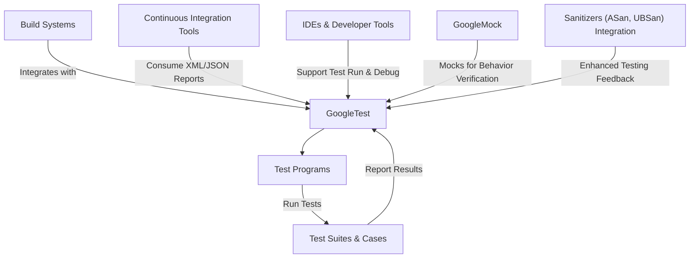

# Integrations and Supported Platforms

Discover how GoogleTest seamlessly integrates with popular C++ build systems, CI tools, IDEs, and complementary extensions, helping you establish a robust and efficient testing workflow across diverse development environments.

---

## Supported Platforms and Environments

GoogleTest is designed to be portable and works reliably across a wide range of platforms and operating systems, including:

- **Linux** (various distributions)
- **Windows** (including Windows CE and Windows Mobile)
- **macOS** (including Apple platforms excluding iOS where noted)

This broad platform support ensures your tests can be run consistently on your development and deployment targets.

> GoogleTest detects platform capabilities automatically and adapts functionality accordingly, enabling signal handling, stack tracing, and exception support where possible.

## Integration with Build Systems

GoogleTest fits naturally within common C++ build workflows.

### CMake
- GoogleTest can be included as a subproject or linked as an external library.
- Provides CMake targets and modules to simplify integration.
- Supports automatic discovery and registration of tests enabling `ctest` harnesses.

### Bazel
- Supports Bazel build environment with relevant build rules.
- Recognizes test shard environment variables (`GTEST_TOTAL_SHARDS`, `GTEST_SHARD_INDEX`) to enable parallel execution.
- Integrates smoothly with Bazel's test filtering and output capture.

### Manual and Other Build Systems
- Source integration by adding files directly.
- Custom builds are supported by invoking GoogleTest APIs correctly.
- Flexible, allowing integration into legacy or specialized build environments.

---

## Continuous Integration (CI) and Test Automation Support

GoogleTest is ideal for automated testing pipelines with compatible CI environments.

- Supports generating **XML** and **JSON** test reports via the `--gtest_output` flag.
- These test reports follow standards compatible with CI tools like Jenkins, GitLab CI, and others, enabling rich visualization and fail/pass tracking.
- Supports test sharding via environment variables, facilitating distributed parallel test runs.
- Provides flags for repeating, shuffling, and filtering tests to optimize CI runs based on test complexity and time constraints.

---

## IDE Support and Developer Tooling

GoogleTest works well with popular IDEs and developer tools to streamline your testing experience.

- Many IDEs, including Visual Studio, CLion, and Eclipse CDT, provide native or plugin-based support for GoogleTest.
- IDE integration offers clickable test results, easy test discovery, and debugging capabilities tied to test executions.
- GoogleTest’s output formatting supports colored terminal output and succinct log messages to improve readability.

---

## Interoperability with Companion Tools and Extensions

GoogleTest’s ecosystem includes companion libraries and extensions that enhance its capabilities.

- **GoogleMock**: For mocking interfaces and complex behavior verification.
- Extensions for custom matchers, assertions, and event listeners.
- Support for sanitizer integration to detect memory leaks and undefined behavior within tests.

Together, these add-ons expand GoogleTest beyond plain unit testing to comprehensive test frameworks.

---

## Practical Integration Workflow

Here’s a typical workflow illustrating GoogleTest integration in a modern C++ project:

1. **Setup Build System**: Add GoogleTest as a CMake subdirectory or Bazel dependency.
2. **Write Tests**: Define your tests with the rich macros like `TEST()`, `TEST_F()`, `TEST_P()`, and advanced fixtures.
3. **Configure CI**:
   - Set flags to generate XML or JSON reports.
   - Use test filtering or sharding to optimize test execution.
4. **Run Tests**:
   - Locally during development using IDE or command line (`RUN_ALL_TESTS()`).
   - Automatically in CI pipelines with results published.
5. **Extend**:
   - Add GoogleMock for mock-based tests.
   - Register event listeners to hook into test lifecycle events.

This workflow ensures a smooth, scalable testing process from initial setup through team-wide validation.

---

## Tips and Best Practices

- Always call `InitGoogleTest()` before running tests to set up flags and environment variables.
- Use test filtering to run targeted tests during development.
- Enable XML or JSON outputs for integration with CI dashboards.
- Use `AddGlobalTestEnvironment` for expensive shared resources initialized once.
- Prefer parameterized and typed tests for test reuse across inputs and types.
- Use environment variables and flags to control color output and verbosity for best readability.

---

## Troubleshooting Common Integration Issues

- Ensure your build system correctly includes GoogleTest headers and links the library.
- Check environment variables for test sharding and filtering if tests are not running as expected.
- Use the `--gtest_list_tests` flag to verify the discovered tests.
- Confirm that your CI system is configured to consume XML or JSON reports correctly.

---

## References and Further Reading

- For detailed platform-specific notes, see [Supported Platforms](https://github.com/google/googletest/blob/main/docs/faq/getting-started-issues/faq-supported-platforms.md).
- Learn how to integrate into build systems:
  - [Installing with CMake](https://github.com/google/googletest/blob/main/docs/getting-started/installation-integration/installing-via-cmake.md)
  - [Installing with Bazel](https://github.com/google/googletest/blob/main/docs/getting-started/installation-integration/installing-via-bazel.md)
- Understand test environment management via [Global Set-Up and Tear-Down](https://github.com/google/googletest/blob/main/docs/advanced.md#global-set-up-and-tear-down).
- See [Test Automation and CI Tips](https://github.com/google/googletest/blob/main/guides/integration-advanced/test-automation.md) for CI pipeline integration best practices.
- Explore [Parameterized and Typed Tests](https://github.com/google/googletest/blob/main/overview/core-concepts/parameterized-and-type-tests.mdx) to maximize code reuse.

---

For authoritative API details, refer to the [Testing Reference](https://github.com/google/googletest/blob/main/docs/reference/testing.md).

### Mermaid Diagram: GoogleTest Integration Ecosystem

---