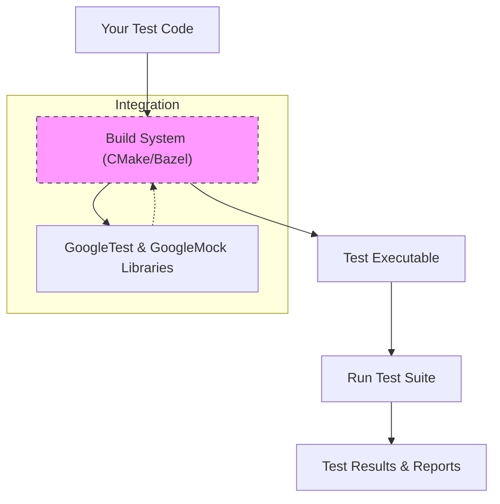

# Platform Support and Build Integration

## Seamless Platform Compatibility

GoogleTest is designed to run flawlessly across a wide range of platforms and compilers, making it a versatile choice for developers working in diverse environments. Whether you're developing on Windows, Linux, or macOS, or targeting various processor architectures, GoogleTest ensures your tests compile and run reliably.

### Supported Compilers and Platforms
- **Compilers:** GoogleTest supports major C++ compilers including GCC, Clang, MSVC (Visual Studio 2015 and later), and Intel C++ Compiler. This broad compatibility ensures your existing toolchains can integrate GoogleTest without disruptions.
- **Platforms:** Support spans across mainstream operating systems such as Windows, Linux distributions, and macOS, as well as embedded and specialized platforms where the compiler support is available.

By aligning with these widely used compilers and operating systems, GoogleTest removes barriers to adoption and facilitates consistent testing across your entire development ecosystem.

## Integrating GoogleTest into Your Build System

To accelerate adoption and streamline your testing workflows, GoogleTest integrates smoothly with the most popular build systems, including CMake and Bazel. This integration supports automatic test discovery, building, and execution in the context of your projects.

### CMake Integration
CMake is the most widely adopted build system in the C++ community, and GoogleTest provides out-of-the-box support for it:

- **FetchContent and ExternalProject:** Easily pull GoogleTest as an external dependency within your CMake project with minimal configuration.
- **Targets:** GoogleTest and GoogleMock provide CMake targets `gtest`, `gtest_main`, `gmock`, and `gmock_main` that you can link against your test executables directly.
- **Automatic Setup:** By using these targets, your project benefits from all GoogleTest functionalities without needing to manually manage source files or compilation flags.

**Example**: Adding GoogleTest using CMake's FetchContent
```cmake
include(FetchContent)
FetchContent_Declare(
  googletest
  URL https://github.com/google/googletest/archive/release-1.12.1.zip
)
FetchContent_MakeAvailable(googletest)

target_link_libraries(your_test_target
  PRIVATE
    gtest_main
)
```

This example demonstrates rapid inclusion of GoogleTest and linking to your test target.

### Bazel Integration
For users adopting Bazel as their build tool, GoogleTest seamlessly fits into the Bazel ecosystem:

- **Rules:** Bazel builds GoogleTest with predefined `cc_test` rules, making it straightforward to declare and run test targets.
- **Dependency Management:** GoogleTest and GoogleMock appear as Bazel external repositories, enabling explicit dependency management and version control.

By leveraging these integrations, developers can embed GoogleTest into continuous integration setups effortlessly.

## Why This Page Matters

This page specifically focuses on the critical aspects of platform support and build integration to empower you to start testing immediately, regardless of your development setup.

It complements architectural insights ([High-Level Architecture](../architecture-integration/high-level-architecture)) and ecosystem ideas ([Ecosystem and Extensions](../architecture-integration/ecosystem-and-extensions)) by showing how GoogleTest fits operationally into your toolchain.

## Practical Tips for Integration Success

- Always verify your compiler version meets GoogleTest’s minimum requirements (for example, Visual Studio 2015 or newer).
- Use official CMake targets (`gtest`, `gmock`, etc.) instead of manually linking source files to reduce maintenance overhead.
- When upgrading GoogleTest versions, review `gmock_main.pc.in` and `gmock.pc.in` files if you build from source to ensure your package information stays consistent.
- For custom or legacy build systems, study the provided `.pc.in` files for linker and compiler flags as templates for your own integration.

## Common Pitfalls and Troubleshooting

<AccordionGroup title="Troubleshooting Build and Integration Issues">
<Accordion title="Unsupported Compiler or Version">
Ensure your compiler meets GoogleTest’s minimum version requirements. MSVC older than 2015 is not supported.
</Accordion>
<Accordion title="Failed Linking Errors">
Confirm linking against the correct GoogleTest libraries (`gtest_main` or `gmock_main`) and that your build system sees the target dependencies correctly.
</Accordion>
<Accordion title="Platform-Specific Build Issues">
For less common platforms, verify availability of all dependencies and compiler flags. Adjust build scripts accordingly or consult community forums.
</Accordion>
</AccordionGroup>

## Summary

GoogleTest’s robust platform support coupled with straightforward build system integration opens the door to rapid adoption and consistent test execution across different environments. Whether using CMake or Bazel, this facilitates embedded and scalable testing workflows.

---

## References and Further Reading

- [High-Level Architecture (with Diagram)](../architecture-integration/high-level-architecture): Understand the architectural context of GoogleTest.
- [Ecosystem and Extensions](../architecture-integration/ecosystem-and-extensions): Explore plugins and additional integrations.
- [Installation Methods](../../getting-started/setup-basics/installation-methods): For detailed setup instructions.
- [Prerequisites & System Requirements](../../getting-started/setup-basics/prerequisites-system-requirements): Check system and compiler requirements.

## Example Mermaid Diagram: Build Workflow Integration


This diagram captures the flow from your source test code through your build system, linking GoogleTest, compiling tests, and running your tests with feedback.

## Sample CMake Package Configuration Snippet

```cmake
# Imported package found by find_package(googletest)
find_package(Threads REQUIRED)

target_link_libraries(your_test_target PRIVATE gtest_main Threads::Threads)
```

---

<Question>
Curious about steps to integrate GoogleTest in older build systems or platforms with limited compiler support? Visit the FAQ and Community Support for guidance and tips.
</Question>

---

<Note>
Continuous modernization of GoogleTest ensures staying current with contemporary compiler features and industry practices. Always consult the latest release notes and migration guides for smooth upgrades.
</Note>
