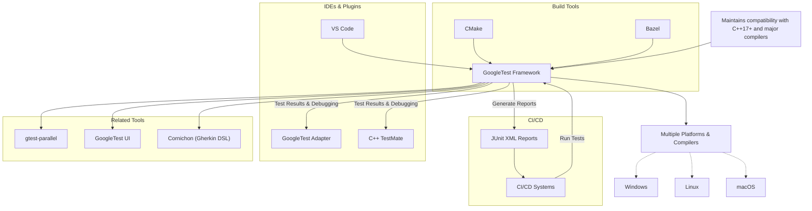

# Integration & Ecosystem

## How GoogleTest Fits Into Your Development Toolchain

GoogleTest seamlessly integrates into the broader C++ development ecosystem, enhancing testing workflows within diverse toolchains and platforms. Whether you are embedding tests into Continuous Integration/Continuous Deployment (CI/CD) pipelines, leveraging build tools like CMake or Bazel, or using popular IDEs and open-source plugins, GoogleTest provides reliable and flexible support to simplify test automation and maintain high code quality.

### Key Integration Points

- **CI/CD Systems**: GoogleTest works out of the box with CI/CD workflows. Its command-line test runners and standardized XML output formats allow easy incorporation into pipelines for automated builds, test runs, and result reporting. This enables rapid feedback on code changes and supports quality gates.

- **Build Tools Support**: The framework is designed to be compatible with major C++ build tools.
  - **CMake**: GoogleTest includes ready-to-use CMake scripts enabling smooth integration. You can build GoogleTest as a standalone or add it as a subdirectory to your project’s CMake build, allowing consistent compiler settings and reducing integration friction.
  - **Bazel**: Bazel-based projects can easily depend on GoogleTest with official Bazel build targets, streamlining test compilation and execution.

- **IDEs and Developer Tools**: GoogleTest fits naturally within development environments.
  - Many popular IDEs recognize GoogleTest test structures and support test discovery, execution, and debug capabilities.
  - Visual Studio Code extensions such as **GoogleTest Adapter** and **C++ TestMate** enhance developer experience by providing test tree views and debug/run controls directly inside the IDE.

- **Related Open-Source Plugins & Tools**:
  - **GTest Runner**: A Qt5-based GUI test runner suitable for Windows and Linux platforms, providing progress visualization and test management.
  - **GoogleTest UI**: A C#-based test runner offering an intuitive interface to browse and inspect test results.
  - **GTest TAP Listener**: Enables output in TAP (Test Anything Protocol) format, compatible with many test frameworks and CI systems.
  - **gtest-parallel**: Executes tests in parallel to accelerate test suite runtime, compatible with large projects where test speed is critical.
  - **Cornichon**: Provides Gherkin DSL parsing and stub code generation tailored for GoogleTest, assisting behavior-driven development workflows.

## Supported Platforms and Toolchains

GoogleTest adheres to Google's Foundational C++ Support Policy and embraces modern C++ standards. It is compatible with a wide range of compilers, platforms, and build tools, ensuring portability and stability across environments:

- Requires **C++17** or higher as of release 1.17.0.
- Supported compilers include GCC, Clang, MSVC, and others adhering to the standard.
- Runs on major operating systems including Linux, Windows, macOS, and various embedded targets.

For detailed compatibility, refer to the [Foundational C++ Support Matrix](https://github.com/google/oss-policies-info/blob/main/foundational-cxx-support-matrix.md).

## Real-World Impact and Notable Consumers

GoogleTest powers testing in many influential open-source projects and companies:

- **Chromium projects**: The foundation behind Google Chrome browser and Chrome OS.
- **LLVM**: A modern compiler infrastructure project.
- **Protocol Buffers**: Google's language-neutral, platform-neutral extensible mechanism for serializing structured data.
- **OpenCV**: Popular computer vision and machine learning software library.

These projects leverage GoogleTest's robustness, scalability, and integration flexibility.

## Practical Guidance for Integration

### Embedding GoogleTest in Your Build System

#### With CMake

1. Add GoogleTest as a subdirectory to your project:

```cmake
add_subdirectory(path/to/googletest)
```

2. Link your test targets with GoogleTest libraries:

```cmake
target_link_libraries(your_test_target gtest gtest_main)
```

3. Define custom test commands using `add_test()` for integration with CTest and CI usage.

#### With Bazel

Declare a dependency on GoogleTest in your `BUILD` file:

```bazel
cc_test(
    name = "my_tests",
    srcs = ["my_tests.cc"],
    deps = ["@com_google_googletest//:gtest_main"],
)
```

### Leveraging GoogleTest in CI Pipelines

- Use GoogleTest's XML output (`--gtest_output=xml:<file>`) to produce JUnit-compatible reports for CI dashboards.
- Use command-line flags to filter and repeat specific tests, enabling targeted and iterative development.

### Extending GoogleTest Ecosystem with Plugins

Take advantage of community-maintained tools enhancing visualization, parallelization, and test management:

- Install the **GoogleTest Adapter** or **C++ TestMate** VS Code extensions for better test insight and debugging.
- Use **gtest-parallel** to speed up large test suites by running tests concurrently.

## Troubleshooting and Compatibility Considerations

- Ensure consistent compiler and runtime library settings when building GoogleTest and your project to avoid linker errors, especially on Windows.
- Build GoogleTest as either static or shared libraries according to your project needs; use provided CMake options for precise control.
- For unusual environments, consider defining GoogleTest control macros to adapt to platform-specific requirements.

## Summary Diagram: GoogleTest Ecosystem Integration



---

## Next Steps

To get started integrating GoogleTest into your projects:

- Review the [Installation and Setup guide](https://github.com/google/googletest/blob/main/README.md#generic-build-instructions) to select your build system.
- Explore [Writing Your First Test](overview/product-intro/what-is-googletest) and [GoogleMock basics](googletest/README.md) for enhanced mocking support.
- Explore dedicated documentation on [continuous integration workflows](concepts/extensibility-and-scalability/integration-and-automation) to optimize your test pipeline.

<Tip>
Integrating GoogleTest thoughtfully into your toolchain accelerates development feedback cycles and boosts code quality. Start with native build tool support and then branch into IDE integrations and CI automation for a powerful, end-to-end testing solution.
</Tip>

<Note>
For advanced mocking capabilities, explore the [gMock framework documentation](https://github.com/google/googletest/tree/main/googlemock).
</Note>
