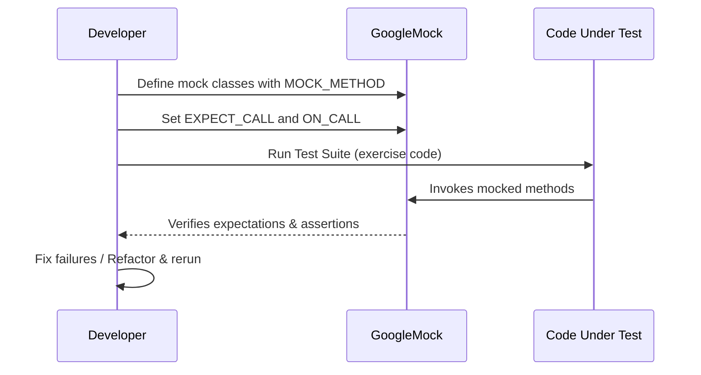

# Target Audience & Typical Use Cases

GoogleTest and GoogleMock form a powerful testing and mocking framework tailored for C++ developers who aim to build robust, reliable, and maintainable codebases. This page profiles the primary users and discusses real-world scenarios where GoogleTest and GoogleMock demonstrate their immense value, empowering teams to elevate software quality effortlessly.

---

## Who Uses GoogleTest & GoogleMock?

### Primary Users

- **C++ Developers:** Engineers focused on creating unit and integration tests to validate their code's correctness and robustness.

- **Library and Framework Maintainers:** Individuals managing reusable components rely on GoogleTest and GoogleMock to verify backward compatibility and prevent regressions.

- **Open-Source Contributors:** Community contributors use this framework to maintain code quality collaboratively across diverse environments.

- **Large and Complex Codebases:** Projects that require automated testing pipelines, often across multiple platforms and involving intricate dependency graphs.

### Why These Users Care

GoogleTest and GoogleMock offer a unified system that simplifies writing both rigorous unit tests and expressive mocks. Their design helps users catch bugs early, ensure code correctness, and maintain long-term stability while supporting sophisticated workflows such as Test-Driven Development (TDD) and regression testing automation.

---

## Typical Use Cases

### 1. Unit Testing Individual Components

GoogleTest enables users to write comprehensive and precise unit tests. With support for fixtures, parameterized tests, and rich assertion macros, developers can focus on expressing the intended functionality clearly:

```cpp
using ::testing::Test;
class FooTest : public Test {
 protected:
   Foo foo_;  // Test fixture for Foo class
};

TEST_F(FooTest, ReturnsExpectedValue) {
  EXPECT_EQ(foo_.Calculate(5), 42);
}
```

*Value:* Dependency-independent testing accelerates feedback loops, reduces bugs, and fosters confidence in component changes.

### 2. Regression Testing

By capturing expected behaviors in tests, GoogleTest helps users quickly detect unintended side-effects of code modifications. Automated runs flag failures instantly, encouraging safer refactoring and feature evolution.

### 3. Test-Driven Development (TDD)

GoogleMock's declarative syntax lets developers define interaction expectations upfront, guiding design through tests:

```cpp
class MockDatabase {
 public:
  MOCK_METHOD(bool, Connect, (), (override));
};

TEST(ServiceTest, ConnectsToDatabase) {
  MockDatabase mock_db;
  EXPECT_CALL(mock_db, Connect()).Times(1).WillOnce(Return(true));

  Service service(&mock_db);
  EXPECT_TRUE(service.Initialize());
}
```

*Value:* Ensures collaboration between components is explicit, testable, and easy to verify.

### 4. Platform-Agnostic Build & Test Integration

GoogleTest and GoogleMock's minimal dependencies enable integration into diverse platforms and CI/CD pipelines without extra overhead. They support multiple compilers and build systems, facilitating cross-platform automation seamlessly.

*Value:* Consistent test execution and quality assurance across heterogeneous environments.

---

## Concrete User Workflows

### From Development to Continuous Testing

1. **Write Mock Classes:** Use `MOCK_METHOD` in publicly accessible mock classes to define behaviors, including handling overloaded or templated methods.

2. **Set Expectations:** Use `EXPECT_CALL` to specify method call expectations such as call count, argument matchers, and return values.

3. **Define Default Behaviors:** Use `ON_CALL` to set default actions for mock methods when specific expectations are not needed.

4. **Run Tests:** Exercise code interacting with mocks; GoogleTest verifies assertion and interaction correctness automatically.

5. **Maintain Feedback:** Address any failures from unexpected calls, missing calls, or argument mismatches highlighted by GoogleMock.

### Best Practices

- Use `NiceMock<>` for mocks where uninteresting calls should be ignored silently, reducing noise.
- Use `StrictMock<>` to catch unplanned calls early, making tests more precise but potentially brittle.
- Organize expectations to reflect real interaction sequences using `InSequence` and `After` clauses.
- Combine `EXPECT_CALL` with rich matchers to precisely capture argument expectations, avoiding over-specification.

---

## Benefits Realized

| Benefit                     | Description                                                        |
|-----------------------------|--------------------------------------------------------------------|
| Faster Bug Detection         | Early and clear feedback on failures saves debugging time.         |
| Improved Code Design         | Interaction-based tests encourage better interface design.          |
| Regression Safety            | Automated regression tests catch unintended breakages effectively. |
| Scalability                 | Supports growing codebases with modular, maintainable tests.        |
| Platform Flexibility         | Works across different OSes and compilers without hassle.           |

---

## Troubleshooting & Common Pitfalls

- Remember to define `MOCK_METHOD` in the `public` section of mocks, regardless of the base method's access.
- Avoid mocking non-virtual methods unless using specific high-performance techniques.
- Set expectations *before* exercising the code to prevent undefined behavior.
- Use mocks judiciously - overly strict mocks (e.g., `StrictMock`) may cause brittle tests needing frequent updates.
- Take advantage of verbosity flags like `--gmock_verbose=info` during debugging to get detailed call traces.

---

## Summary Diagram: Typical Interaction Flow



---

## Next Steps

- Explore [What is GoogleTest & GoogleMock?](/overview/product-intro-core-concepts/what-is-googletest) for foundational concepts.
- Visit [gMock Cookbook](https://google.github.io/googletest/gmock_cook_book.html) for detailed usage recipes.
- Review [Core Features at a Glance](/overview/product-intro-core-concepts/core-features-overview) to understand key capabilities.
- Begin hands-on [Writing Your First Test](/getting-started/first-test-run-validation/writing-your-first-test) to apply skills.

<Tip>
For more advanced test design, consider using `NiceMock` or `StrictMock` to tailor strictness levels for uninteresting calls.
</Tip>

<Note>
Setting up `EXPECT_CALL`s with sequences and partial orderings helps manage complex interaction expectations.
</Note>

<Tip>
Use command-line flags like `--gmock_verbose=info` during test failures to gain deep insight into mock method calls and expectation matches.
</Tip>