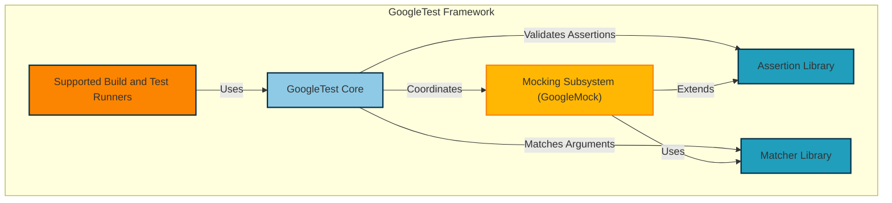

# System Architecture Overview

## Visual Architecture Diagram

## Introduction

The System Architecture Overview provides a clear, visual breakdown of the main components that make up the GoogleTest and GoogleMock framework. It focuses on the framework's principal modules and explains how these elements collaborate to deliver a seamless, reliable testing and mocking experience in C++ development.

This page is designed to orient new and experienced users alike, anchoring their understanding of the framework’s structure and the interaction of its key parts.

## Core Components Explained

### GoogleTest Core

At the heart of the framework lies the GoogleTest Core, responsible for orchestration of test execution. It manages the lifecycle of tests, handles configuration, and integrates assertion evaluation and mocking coordination.

Users rely on the core to discover and run tests efficiently across supported platforms.

### Assertion and Matcher Libraries

GoogleTest provides a rich Assertion Library backed by the Matcher Library. Assertions evaluate conditions within tests to verify correctness, while the Matcher Library offers fine-grained control and expressive power to specify argument expectations and test conditions.

Matchers enable users to write intuitive and flexible test checks that enhance readability and maintainability.

### Mocking Subsystem (GoogleMock)

Integrated within the framework, the Mocking Subsystem enables developers to create mock objects effortlessly. It leverages the matcher and assertion libraries to specify and verify interactions with dependencies, facilitating robust interaction-based testing.

GoogleMock enhances test modularity by allowing precise control over method call expectations, argument matching, and action behavior.

### Supported Build and Test Runners

GoogleTest is designed to interface seamlessly with various build and test systems, including popular runners like Bazel, CMake, and others. This support ensures smooth integration into existing development workflows and continuous integration pipelines.

## How It All Fits Together

The diagram above illustrates that the Supported Build and Test Runners invoke the GoogleTest Core, which in turn manages assertions through its Assertion Library and Matcher Library. The Mocking Subsystem interacts closely with the Matcher Library and asserts method interactions with precision.

Together, they create a cohesive ecosystem where unit testing and mocking coexist naturally, aiding developers in writing highly maintainable and trustworthy test suites.

## Practical Scenario: Running a Test

When a user runs tests via their build system, the following happens:

1. The build/test runner triggers GoogleTest Core.
2. GoogleTest Core discovers tests and injects assertion checks using the Assertion Library.
3. Where mocks are involved, the Mocking Subsystem uses matchers from the Matcher Library to validate expectations and provides mock implementations.
4. Results are captured and returned to the build/test runner for reporting.

This collaboration across components enables smooth test execution without requiring users to manage internal plumbing.

## Tips & Best Practices

- **Leverage the Matcher Library** for powerful and readable assertions and mock expectations.
- **Use mock objects** strategically to isolate code under test and validate interactions.
- **Integrate your tests** with supported build/test runners for automation and scalability.

## Troubleshooting

- If tests are not discovered by your build system, verify the integration with GoogleTest Core.
- Mock verification failures often stem from mismatched expectations; ensure your matchers accurately reflect intended argument constraints.
- Use verbose logging flags (`--gmock_verbose=info`) to trace mock call matching.

## Next Steps

To deepen your mastery of the framework, consider exploring:

- [What is GoogleTest & GoogleMock?](../product-intro-core-concepts/what-is-googletest)
- [Core Features at a Glance](../product-intro-core-concepts/core-features-overview)
- [Key Concepts and Terminology](../product-intro-core-concepts/key-concepts-and-terminology)

These pages build on the architectural context provided here by detailing usage workflows, feature sets, and essential testing concepts.

---

### Source Code Reference

Source code related to GoogleTest core functionality and framework architecture can be found in the `googletest/src/gtest.cc` file in the repository.

<Source url="https://github.com/google/googletest" branch="main" paths={[{"path": "googletest/src/gtest.cc", "range": "1-1500"}]} />

---

### Additional Resources

- [GoogleMock README](../../googlemock/README.md) — Details about the mocking subsystem
- [gMock Cookbook](../../docs/gmock_cook_book.md) — Recipes for advanced mocking techniques
- [Supported Platforms](../../docs/platforms.md) — Compatibility details
- [Official GitHub Repository](https://github.com/google/googletest)
