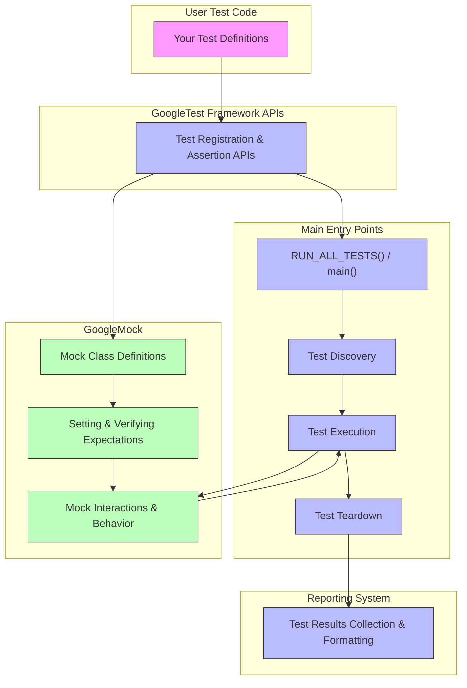

# System Architecture Overview

## Visualizing GoogleTest’s Internal Flow

This page offers a high-level visualization of GoogleTest’s internal process, guiding users through the journey from writing a test definition to executing it. By illustrating the roles of key components — including user test code, core framework APIs, main entry points, reporting mechanisms, and extensions via GoogleMock — this overview clarifies how GoogleTest orchestrates tests and extends its capabilities.

---

### Understanding the Test Execution Flow

GoogleTest operates by interpreting user-defined test cases and coordinating their execution through defined API interfaces. This overview focuses on presenting the logical flow rather than internal implementation details, emphasizing what users need to know to understand how their tests progress within the framework.

Users write test code that leverages GoogleTest's APIs, which act as the primary interface to the framework's core. Upon initiating the test run, GoogleTest passes control through its main entry points responsible for test discovery, setup, execution, and teardown.

### GoogleMock Extension

The diagram also highlights how GoogleMock, bundled within GoogleTest, extends core functionality by enabling sophisticated mocking capabilities. This inclusion allows users to isolate dependencies and specify interactions, making tests more expressive and robust.

---

## Core Components Illustrated in the Architecture

- **User Test Code**: The starting point where tests are written using GoogleTest APIs.
- **Framework APIs**: The interface layer that enables test registration, assertion handling, and test lifecycle control.
- **Main Entry Points**: Critical functions and orchestrators that manage test discovery, execution sequencing, and results aggregation.
- **Reporting System**: Collects and formats test results, enabling clear feedback to developers.
- **GoogleMock**: An integrated mocking extension that provides tools for creating mock objects, setting expectations, and verifying interactions.

---

## How This Helps You

This architectural overview empowers you to:

- Grasp how your test code interacts with GoogleTest and GoogleMock internally.
- Understand the sequence from writing tests to generating reports.
- Gain insight into extension points and how mocking complements core testing.
- Diagnose where your tests reside in the execution lifecycle to better interpret output and debug failures.

## Mermaid Diagram

---

## Practical Tips & Best Practices

- **Writing Tests:** Understanding this architecture helps you structure your tests better knowing how GoogleTest discovers and orchestrates them.

- **Using GoogleMock:** Recognize how mock classes tie into the framework APIs to let you isolate dependencies and focus on interaction-based testing.

- **Troubleshooting:** When tests fail, this flow helps pinpoint which phase (discovery, execution, teardown, mocking) might be responsible.

- **Extending GoogleTest:** Familiarity with core components can help you appreciate points where customization or integration with build systems might occur.

---

## Get Started

To translate this knowledge into action:

1. Write simple test cases that use GoogleTest APIs to see discovery and execution in motion.
2. Gradually incorporate GoogleMock for mocking dependencies, noting how the mocking components integrate.
3. Explore the 'Integration with Build Systems & Tools' page next to understand how this architecture fits into your broader development setup.

<Tip>
Refer to the [Core Concepts & Terminology](/overview/core_concepts_and_features/concepts_and_terminology) page next for detailed definitions of key terms used within these components.
</Tip>

<Tip>
Check out the [Feature Overview](/overview/core_concepts_and_features/feature_overview) page to see what capabilities are exposed through the APIs highlighted in this architecture.
</Tip>

<Tip>
For a practical walkthrough, start with [Writing and Running Your First Test](/getting-started/first-run-validation/writing-first-test).
</Tip>

---

## Summary

This overview equips you with a conceptual framework for GoogleTest’s internal operations and the augmentation provided by GoogleMock. Visualizing the flow helps demystify your tests’ lifecycle and the interaction between components.

---

## Additional Resources

- [GoogleTest Primer](primer.md) — Learn how to write tests in GoogleTest.
- [GoogleMock for Dummies](gmock_for_dummies.md) — Introduction to mocking and GoogleMock syntax.
- [System Overview](concepts/core-architecture/system-overview) — Deeper architecture insights.
- [Integration with Build Systems & Tools](/overview/architecture_and_integration/integration_points) — For build and platform integration info.

---

*This page is part of the Architecture & Integration section and complements pages under Introduction, Core Concepts, and Guides tabs.*

---

<Source url="https://github.com/google/googletest" branch="main" paths={[{"path": "docs/overview/architecture_and_integration/system_overview_diagram.mermaid", "range": "1-50"}]} />