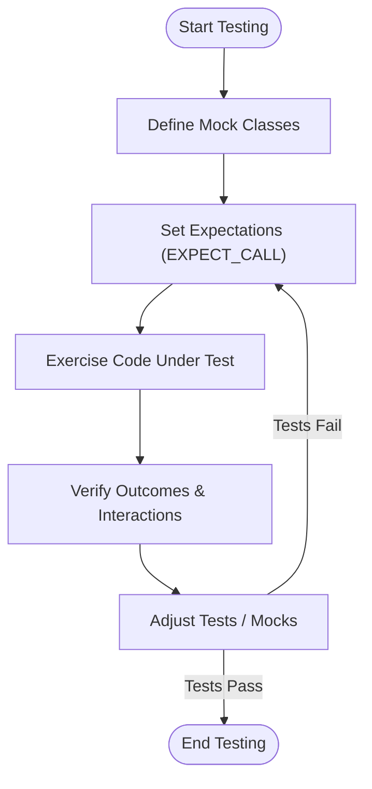

# Key Use Cases

Explore how GoogleTest is applied: from unit and regression testing to interface mocking and CI/CD automation. See representative scenarios including validating algorithm logic, simulating failures, and instrumenting large C++ codebases.

---

## Introduction

GoogleTest is a powerful framework designed to elevate the quality and reliability of your C++ software through effective automated testing. This page dives into *how* GoogleTest is applied across a wide spectrum of testing needs, showcasing real-world scenarios and workflows that put its features to work.

Whether you are validating critical algorithm logic, simulating complex failure behaviors with mocks, or automating tests within continuous integration pipelines, GoogleTest provides robust, flexible mechanisms to support your objectives.

---

## Unit Testing: Validating Algorithm Logic

Unit testing is the foundation of software quality assurance. GoogleTest empowers developers to write precise, maintainable tests for individual classes and functions.

### What You Achieve

- **Isolate individual units** of code to verify correctness.
- **Catch regressions early** by running automated tests frequently.
- Write **clear, readable tests** that document expected behavior.

### Typical Workflow

1. Write a test case for a function or class method.
2. Use assertions (`EXPECT_EQ`, `ASSERT_TRUE`, etc.) to verify outcomes.
3. Run tests to confirm the code meets specifications.

### Example

```cpp
#include <gtest/gtest.h>

int Factorial(int n) {
  return (n <= 1) ? 1 : n * Factorial(n - 1);
}

TEST(FactorialTest, HandlesPositiveInput) {
  EXPECT_EQ(Factorial(1), 1);
  EXPECT_EQ(Factorial(4), 24);
  EXPECT_EQ(Factorial(8), 40320);
}
```

In this simple example, GoogleTest helps ensure the factorial function behaves as expected across multiple inputs.

---

## Regression Testing: Ensuring Stable Codebases

When maintaining large or rapidly evolving codebases, preventing regressions is vital. GoogleTest allows teams to build comprehensive suites that guard core functionality.

- **Batch-run hundreds or thousands of tests** efficiently.
- Group tests in suites that reflect your code’s structure for intuitive organization.
- Leverage *parameterized tests* to scale coverage without code duplication.

### Real Scenario

A continuous integration server executes the full GoogleTest suite on every code check-in, quickly alerting teams to regressions before they reach production.

---

## Interface Mocking: Simulating Collaborators and Failures

Effective unit tests often require controlling dependencies that are complex or unavailable in test environments. GoogleMock, integrated with GoogleTest, provides a declarative way to create mock objects.

### What It Enables

- Simulate collaborator behavior, including:
  - Normal operation
  - Failures or exceptions
  - Complex interactions with ordered expectations
- Validate that code-under-test interacts correctly with dependencies.
- Facilitate *interaction-based testing* by setting call expectations.

### Typical Use Case

Consider a module that depends on a database interface. Using a mock, you can simulate:

- Successful queries returning expected data
- Failures such as connection loss
- The exact order and number of method calls invoked

### Example

```cpp
#include <gmock/gmock.h>
using ::testing::Return;

class MockDatabase : public DatabaseInterface {
 public:
  MOCK_METHOD(bool, Connect, (), (override));
  MOCK_METHOD(int, GetUserId, (const std::string& username), (override));
};

TEST(UserManagerTest, FindsUserId) {
  MockDatabase mock_db;
  EXPECT_CALL(mock_db, Connect()).WillOnce(Return(true));
  EXPECT_CALL(mock_db, GetUserId("alice")).WillOnce(Return(42));

  UserManager manager(&mock_db);
  ASSERT_EQ(manager.GetUserId("alice"), 42);
}
```

This test ensures that `UserManager` calls its `DatabaseInterface` as expected.

---

## CI/CD Automation: Integrating GoogleTest in Build Pipelines

GoogleTest’s design strongly supports automation in continuous integration and deployment workflows.

Benefits include:

- **Command-line execution** suitable for automated test runs.
- **Standardized exit codes** make it easy to detect test success or failure in scripts.
- **Filter and repeat tests** to fine-tune and isolate issues.
- **Parallel test execution** support for efficiency.

### Example Pipeline Step

```bash
# Run all tests, output detailed info on failures
./my_tests --gtest_output=xml:results.xml --gtest_color=yes
if [ $? -ne 0 ]; then
  echo "Tests failed!"
  exit 1
fi
```

---

## Instrumenting Large C++ Codebases

GoogleTest scales from small projects to massive, complex systems.

- Supports cross-platform builds (Linux, Windows, Mac).
- Integrates with popular build systems like Bazel and CMake.
- Offers **parameterized tests**, **typed tests**, and **test fixtures** to reduce code duplication and enforce consistency.
- Provides detailed failure messages and stack traces for efficient debugging.

This empowers teams to maintain and evolve large software bases with confidence.

---

## Common Strategies and Best Practices

- Write *small, focused* tests; each test should verify one behavior.
- Use *test fixtures* to share setup and teardown logic.
- Prefer *EXPECT_* assertions unless fatal failure is critical.
- Use mocks judiciously to isolate code-under-test while avoiding over-specification.
- Gradually *cover edge cases* such as error conditions through mocking.
- Integrate GoogleTest runs into automated builds early and often.

---

## Troubleshooting and Pitfalls

- Mocks require **virtual methods**; non-virtual methods can't be mocked directly.
- Setting expectations (e.g., via `EXPECT_CALL`) *must be done before* the method is invoked.
- Beware of overly strict expectations that lead to brittle tests; consider using `NiceMock` to suppress warnings.
- Use `RetiresOnSaturation` to avoid sticky expectations that cause unexpected failures.
- When debugging failing tests with mocks, run with `--gmock_verbose=info` to see call traces and matched expectations.

---

## Next Steps

To apply these use cases:

- Explore [Writing Your First Test](/guides/get-started/writing-tests) to start unit testing.
- Learn about [Introducing GoogleMock: Mocking in Practice](/guides/get-started/mocking-basics) for mocking techniques.
- See [Continuous Integration: Running Tests Automatically](/guides/integration-scenarios/ci-integration) to automate testing in your pipeline.

Refer to the [GoogleTest Primer](overview/product-introduction-and-core-concepts/what-is-googletest) and [Core Concepts and Terminology](overview/product-introduction-and-core-concepts/core-concepts-and-terminology) for foundational knowledge.

---

## Additional Resources

- [GoogleTest Primer](overview/product-introduction-and-core-concepts/what-is-googletest)
- [Mocking Cookbook](docs/gmock_cook_book.md)
- [Mocking Cheat Sheet](docs/gmock_cheat_sheet.md)
- [gMock for Dummies](docs/gmock_for_dummies.md)
- [GoogleTest API Reference](api-reference/core-apis/test-and-mock-interfaces)

---

## Summary

GoogleTest's key use cases demonstrate its critical role in ensuring C++ software quality, supporting everything from unit and regression testing to advanced mock-based validation and automation within CI/CD pipelines. By providing flexible, powerful tools for simulating behaviors and verifying interactions, it enables developers and teams to gain confidence, maintain large codebases reliably, and streamline automated validation.

This page offers practical insight into when and why to use these capabilities and points you to the next steps in mastering GoogleTest's application in your development workflow.

---

## Mermaid Diagram: Typical Flow of Using GoogleTest with Mocks




<CalloutTitle>Tip</CalloutTitle>

Use `NiceMock<T>` to reduce noise from uninteresting calls during test development and switch to stricter modes like `StrictMock<T>` only when verifying complete call correctness.

---