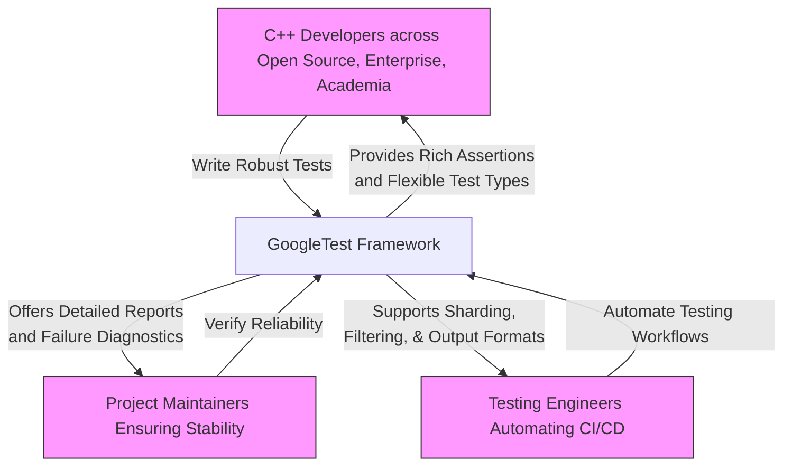

# Who Uses GoogleTest?

GoogleTest stands as a versatile testing framework that serves a broad and dynamic audience engaged in C++ software development. This page profiles the framework's primary users, offering insight into why GoogleTest is integral to their workflows and how it addresses their specific testing challenges.

---

## Developers Crafting C++ Code Across Domains

GoogleTest thrives as a foundational tool for developers creating C++ codebases in open source, enterprise environments, and academia alike.

- **Value They Receive:** Rapid test writing with automatic discovery, expressive assertions, and support for varying test paradigms (e.g., parameterized, typed tests) empowers developers to write robust unit tests that boost confidence in their software.
- **Common Goals:** Validate code correctness, catch regressions early, and maintain high code quality during iterative development.
- **Example Scenario:** A developer refactors a complex module and relies on GoogleTest to quickly rerun targeted tests, catching subtle bugs introduced during refactoring.

---

## Maintainers Focused on Reliability and Stability

Maintainers who oversee large or critical C++ projects use GoogleTest to ensure long-term codebase health and prevent regressions.

- **Value They Receive:** The framework's clear test reporting, detailed assertion failure information, and features like death tests enable maintainers to detect and diagnose issues efficiently.
- **Common Goals:** Enforce quality standards, automate regression verification, and support continuous integration demands.
- **Example Scenario:** An open source project maintainer integrates GoogleTest in CI pipelines, automatically reporting test statuses to maintain code safety.

---

## Testing Engineers Seeking Automation and Safety in Continuous Delivery

Engineers specializing in test automation and continuous delivery turn to GoogleTest to embed rigorous unit tests within their automated workflows.

- **Value They Receive:** Features such as test filtering, sharding, and rich output reporting formats (XML, JSON) make it easy to integrate GoogleTest results into CI dashboards and build systems.
- **Common Goals:** Achieve fast feedback loops, automate test executions, and maintain traceability of test failures across software releases.
- **Example Scenario:** A CI engineer configures GoogleTest with test sharding and filtered runs to maximize throughput and pinpoint flaky tests effectively.

---

## Why GoogleTest Matters to Users

Beyond these user profiles, GoogleTest excels by:

- **Simplifying Test Writing:** Clear macros and minimal boilerplate reduce the barrier to writing thorough tests.
- **Ensuring Cross-Platform Consistency:** Uniform behavior across supported platforms ensures tests remain reliable in diverse environments.
- **Supporting Extensibility:** Seamless integration with GoogleMock and customization through rich APIs expand testing capabilities for complex needs.

Whether you are writing your first test case or maintaining a vast codebase, GoogleTest adapts to your role and empowers your goals.

---

## Next Steps

Users interested in seeing concrete examples of GoogleTest's value and workflows are encouraged to explore:

- [Why Use GoogleTest?](../intro-core-concepts/value-proposition)
- [Common Use Cases](../audience-use-cases/use-case-snapshots)
- [Mocking Basics with GoogleMock](../../guides/real-world-workflows/mocking-basics)

For maintainers and engineers looking to integrate GoogleTest into continuous integration systems, the [Integrating with Your Build & CI](../architecture-features-integration/integration-scenarios) page offers practical guidance.

---

<Callout>
**Tip:** This page speaks directly to the people and roles who benefit from GoogleTest. For detailed instructions and API references, consult the [Testing Reference](../../api-reference/gtest-core-api/testing.html) and [Mocking Reference](../../api-reference/gmock-mock-api/mock-object-definition.html).
</Callout>

---

## Visual Summary of GoogleTest Audiences

---

This overview highlights that GoogleTest is not limited to a narrow group but instead empowers a diverse community unified by the goal of producing trustworthy C++ software.

