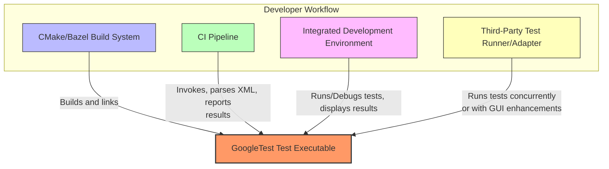

# Integration with Other Systems

Seamlessly incorporating GoogleTest into your existing development process is crucial for maximizing efficiency and reliability. This page guides you through how GoogleTest integrates with widely-used build systems, continuous integration (CI) pipelines, integrated development environments (IDEs), and third-party test runners or adapters, empowering you to embed robust testing without disrupting your setup.

---

## Why Integration Matters

Imagine this typical scenario: your development team uses CMake or Bazel to manage builds, relies on CI tools to automate tests on every code push, and prefers IDEs for debugging. GoogleTest seamlessly slots into this workflow, running tests automatically during the build or in your CI pipeline, reporting results directly in your IDE, or interoperating with third-party test adapters for enhanced tooling.

By understanding and leveraging these integration points, you unlock smooth automation, early failure detection, and comprehensive test reporting — all without manual intervention.

---

## Supported Build Systems

### CMake

GoogleTest is designed to integrate effortlessly with CMake-based projects, one of the most popular build systems for C++:

- **Easy Configuration:** You can add GoogleTest as an external project or use pre-installed libraries.
- **Targets and Dependencies:** GoogleTest provides `gtest` and `gtest_main` targets, making it simple to include in your test executables.
- **Threading Support:** GoogleTest detects available threading libraries (like PThreads on UNIX) and configures accordingly.

#### Example
```cmake
# Fetch GoogleTest
include(FetchContent)
FetchContent_Declare(
  googletest
  URL https://github.com/google/googletest/archive/release-1.11.0.zip
)
FetchContent_MakeAvailable(googletest)

# Link GoogleTest to your test executable
add_executable(MyTests test_main.cpp)
target_link_libraries(MyTests gtest_main)

# Enable pthreads if needed
if (UNIX)
  find_package(Threads REQUIRED)
  target_link_libraries(MyTests Threads::Threads)
endif()
```

### Bazel

For Bazel users, GoogleTest integrates as a first-class testing framework:

- **Predefined rules:** `cc_test` rule supports GTest natively.
- **Test executables:** Easily define test binaries that Bazel detects and runs.
- **Dependencies:** You specify GoogleTest as a dependency in `WORKSPACE` and `BUILD` files.

Example snippet from `BUILD`:
```bazel
cc_test(
    name = "example_test",
    srcs = ["example_test.cpp"],
    deps = ["@com_google_googletest//:gtest_main"],
)
```

---

## Continuous Integration (CI) Pipelines

Automating your tests on every commit or pull request is a cornerstone of modern development. GoogleTest is CI-ready:

- **Exit Codes:** Returns 0 on success, 1 on failures, allowing your CI to detect test results easily.
- **Output Formats:** Supports XML report generation (`--gtest_output=xml:<file>`) that CI servers like Jenkins, GitLab CI, and TeamCity can parse.
- **Sharding & Repetition:** Flags available to split tests among multiple executors or repeat tests for robustness.

In practice, your CI pipeline YAML or script invokes the compiled test binary directly or through Bazel/CMake commands, capturing and reporting results.

---

## Integrated Development Environments (IDEs)

GoogleTest aligns with popular C++ IDEs to boost developer productivity:

- **Test Discovery:** Auto-detects GoogleTest tests within projects.
- **Debugging:** Launch test runs in debug mode directly from the IDE.
- **Test Reporting:** Displays test pass/fail status and failure details inside IDE test explorers.

### Common IDE Support

- **Visual Studio:** Via test adapters like the GoogleTest Adapter or built-in support with recent MSVC versions.
- **CLion:** Native GoogleTest support with GUI test runners.
- **VS Code:** Extensions exist to run, debug, and visualize GoogleTest results, such as the C++ TestMate or GoogleTest Adapter extensions.

---

## Third-Party Test Runners and Adapters

You can augment GoogleTest with third-party tools and adapters:

- **Test Runners:** Tools like `gtest-parallel` run tests concurrently to reduce test time.
- **Protocol Adapters:** TAP listeners and XML reporters enable integrating with diverse reporting systems.
- **GUI Test Applications:** Tools like GTest Runner and GoogleTest UI provide graphical interfaces for observing test runs and inspecting failures.

This interoperability allows teams to tailor test execution and reporting to organizational needs without sacrificing GoogleTest’s robustness.

---

## Customization and Extensibility

GoogleTest allows advanced users to customize integration points:

- **Macros for Environment Detection:** You can override macros like `GTEST_HAS_PTHREAD` or `GTEST_OS_WINDOWS` to fine-tune how GoogleTest behaves in your environment.
- **Custom Printers and Loggers:** Extend output formatting and logging to fit complex pipelines.
- **Integration Hooks:** Event listeners enable triggering external actions from test events, such as notifying CI dashboards or custom reporters.

---

## Practical Tips

- Always verify your build system links the correct GoogleTest libraries (`gtest`, `gtest_main`, or `gmock` as needed).
- Use XML output in your CI pipelines for richer test reports.
- Configure test filters (`--gtest_filter`) in CI or local runs to control what test subsets execute.
- Take advantage of parallel execution tools for large test suites to accelerate feedback.
- Ensure environment variables and OS specifics (like pthread availability) are correctly detected by GoogleTest or explicitly set via customization points.

---

## Troubleshooting Common Integration Issues

<AccordionGroup title="Common Problems and Solutions">
<Accordion title="Tests Not Discovered in IDE">
Ensure your IDE supports GoogleTest or install and configure a corresponding test adapter. Confirm your test binaries include GoogleTest correctly and the IDE is aware of those binaries.
</Accordion>
<Accordion title="Test Failures Not Reported Correctly in CI">
Check if your CI pipeline is capturing standard output and error. Use `--gtest_output=xml:report.xml` and configure your CI to parse the XML report for detailed results.
</Accordion>
<Accordion title="Build Failures Linking GoogleTest">
Verify your build system's include paths and library links point to the correct GoogleTest versions. Confirm threading libraries are linked on UNIX-like systems.
</Accordion>
</AccordionGroup>

---

## Summary

Integrating GoogleTest with your build system, CI pipeline, IDE, or third-party tools is straightforward and designed for real-world workflows. Whether using CMake, Bazel, Jenkins, Visual Studio, or custom tooling, GoogleTest adapts to fit, making comprehensive C++ testing effortless.

---

## Next Steps

- Explore the [Installation: CMake & Bazel](../getting-started/prerequisites-installation/installation-cmake-bazel) page for detailed build integration.
- Visit [Writing and Running Your First Test](../guides/gtest-core-workflows/writing-and-running-tests) to learn how to prepare tests for seamless execution.
- See [Common Use Cases](./common-use-cases) for practical integration scenarios in CI/CD.

---

## References and Resources

- [GoogleTest Official Documentation](https://google.github.io/googletest/)
- [GoogleMock Documentation](../googlemock/README.md)
- [GoogleTest GitHub Repository](https://github.com/google/googletest)
- [CMake Integration Guide](../guides/real-world-integration/build-integration)
- [Continuous Integration with GoogleTest](https://github.com/google/googletest/blob/main/README.md#continuous-integration)

---

## Diagram: Integration Workflow Overview


