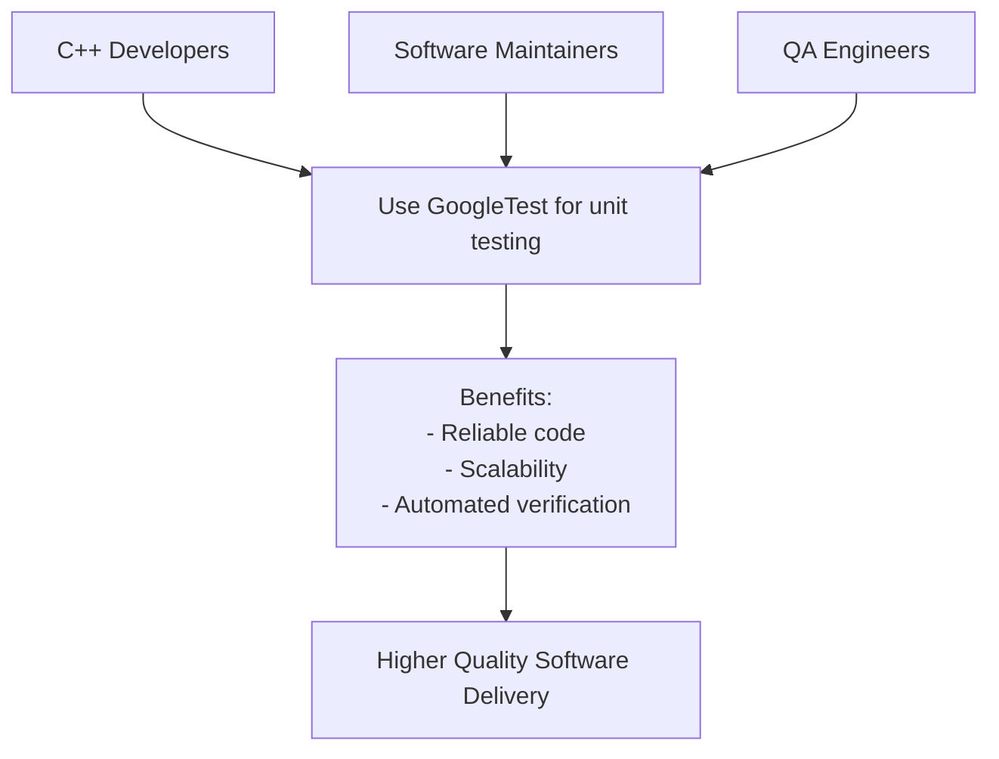

# Who Should Use GoogleTest?

GoogleTest is a comprehensive C++ testing framework designed to empower **developers**, **maintainers**, and **QA engineers** in building reliable software across all scales—from individual utilities to large industrial platforms. Whether you are working in open source projects or enterprise environments, GoogleTest provides the tools necessary to write maintainable, stable, and expressive tests.

---

## Target Audience and Roles

### 1. C++ Developers

If your role involves writing C++ code, GoogleTest is crafted with you in mind. It helps you:

- Validate your code logic with powerful assertions.
- Verify that your changes don't break existing functionality.
- Write expressive, easy-to-read tests that document expected behavior.
- Catch bugs early in development before they reach production.

**Scenario:** Imagine you're developing a new feature in a multi-million line code base. Using GoogleTest, you can write focused unit tests that quickly verify your feature’s correctness without running the entire application.

### 2. Software Maintainers

Maintainers handling legacy or evolving codebases benefit from GoogleTest’s robust feature set to:

- Refactor code confidently, backed by automated test coverage.
- Detect regressions introduced by others’ changes before integration.
- Structure tests to reflect changes in functionality over time.

**Scenario:** After inheriting an older module without tests, you gradually add GoogleTest cases around critical components, enabling safe iterative improvements.

### 3. Quality Assurance Engineers

QA teams aiming to automate testing workflows will find GoogleTest suitable for:

- Designing repeatable, automated test campaigns.
- Enforcing quality gates via integration with CI systems.
- Validating expected failure modes and edge cases using death tests.

**Scenario:** You create parameterized tests with GoogleTest that validate a function against a wide spectrum of inputs, ensuring robustness across diverse scenarios.

---

## Why GoogleTest Fits Diverse Use Cases

- **From Single Developers to Large Teams:** Whether you are working alone or within complex organizational structures, GoogleTest scales with your needs.
- **Cross-Platform and Compiler Versatility:** Supports Windows, Linux, Mac OS, and integrates with multiple toolchains.
- **Depth for Both Simple and Advanced Testing:** Write straightforward tests quickly or adopt advanced features like mocking, typed and parameterized tests as your needs evolve.

---

## Practical Examples of Usage Contexts

| Use Case                         | Description                                                                |
|---------------------------------|----------------------------------------------------------------------------|
| Unit Testing                    | Validate functions and classes in isolation to catch logic errors early.  |
| Integration Testing             | Check interaction between components with targeted test cases.            |
| Regression Prevention           | Cover legacy features to ensure updates don’t introduce breakage.         |
| Mocking Dependencies            | Replace complex or unavailable modules with mock components.               |
| Parameterized Tests             | Run the same test logic with varied input data efficiently.                |
| Death Tests                    | Verify that code fails safely under defined error conditions.              |

---

## Summary

Designed specifically for C++ projects, GoogleTest matches the workflow and mindset of C++ developers, maintainers, and QA engineers who want to build software that is resilient, well-tested, and maintainable. Its broad applicability makes it a foundational tool for anyone serious about C++ software quality.

---

## Getting Started

To start using GoogleTest effectively:

- Review the [GoogleTest Primer](../overview/introduction-value/what-is-googletest) to understand the fundamentals.
- Learn how to write simple tests and assertions.
- Explore the use of [mock objects](gmock_for_dummies.md) if your code depends on external systems.

---

## Best Practice Recommendations

- Embrace automated testing as a first-class activity in your development practice.
- Use mock objects to isolate units under test and simulate dependencies.
- Leverage parameterized and typed tests to maximize coverage and express intent.
- Integrate GoogleTest with your build and Continuous Integration (CI) systems for early feedback.

---

## Troubleshooting and Support

If you encounter issues or need help:

- Consult the [GoogleTest FAQ](../faq/getting-started-issues/how-do-i-install-googletest) for common questions.
- Use the [gMock Cookbook](gmock_cook_book.md) and [Mocking Cheat Sheet](gmock_cheat_sheet.md) for advanced mocking techniques.

---

## Related Documentation

- [What is GoogleTest?](overview/introduction-value/what-is-googletest) — Introductory concepts and core value.
- [Why Choose GoogleTest?](overview/introduction-value/value-proposition) — Core benefits and feature comparisons.
- [GoogleTest Primer](docs/primer.md) — Step-by-step beginner guide.
- [Using Mocks with GoogleMock](gmock_for_dummies.md) — Complete guide to mocking.
- [Integration with Build & CI Systems](overview/audience-usecases-integration/integration-points) — Automating your tests.

---

## Visual Overview

---

<Tip>
To get the most out of GoogleTest, start small by writing simple tests and incrementally add more advanced patterns like mocks and parameterized tests as your project grows.
</Tip>
<Note>
Remember that you should write expectations (`EXPECT_CALL`) before exercising mocks to avoid undefined behavior.
</Note>