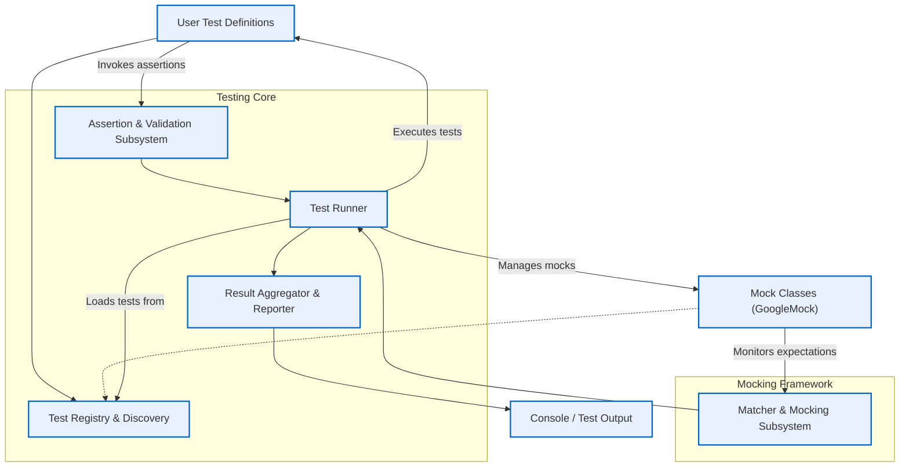

# System Architecture Overview

## Overview

This page presents a high-level view of GoogleTest’s architecture, revealing how its main components collaborate to enable efficient, reliable C++ testing. Through a clear illustration and explanation, developers can gain a mental model of the runtime flow — from test definitions and execution to assertion verification and reporting.

Understanding this architecture empowers users to better debug, extend, and integrate GoogleTest and its mocking extension, GoogleMock.

---

## Core Architectural Components

### 1. Test Definition

At the heart of GoogleTest are user-defined tests, organized into test suites or fixtures. These definitions are typically written using macros such as `TEST()`, `TEST_F()`, or parameterized test macros.

The framework registers these tests during program initialization, building a comprehensive catalog for later execution.

### 2. Test Runner

The Test Runner orchestrates the lifecycle of tests:

- Initializes the testing environment
- Discovers and iterates over registered tests
- Invokes each test, managing setup and teardown for fixtures
- Collects test results and outcomes

### 3. Assertion Subsystem

GoogleTest’s robust assertion subsystem evaluates conditions within tests, categorizing failures as fatal or non-fatal. Assertions like `EXPECT_EQ()` or `ASSERT_TRUE()` are translated into structured results. These results feed back into the test runner to determine success or failure.

### 4. Matcher and Mocking Subsystem (GoogleMock)

GoogleMock integrates tightly with GoogleTest, providing the ability to create mock objects, define expectations, and verify interactions.

- The mocking framework introduces special mock classes using macros like `MOCK_METHOD()`.
- Mock expectations are declared with macros such as `EXPECT_CALL()`, capturing call counts, arguments, and sequencing.
- At runtime, GoogleMock monitors calls to mock methods and checks them against expectations.

### 5. Result Reporting and Logging

After tests finish executing, GoogleTest aggregates the results:

- Pass/fail status
- Details on failed assertions, including stack traces and mismatch details
- Summary of test suite execution

It then outputs this information to standard output or user-configured listeners.

---

## Data Flow and Interaction

The diagram below illustrates the interaction and data flow across the GoogleTest architecture components during a typical test run.

---

## Detailed Description

### Test Registration

GoogleTest automatically registers all test cases and mock classes as the program starts, building internal data structures that describe these tests. This ensures that no manual test listing is needed — GoogleTest knows the tests defined and ready to execute.

### Test Execution

When `RUN_ALL_TESTS()` is called:

- GoogleTest enumerates all registered tests.
- Each test runs within its own fixture scope, ensuring test isolation.
- Tests may use mocks generated by GoogleMock to replace dependencies.
- At runtime, calls to mock methods are verified against expectations immediately.

### Assertions

Users define assertions in tests to verify outcomes. GoogleTest intercepts these and evaluates them during test execution.

- **Non-fatal assertions (EXPECT_*)**: Allow tests to continue even if an assertion fails
- **Fatal assertions (ASSERT_*)**: Abort the current test upon failure

These assertions feed status information back to the test runner, determining if tests pass or fail.

### Mocking & Matchers

GoogleMock extends this by providing:

- Declaration of mock interfaces using `MOCK_METHOD`
- Setting call expectations using `EXPECT_CALL`
- Matching arguments using rich matcher expressions
- Defining call order constraints and behaviors

Mock objects track calls in real-time, reporting violations or successes as tests run.

### Result Aggregation and Reporting

Once all tests have completed:

- The framework aggregates assertion and mocking results.
- It generates detailed reports summarizing successes and failures.
- Output can include stack traces, failed expectation messages, and statistics.

This output is critical for diagnosing issues and verifying code correctness.

---

## Practical Usage Insights

- **Seamless Integration:** The architecture smoothly integrates mocking into the testing workflow, so users can transparently substitute real dependencies with mocks.
- **Immediate Feedback:** With expectation checks happening as calls occur, errors surface instantly, simplifying debugging.
- **Extensible:** Users can extend matchers, actions, and mock behaviors to adapt GoogleTest to complex scenarios.

---

## Summary

Understanding GoogleTest’s architecture equips you to write more effective tests, use GoogleMock more confidently, and troubleshoot issues efficiently. The high-level flow from test registration through execution to outcome reporting gives a clear mental picture of the framework in operation.

For a deeper dive, explore related documentation on:

- [gMock for Dummies](gmock_for_dummies.md) — basics of GoogleMock interaction
- [Mocking Cookbook](gmock_cook_book.md) — advanced mocking patterns
- [Test Macros and Fixtures](api-reference/core-testing-api/test-macros-and-fixtures.md) — how tests are declared and structured
- [Defining Expectations (ON_CALL & EXPECT_CALL)](api-reference/mocking-and-matchers/defining-expectations.md) — how mocking expectations work

---

## Troubleshooting Tips

- Ensure your mock objects are destructed to trigger automatic expectation verification.
- Use verbosity flags such as `--gmock_verbose=info` to gain insight into mock calls and matcher usage.
- Leverage sequences and partial ordering to define precise call order when needed.

---

By mastering this architecture, you maximize the return on your investment in the GoogleTest and GoogleMock tools.

<Source url="https://github.com/google/googletest" paths={[{"path": "googlemock/src/gmock-spec-builders.cc", "range": "1-451"}]} />
