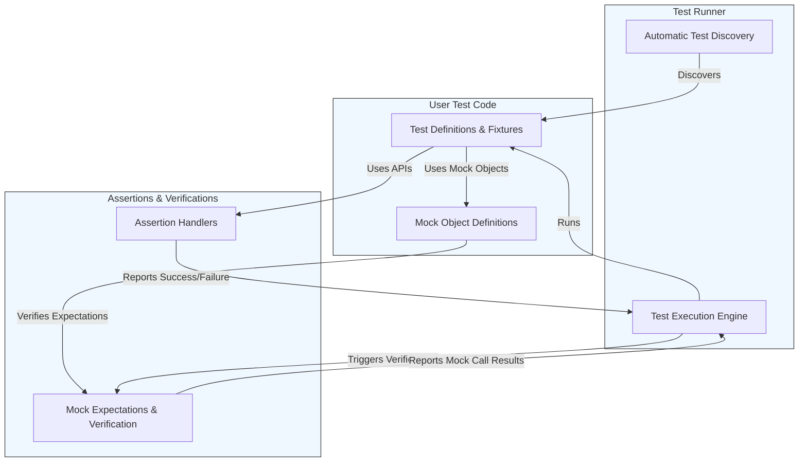

# Architecture Overview

GoogleTest's Architecture Overview presents a clear, high-level diagram illustrating the core components and their interactions within the framework. This page is designed to give you a concrete understanding of how GoogleTest processes tests—from test discovery through execution—highlighting key elements such as test runners, assertion modules, test definitions, and mocking capabilities. By seeing how data and control flow during test execution, you gain actionable insights into effective test design and debugging.

---

## At a Glance: The Architecture Diagram

This architecture diagram, expressed in Mermaid syntax, depicts the primary components of GoogleTest and their connections during the lifecycle of a test run:

- **Test Runner:** Orchestrates test discovery and execution flow.
- **Test Definitions:** Code sections where users define tests and test fixtures.
- **Assertion Modules:** Handle verification points, reporting successes or failures.
- **Mocking Framework (gMock):** Facilitates the creation and verification of mock objects to isolate and control dependencies within tests.

This flow illustrates the orchestration and seamless integration at the heart of GoogleTest's testing infrastructure.

---

## Understanding the Architecture

### What Is This Page?

This page explains how GoogleTest components work together during a test run — from discovering your tests to executing them with in-depth assertions and mock verifications. It provides a bird’s-eye view to help you grasp the framework's structure without diving into implementation complexity.

### Why It Matters

Seeing the architecture helps you understand how your test code integrates with the framework, enabling you to optimize your test design, debug effectively, and leverage GoogleTest’s full potential.

### Key Components Explained

| Component               | Role and User Value                                                                                     |
|------------------------|------------------------------------------------------------------------------------------------------|
| Test Runner            | Automatically discovers tests in your codebase and manages their execution seamlessly. Ensures reliable and orderly test runs without manual intervention. |
| Test Definitions       | Where you author tests and test fixtures. Provides structure and context for your testing scenarios.   |
| Assertion Modules      | Offer expressive macros and functions to verify expected behaviors. Capture failures promptly and clearly to expedite troubleshooting. |
| Mocking Framework (gMock) | Lets you create mock classes and define behavior and expectations declaratively. Helps isolate dependencies and precisely control test interactions for robust, maintainable tests. |

---

## How It Works: Typical User Flow

1. **Test Discovery:** When you trigger your test binary, the Test Runner automatically scans for available test cases and fixtures.
2. **Test Execution:** The runner systematically invokes your test functions.
3. **Assertions:** During execution, your tests call assertion macros that validate conditions and report pass/fail results through the assertion modules.
4. **Mock Usage & Verification:** If mocks are used, they intercept interactions per expectations set by your test, verifying call counts, argument values, and sequences.
5. **Result Reporting:** Test Runner aggregates results and reports the overall outcomes.

This flow ensures swift, robust unit test management without demanding manual bookkeeping from you.

---

## Practical Tips for Leveraging the Architecture

- **Organize Tests Cleanly:** Define tests and test fixtures logically. This ensures seamless discovery and execution.
- **Use Assertions Strategically:** Frame assertions to pinpoint expected outcomes explicitly, improving failure diagnostics.
- **Embrace Mocks for Isolation:** Use mocks to simulate external dependencies, making tests fast, deterministic, and highly maintainable.
- **Understand Sequencing:** Use features like sequences and strictness modifiers if requiring precise interaction order in tests.
- **Explore Diagnostic Flags:** For deeper insight during failures, utilize verbosity and logging flags to trace mock calls and assertions.

---

## Getting Started with Architecture Awareness

Build familiarity with GoogleTest by reviewing the following related pages for practical details:

- [Feature Overview](https://google.github.io/googletest/overview/concepts-architecture/feature-overview.html) — Learn about core capabilities including mocking and assertion modules.
- [What is GoogleTest?](https://google.github.io/googletest/overview/introduction-value/what-is-googletest.html) — Understand the purpose and core benefits.
- [Mocking Reference](https://google.github.io/googletest/docs/reference/mocking.html) — Dive into the mocking APIs and usage.

Try creating simple test cases and run them to see the architecture components in action.

---

## Troubleshooting Common Confusions

- If your tests are not discovered, check that your test cases are correctly declared using TEST or TEST_F macros.
- For unexpected mock failures, verify that expectations are set before exercising mocks.
- Use the `--gmock_verbose=info` flag to trace calls and understand why particular expectations are not met.

---

*For source code and implementation details related to the architecture, see the [GoogleTest GitHub repository](https://github.com/google/googletest).*

---

## Summary

The Architecture Overview page connects the dots between GoogleTest’s core modules, revealing how your test code, assertions, mock objects, and the test runner orchestrate together. Equipped with this structural understanding, you are empowered to write expressive, maintainable tests and diagnose issues faster.
