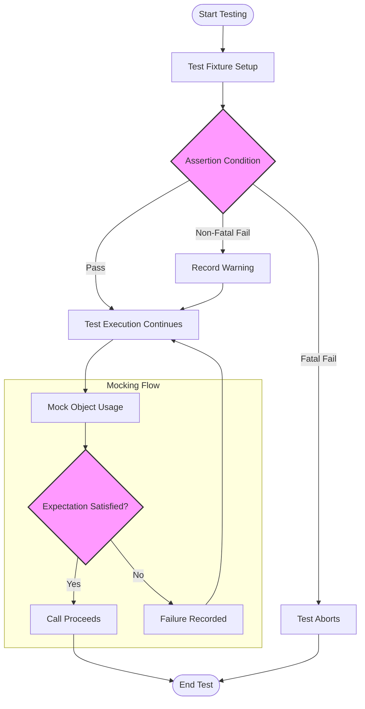

# Core Concepts & Terminology

GoogleTest introduces a robust framework for C++ testing and mocking, underpinned by precise core concepts that empower you to write maintainable, expressive, and reliable tests. This page defines essential terms—such as test fixture, assertion, mock, expectation, fatal/non-fatal failure, and parameterized test—to ground your understanding of how these ideas support everyday usage of GoogleTest.

---

## Understanding Key Terms

Before diving into writing tests with GoogleTest, it’s crucial to understand the fundamental terms that shape its workflows and usage.

### Test Fixture
A **test fixture** is the environment and context in which tests run. It encapsulates common setup and teardown code shared by multiple test cases, allowing you to write cleaner and more maintainable tests. By grouping related tests under a fixture, you create a stable and consistent foundation for testing a component or a module.

**Example:**

```cpp
class MyTestFixture : public ::testing::Test {
 protected:
  void SetUp() override {
    // Common setup for multiple tests
  }

  void TearDown() override {
    // Cleanup
  }
};

TEST_F(MyTestFixture, TestA) {
  // Test code here
}

TEST_F(MyTestFixture, TestB) {
  // Another test sharing setup and teardown
}
```

### Assertion
An **assertion** is a statement in your test that verifies if a condition holds true. If an assertion fails, it marks the current test as failed. Assertions enable you to specify expected behaviors, outcomes, or states in your test code.

GoogleTest offers various assertion macros, such as `EXPECT_EQ`, `ASSERT_TRUE`, and more, tailored to different comparison needs.

### Mock
A **mock** is a simulated object that mimics the behavior of real components in your code. Mocks replace real implementations to isolate the tested code and verify interactions, such as method calls, their arguments, and call sequences.

GoogleTest’s `gMock` provides powerful facilities to define mocks, specify behaviors and expectations.

### Expectation
An **expectation** defines how a mock object’s method is expected to be invoked during the test. It specifies:

- How many times the method should be called (cardinality)
- What arguments it should be called with
- The order relative to other expectations
- The behavior to perform when the method is called (
  e.g., return values, side effects)

Expectations act as a contract your test enforces against the mock object to ensure the code behaves correctly.

### Fatal vs Non-Fatal Failure
- A **fatal failure** immediately aborts the current function (e.g., a test case), preventing further execution.
- A **non-fatal failure** reports an error but allows the test to continue running.

GoogleTest distinguishes these to give you control over how strictly failures influence test execution. For example, `ASSERT_*` macros produce fatal failures, while `EXPECT_*` macros produce non-fatal failures.

### Parameterized Test
**Parameterized tests** allow you to write one test logic that runs with different input values or parameters, increasing test coverage without duplication.

GoogleTest supports parameterized tests by combining fixtures with template-based test definitions.

**Example:**

```cpp
class MyParamTest : public ::testing::TestWithParam<int> {};

TEST_P(MyParamTest, IsEven) {
  int value = GetParam();
  EXPECT_EQ(value % 2, 0);
}

INSTANTIATE_TEST_SUITE_P(
  EvenTests,
  MyParamTest,
  ::testing::Values(2, 4, 6, 8));
```

---

## Why These Concepts Matter

These core terms are not just vocabulary. They form the foundation for your test design and implementation in GoogleTest:

- **Test fixtures** keep your test code DRY and coherent.
- **Assertions** validate code behavior clearly and expressively.
- **Mocks** let you isolate components and verify interactions precisely.
- **Expectations** provide fine control over test verifications, making tests reliable and insightful.
- **Failure types** give you flexibility in managing test flow.
- **Parameterized tests** enable broad coverage efficiently.

Understanding these allows you to harness GoogleTest effectively, leading to confident, maintainable tests with clear intent.

---

## Practical Tips & Common Pitfalls

- Always define **virtual destructors** for interfaces or base classes you plan to mock. GoogleTest expects this for safe deletion via base pointers.
- When mocking methods, use the `MOCK_METHOD` macro in the `public` section of the mock class, regardless of the original access modifiers.
- Avoid over-specifying expectations which can lead to brittle tests. Use `ON_CALL` for specifying default behavior without requiring strict expectations.
- Know when to use `EXPECT_*` vs `ASSERT_*` based on whether you want the test to stop immediately upon failure.
- For parameterized tests, keep the parameter values meaningful and limited in number to ensure efficient and effective tests.

---

## Related Concepts Illustrated



The above diagram depicts a high-level flow of how test fixtures establish context, assertions evaluate conditions, and how mocks incorporate expectations to validate interaction.

---

## Next Steps

Now that you’re familiar with these core concepts, explore the following documentation pages to deepen your practical understanding and begin your testing journey:

- [What is GoogleTest?](../introduction-value/what-is-googletest) — See how the product is introduced and what it offers.
- [Product Value Proposition](../introduction-value/value-proposition) — Learn about the benefits and why GoogleTest is a strong choice.
- [Using Mock Objects Effectively](../../guides/writing-and-running-tests/using-mock-objects) — Apply these concepts into real, practical mocking.
- [Mocking API Reference](../../api-reference/core-apis/mocking) — Detailed API documentation for mocks, expectations, and actions.


---

> "Core concepts like test fixtures and mocks underpin your daily work with GoogleTest, enabling you to write precise, maintainable, and expressive tests that deliver confidence in C++ projects."

---

## Additional Resources

- [gMock for Dummies](https://google.github.io/googletest/gmock_for_dummies.html) — A beginner-friendly guide to mocking.
- [gMock Cheat Sheet](https://google.github.io/googletest/gmock_cheat_sheet.html) — A handy reference to common mocking patterns and idioms.
- [Mocking Reference](../../api-reference/core-apis/mocking) — Comprehensive API documentation.

---

Feel empowered: mastering these terms leads to more effective control over test design, helping you to future-proof your test suite while improving its clarity and usefulness.