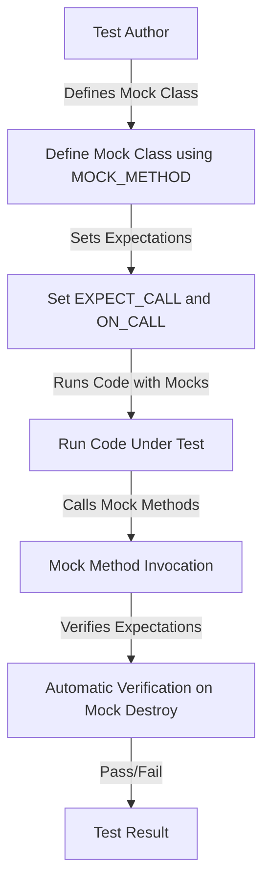

# Feature Overview

GoogleTest is a comprehensive C++ testing framework designed for writing robust, maintainable, and efficient unit tests. It offers xUnit-style test structures, rich assertions, parameterized and type-parameterized test support, death tests for process-level failures, and flexible test execution options. Additionally, GoogleMock, integrated within GoogleTest, provides powerful mocking capabilities to simulate and verify interactions with dependencies.

---

## Key Features of GoogleTest

- **xUnit-Style Testing Architecture:** Organize tests into suites and cases, supporting setup and teardown operations.
- **Rich Assertion Library:** Use expressive assertions to validate conditions and compare complex data structures.
- **Parameterized and Typed Tests:** Write tests that run with multiple data sets or types to increase coverage efficiently.
- **Death Tests:** Verify that programs terminate as expected under error conditions.
- **Flexible Test Execution:** Filter tests to run subsets, repeat tests, shuffle test execution order, and control output verbosity.

## GoogleMock Capabilities

GoogleMock complements GoogleTest by allowing the creation and configuration of mock objects that imitate the behavior of complex dependencies. It enables developers to:

- Declare mock classes easily using intuitive macros.
- Specify expectations on method calls including argument matching, call counts, and sequences.
- Define return values and side effects to simulate various scenarios.
- Control strictness of mock objects (NiceMock, NaggyMock, StrictMock) to adjust tolerance to unexpected calls.
- Utilize advanced matchers and actions for precise control over interactions.

## Practical Benefits

- **Test Isolation:** Decouple unit tests from external dependencies for more reliable and faster tests.
- **Improved Debugging:** Detailed failure reports with stack traces and argument values aid quick bug identification.
- **Maintainable Tests:** Domain-specific language (DSL) style expectations encourage readable and intention-revealing test code.
- **Extensibility:** Customize matchers, actions, and mock behaviors to fit unique testing requirements.

## Real-world Use Cases

- Writing unit tests for classes with complex external dependencies.
- Verifying state and interaction behavior of components in isolation.
- Testing error-handling logic through simulation of failure scenarios.
- Refactoring legacy codebases by gradually introducing mocks to encapsulate dependencies.

## Getting Started with Feature Exploration

To begin leveraging these features, readers should proceed to the [Getting Started](../getting-started/installation-setup/prerequisites-requirements) section to set up the environment, followed by [Writing Your First Unit Test](../guides/getting-started/first-unit-test) and [Creating Your First Mock Object](../guides/getting-started/first-mock). Advanced users may explore detailed concepts in [Core Concepts & Terminology](../overview/concepts-features-usecases/core-concepts-and-terminology).

---

## Sample Code Snippet: Basic Mocking and Expectation

```cpp
#include <gmock/gmock.h>
#include <gtest/gtest.h>

using ::testing::Return;
using ::testing::_;  // Matcher for any argument

class Foo {
 public:
  virtual ~Foo() = default;
  virtual int GetSize() const = 0;
  virtual std::string Describe(const char* name) = 0;
};

class MockFoo : public Foo {
 public:
  MOCK_METHOD(int, GetSize, (), (const, override));
  MOCK_METHOD(std::string, Describe, (const char* name), (override));
};

TEST(FooTest, BasicMockUsage) {
  MockFoo mock;

  ON_CALL(mock, GetSize())
      .WillByDefault(Return(5));

  EXPECT_CALL(mock, Describe(_))
      .Times(1)
      .WillOnce(Return("Mocked description"));

  EXPECT_EQ(mock.GetSize(), 5);
  EXPECT_EQ(mock.Describe("test"), "Mocked description");
}
```

In this example, a mock class `MockFoo` is created from the interface `Foo`. The test sets a default action for `GetSize()` and an expectation with a specified return for `Describe()`. The test verifies that these mock methods behave as expected.

---

## Diagram: Mocking Workflow High-level Overview



This workflow shows the user defining mocks, setting expectations, running tests that invoke mocks, and the framework automatically verifying the expectations.

---

For more detailed explanations and code examples, please refer to:

- [gMock for Dummies](../docs/gmock_for_dummies.md) – Beginner-friendly introduction
- [Mocking Reference](../docs/reference/mocking.md) – Complete API reference
- [gMock Cookbook](../docs/gmock_cook_book.md) – Recipes and advanced usage
- [gMock Cheat Sheet](../docs/gmock_cheat_sheet.md) – Quick syntax guide


## Troubleshooting and FAQs

Common issues and their resolutions are discussed in the [Legacy gMock FAQ](../docs/gmock_faq.md), covering topics such as:

- Handling calls where real methods are invoked instead of mocks
- Dealing with variadic functions
- Compiler-specific warnings
- Debugging unfulfilled expectations
- Strategies to handle static, global, and non-virtual functions
- Managing default actions and uninteresting calls

---

Continue exploring GoogleTest and GoogleMock to build rigorous and maintainable C++ tests that effectively simulate and verify interactions with complex systems.