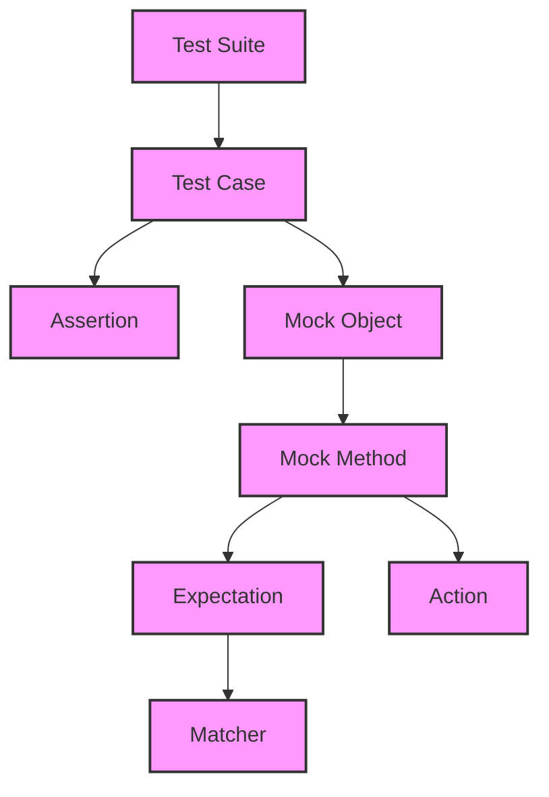

# Core Concepts & Terminology

## Understanding the Essential Language of GoogleTest

Welcome to the foundational page that deciphers the key concepts and terminology used throughout GoogleTest. Here, you will build a solid mental model of test suites, test cases, assertions, matchers, mocks, actions, and expectations—the very language that enables you to interact fluently with the framework. This clarity is crucial to bridge your intentions with how GoogleTest works, empowering you to write precise, maintainable, and effective tests.

---

## What Users Need to Know and Achieve

When you use GoogleTest, your main intention is to structure your tests clearly and to express verification rules that ensure your code behaves correctly. To do this, you must understand:

- What test suites and test cases represent and how they organize your tests.
- How assertions and matchers validate test outcomes.
- How mocks stand in for real dependencies during testing.
- What actions can be assigned to mocks to simulate specific behaviors.
- How expectations define rules about mock invocations.

This page demystifies these terms so you can focus on writing tests that catch real bugs while remaining easy to read and evolve.

---

## Core Terminology Overview

### 1. Test Suites and Test Cases

- **Test Suite:** A logical grouping of tests often related to the same component or feature.
- **Test Case:** An individual test that checks a specific condition or behavior.

**User Story Example:** You're developing a collection library. You create a test suite named `StackTests`. Inside it, each test case checks behaviors like pushing an element, popping an element, or checking the stack size.

This hierarchy helps keep your tests organized and makes it easy to run targeted validations.

### 2. Assertions and Matchers

- **Assertion:** A statement that verifies a condition within a test case, such as `EXPECT_EQ` or `ASSERT_TRUE`.
- **Matcher:** A flexible predicate describing what values are expected, used within assertions and mock expectations to specify argument conditions (e.g., `Eq`, `Ge`, `_` for any value).

**Example:** `EXPECT_CALL(mock, Foo(Eq(5)))` states that the mock called method `Foo` should be invoked with argument equal to 5.

This combination makes your test validations expressive and readable.

### 3. Mocks and Mock Methods

- **Mock Object:** A test double that implements a specified interface, enabling you to simulate its behavior.
- **Mock Method:** Methods within mock objects that can be programmed with expectations and actions.

**Scenario:** You have a `Database` interface. Instead of using a real database in tests (which would be slow or unreliable), you create a `MockDatabase`. You then set expectations on its methods like `Connect` or `Query` to verify interactions with your code.

### 4. Actions

- **Actions:** Instructions assigned to mock methods that define what occurs when the method is called — e.g., return a specific value, invoke a callback, or modify arguments.

**Example:** An action `Return(42)` causes the mock method to return `42` when invoked.

### 5. Expectations

- **Expectations:** Defined rules that specify how often and with what arguments mock methods should be called.

**Example:** `EXPECT_CALL(mock, Process(_)).Times(Exactly(3));` expects the `Process` method to be called exactly three times.

Expectations serve as the checks on the code under test to ensure proper interaction.

---

## Why This Terminology Matters

Without a shared language, reading and writing tests becomes confusing—perhaps leading to brittle or ineffective tests. Knowing the meaning of these concepts gives you confidence in interpreting the framework’s messages and structuring your tests logically.

**Before:** You might write scattered assertions but struggle to mock dependencies, leading to slow, flaky tests.

**After:** With these concepts in hand, you organize your tests into suites, mock collaborators cleanly, and write precise expectations to validate behavior reliably and quickly.

---

## Practical Tips and Best Practices

- **Start Simple:** Begin by grouping tests in suites and writing plain assertions before introducing mocks.
- **Mock Where Needed:** Use mocks to isolate the unit under test from external dependencies.
- **Avoid Over-Specifying:** Do not rigidly expect every call unless necessary; use flexible matchers to avoid brittle tests.
- **Leverage Actions:** Use `WillOnce` and `WillRepeatedly` to model mock method behavior that simulates real scenarios.
- **Use Sequences Wisely:** To test call order, apply sequences or `InSequence` blocks.
- **Read Error Messages:** GoogleTest uses this terminology in output; understanding it accelerates debugging.

---

## Overview Diagram of Core Concepts



This diagram visually connects the core concepts, emphasizing how they interrelate in a typical test flow.

---

## Concrete Examples: From Concepts to Code

### Declaring a Mock Class

```cpp
#include <gmock/gmock.h>

class Database {
 public:
  virtual ~Database() {}
  virtual bool Connect(const std::string& url) = 0;
  virtual int Query(const std::string& query_str) = 0;
};

class MockDatabase : public Database {
 public:
  MOCK_METHOD(bool, Connect, (const std::string& url), (override));
  MOCK_METHOD(int, Query, (const std::string& query_str), (override));
};
```

### Setting Expectations and Actions

```cpp
using ::testing::Return;
using ::testing::_;

TEST(MyServiceTest, QueriesDatabase) {
  MockDatabase mock_db;

  EXPECT_CALL(mock_db, Connect(_))
      .WillOnce(Return(true));

  EXPECT_CALL(mock_db, Query("SELECT * FROM table"))
      .Times(1)
      .WillOnce(Return(42));

  MyService service(&mock_db);
  ASSERT_TRUE(service.Initialize());
  int result = service.FetchData();
  EXPECT_EQ(result, 42);
}
```

This example illustrates how terminology maps to usable test code.

---

## Troubleshooting Common Confusions

<AccordionGroup title="Common User Confusions About Core Concepts">
<Accordion title="What is the difference between Matchers and Assertions?">
Matchers define criteria on values (e.g., "equal to 5"), while assertions use matchers to verify conditions in tests (e.g., EXPECT_EQ uses an implicit matcher).
</Accordion>
<Accordion title="When should I use Mocks versus real dependencies?">
Use mocks to simulate slow, complex, or unavailable components during testing to make tests faster and more reliable.
</Accordion>
<Accordion title="What do Actions do on mocks?">
Actions tell mock methods what to do when invoked, such as returning values or executing functions, helping simulate real behavior.
</Accordion>
<Accordion title="How do Expectations enforce call counts?">
Expectations specify how many times and with what arguments mock methods must be called; if violated, tests fail.
</Accordion>
<Accordion title="Can I ignore some mock method calls?">
By default, uninteresting calls are allowed but warned about. Using NiceMock suppresses these warnings.
</Accordion>
</AccordionGroup>

---

## Getting Started with the Terminology

You’re encouraged to proceed by applying these concepts practically:

<Steps>
<Step title="Explore Writing & Running Tests">
Start by creating your first tests and organizing them into suites with assertions.
</Step>
<Step title="Create Mock Objects">
Define mock classes for dependencies and set expectations and actions.
</Step>
<Step title="Set Precise Expectations">
Use matchers and cardinalities to control interaction and verify behavior.
</Step>
<Step title="Explore Advanced Topics">
Learn about sequences, ordered expectations, and custom matchers and actions.
</Step>
</Steps>

<Check>
Remember: Mastering this terminology unlocks the full power of GoogleTest and gMock, enabling robust, maintainable testing workflows.
</Check>

---

## Additional Resources

- [gMock for Dummies](https://google.github.io/googletest/gmock_for_dummies.html): Beginner-friendly guide on using mocks.
- [Mocking Reference](https://google.github.io/googletest/reference/mocking.html): Detailed reference for mocks, expectations, and actions.
- [gMock Cheat Sheet](https://google.github.io/googletest/gmock_cheat_sheet.html): Quick syntax reference.
- [System Architecture Overview](/overview/core-architecture-and-concepts/system-architecture-overview): See where these concepts fit in the overall framework architecture.

---

## Summary

By grounding in this terminology, you align your mental model with GoogleTest’s design, enabling seamless test creation, understanding failure messages effortlessly, and building tests that serve your software quality goals with clarity and confidence.

---

For in-depth exploration, continue to related pages such as writing mocks, setting expectations, or integrating advanced matchers and actions.
