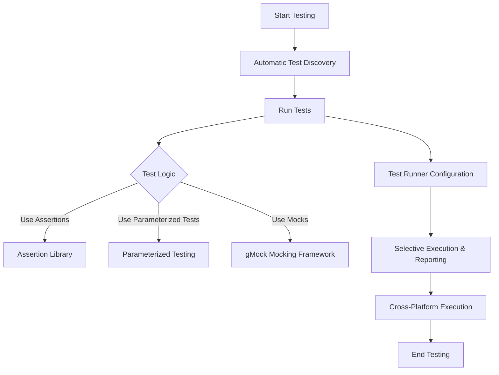

# Feature Quicklook

GoogleTest is a comprehensive C++ testing framework that provides a powerful set of features to help developers write, organize, run, and maintain high-quality tests efficiently. This quicklook surveys its major capabilities, offering a rapid overview of the features that enable automatic test discovery, assertions, parameterized testing, rich mocking, flexible runners, and cross-platform support.

---

## Automatic Test Discovery

GoogleTest automatically discovers tests in compiled binaries without manual registration. This eliminates the need for boilerplate code and lets developers focus on writing tests rather than managing test infrastructure.

- **Primary Benefit:** Streamlines test execution by automatically finding all tests in your codebase.
- **Common Use Case:** Running test suites after builds with minimal setup.

## Rich Assertion Library

GoogleTest features an extensive collection of assertion macros and mechanisms that provide expressive and precise validation within tests.

- **Primary Benefit:** Enables detailed verification of conditions, producing helpful diagnostics when failures occur.
- **Common Use Case:** Checking expected results, error conditions, and exception handling.

## Parameterized Testing

Support for parameterized and typed tests allows running the same test logic against multiple input values or types, enhancing test coverage with minimal duplication.

- **Primary Benefit:** Facilitates scalable testing for different data sets and type variations.
- **Common Use Case:** Validating algorithm correctness on diverse inputs without replicating test code.

## Rich Mocking Capabilities

GoogleTest integrates with gMock, a powerful mocking framework for C++. It enables the creation and use of mock classes to specify precise interactions, expectations, and behaviors.

- **Primary Benefit:** Allows verification of interactions, dependencies, and behaviors within components.
- **Common Use Case:** Testing modules with complex dependencies by mocking collaborators.

## Flexible Test Runners

GoogleTest provides configurable test runners that allow selective test execution, parameterized runs, parallel tests, and customizable reporting formats.

- **Primary Benefit:** Offers fine-grained control over test execution and output analysis.
- **Common Use Case:** Running subsets of tests during development or integrating tests in continuous integration pipelines.

## Cross-Platform Support

Designed to work across platforms and compilers, GoogleTest supports a wide range of operating systems, including Windows, macOS, and Linux.

- **Primary Benefit:** Enables consistent testing environments across diverse development setups.
- **Common Use Case:** Developing portable C++ code where tests can be executed on multiple OSes seamlessly.

---

## Summary Diagram: Feature Flow



This flowchart illustrates how GoogleTest’s features collaborate in a typical testing workflow.

---

## Practical Example: Simple Test with Mock

This snippet shows how GoogleTest’s features come together in a simple test scenario that uses gMock to create a mock object and set expectations.

```cpp
#include <gtest/gtest.h>
#include <gmock/gmock.h>

// Interface for a Widget.
class Widget {
 public:
  virtual ~Widget() = default;
  virtual int Compute(int x) const = 0;
};

// Mock class for Widget.
class MockWidget : public Widget {
 public:
  MOCK_METHOD(int, Compute, (int x), (const, override));
};

TEST(WidgetTest, ComputeReturnsExpectedValue) {
  MockWidget mock_widget;

  // Expect Compute to be called with argument 5, and return 10.
  EXPECT_CALL(mock_widget, Compute(5))
      .Times(1)
      .WillOnce(::testing::Return(10));

  int result = mock_widget.Compute(5);

  EXPECT_EQ(result, 10);
}
```

This test verifies that the `Compute` method behaves as expected when called with a specific argument, illustrating the declarative syntax of setting expectations and using return actions.

---

## Best Practices and Tips

- Use parameterized tests to cover multiple input scenarios without duplicating code.
- Define mock classes using the `MOCK_METHOD` macro to mock virtual methods easily.
- Prefer `ON_CALL` to set default behaviors and `EXPECT_CALL` to specify expectations that must be met.
- Use sequences (`InSequence`) or ordering clauses (`After`) to test call order when necessary.
- Control mock strictness using `NiceMock`, `NaggyMock`, or `StrictMock` to balance warning verbosity and test strictness.
- Leverage GoogleTest’s cross-platform support by writing portable test code.

---

## Troubleshooting Common Issues

- Ensure all mock methods you want to override are declared `virtual` in the base class.
- Use `const` and `override` qualifiers correctly for mocked methods, especially for overloaded and template methods.
- When receiving warnings about uninteresting calls, consider using `NiceMock` to suppress them or explicitly `EXPECT_CALL` with `Times(AnyNumber())` for non-critical methods.
- Use `--gmock_verbose=info` for detailed output during failure investigations.


---

This feature quicklook provides a fast orientation to the capabilities that make GoogleTest a versatile and powerful C++ testing framework, enabling high-impact test writing with minimal effort.


---

For detailed guidance, see the following documentation:

- [What is GoogleTest?](./overview/getting-started-with-googletest/what-is-googletest)
- [gMock for Dummies](./docs/gmock_for_dummies.md)
- [Mocking Reference](./docs/reference/mocking.md)
- [gMock Cookbook](./docs/gmock_cook_book.md)
- [gMock Cheat Sheet](./docs/gmock_cheat_sheet.md)

Explore the Core Concepts and Terminology for foundational understanding and the Guides section for comprehensive usage patterns.