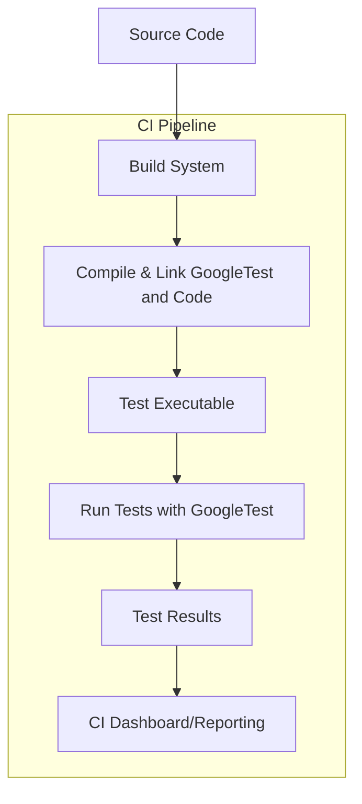

# Integrations & Ecosystem

GoogleTest is not just a standalone testing framework — it thrives within a rich ecosystem of build systems, continuous integration (CI) tools, third-party test runners, editors, and other C++ projects. This page introduces how GoogleTest fits into diverse development environments, ensuring seamless integration, extensibility, and productivity.

---

## Why Integrations Matter

Testing frameworks flourish when they plug smoothly into the tools developers use daily. GoogleTest recognizes this and provides:

- Broad compatibility with popular build systems.
- Support for CI workflows across different platforms and infrastructures.
- Extensible APIs that enable integrating with third-party runners and IDEs.
- Community-driven contributions enhancing and expanding its capabilities.

By integrating tightly with your existing toolchain, GoogleTest minimizes friction so you can focus on writing quality tests rather than configuring complex environments.

## Supported Build Systems

GoogleTest supports and works well with several major build systems, enabling easy compilation, linking, and test execution:

- **Bazel:** Google's own build system offers smooth integration and scaling for large codebases.
- **CMake:** Widely used and supported, CMake scripts are available for straightforward setup.
- **Make:** Traditional Makefiles continue to work well with GoogleTest.
- **Ninja:** For fast incremental builds, Ninja and GoogleTest are fully compatible.

### Example: Adding GoogleTest to a CMake project

```cmake
# Download and unpack googletest at configure time
configure_file(CMakeLists.txt.in googletest-download/CMakeLists.txt)
execute_process(
  COMMAND ${CMAKE_COMMAND} -G "${CMAKE_GENERATOR}" .
  RESULT_VARIABLE result
  WORKING_DIRECTORY ${CMAKE_BINARY_DIR}/googletest-download )
if(result)
  message(FATAL_ERROR "CMake step for googletest failed: ${result}")
endif()
execute_process(
  COMMAND ${CMAKE_COMMAND} --build .
  RESULT_VARIABLE result
  WORKING_DIRECTORY ${CMAKE_BINARY_DIR}/googletest-download )
if(result)
  message(FATAL_ERROR "Build step for googletest failed: ${result}")
endif()

# Add googletest to build
add_subdirectory(${CMAKE_BINARY_DIR}/googletest-src
                 ${CMAKE_BINARY_DIR}/googletest-build)

# Link your test executable with gtest
add_executable(runTests test_main.cpp)
target_link_libraries(runTests gtest gtest_main)
```

This setup lets you build and run GoogleTest-based tests efficiently within a modern C++ project.

## Continuous Integration and Automation

GoogleTest fits well within automated testing pipelines:

- Supports running tests from the command line, suitable for CI jobs.
- Provides rich reporting with XML and JSON output formats for integration with CI dashboards.
- Compatible with common CI/CD platforms such as Jenkins, GitHub Actions, GitLab CI, and more.

### Running GoogleTest in CI

To run tests and generate XML reports:

```shell
./runTests --gtest_output=xml:report.xml
```

Results in `report.xml` can be consumed by most CI systems for visual pass/fail breakdowns.

## Ecosystem of Tools

Developers surrounding GoogleTest have created tools and plugins to streamline testing workflows:

- **Test Runners:** Graphic and CLI runners that discover and execute tests, often providing enhanced UI, filtering, and debugging capabilities.
- **IDE Integration:** Plugins for popular C++ IDEs such as Visual Studio, CLion, and Eclipse to run tests, step through failures, and navigate test results inline.
- **Third-party Extensions:** Tools like code coverage analyzers, performance profilers, and advanced assertion libraries complement GoogleTest.

## How GoogleTest Integrates with C++ Projects

GoogleTest's design is flexible, allowing it to be adopted progressively:

- You can add GoogleTest to existing projects incrementally, writing tests around critical components.
- Mocking with gMock extends testability, with seamless integration into GoogleTest runs.
- Supports C++11 and newer standards, ensuring compatibility with modern codebases.

## Extensibility & Custom Integrations

For teams with custom needs, GoogleTest offers:

- APIs to build custom test runners or integrate test discovery into other systems.
- Hooks to extend or customize test filtering, parameterized tests, and reporting.
- Capacity to integrate with logging, tracing, and monitoring systems to enhance observability during tests.

## Practical Example: Integrating gMock in Your CI

1. **Include gMock:** Since gMock is bundled with GoogleTest, your build system should compile and link both.
2. **Write Mock Classes:** Use `MOCK_METHOD` macros (detailed in the [Mocking Reference](../reference/mocking.md)) to define mocks.
3. **Set Expectations:** Use `EXPECT_CALL` to define behaviors and call expectations within your tests.
4. **Execute Tests in CI:** Run your tests with `--gmock_verbose=info` for richer logs when debugging failures.

This approach ensures you catch integration issues early and maintain high test coverage reliably.

---

## Tips for Successful Integration

- **Use CI flags:** Take advantage of GoogleTest's flags, such as `--gtest_filter`, to selectively run subsets of tests.
- **Manage dependencies:** Keep GoogleTest as a third-party external dependency in your build system to ease upgrades.
- **Leverage community:** Explore third-party libraries and tools that enrich GoogleTest functionality without heavy custom work.

## Troubleshooting Integration Issues

- Verify you include all required GoogleTest headers and link against the compiled libraries.
- Ensure your build system passes the correct compiler definitions and flags that GoogleTest requires.
- Use the `--gtest_list_tests` flag to verify test discovery is working correctly.
- Consult the [Troubleshooting Common Issues](../../getting-started/troubleshooting-validation/troubleshooting-common-issues.md) documentation for environment-specific solutions.

---

## Diagram: GoogleTest Integration in a Typical CI Workflow



---

## Related Documentation

- [Getting Started with GoogleTest](../../overview/getting-started-with-googletest/what-is-googletest.md)
- [Mocking Reference](../reference/mocking.md)
- [Feature Quicklook](../../overview/core-architecture-and-concepts/feature-quicklook.md)
- [System Architecture Overview](../../overview/core-architecture-and-concepts/system-architecture-overview.md)
- [Troubleshooting Common Issues](../../getting-started/troubleshooting-validation/troubleshooting-common-issues.md)

---

## External Resources

- [GoogleTest GitHub Repository](https://github.com/google/googletest)
- [GoogleTest and gMock Documentation Home](https://google.github.io/googletest/)

---

## Next Steps

To get started with integrating GoogleTest in your project:

- Review build system guides relevant to your environment (e.g., CMake, Bazel).
- Explore the [Creating and Using Mock Objects](../guides/mocking-best-practices/creating-mocks.md) for advanced testing practices.
- Set up a basic CI job to run tests and report results.

Embrace the extensibility of GoogleTest to optimize testing workflows in your development lifecycle.
