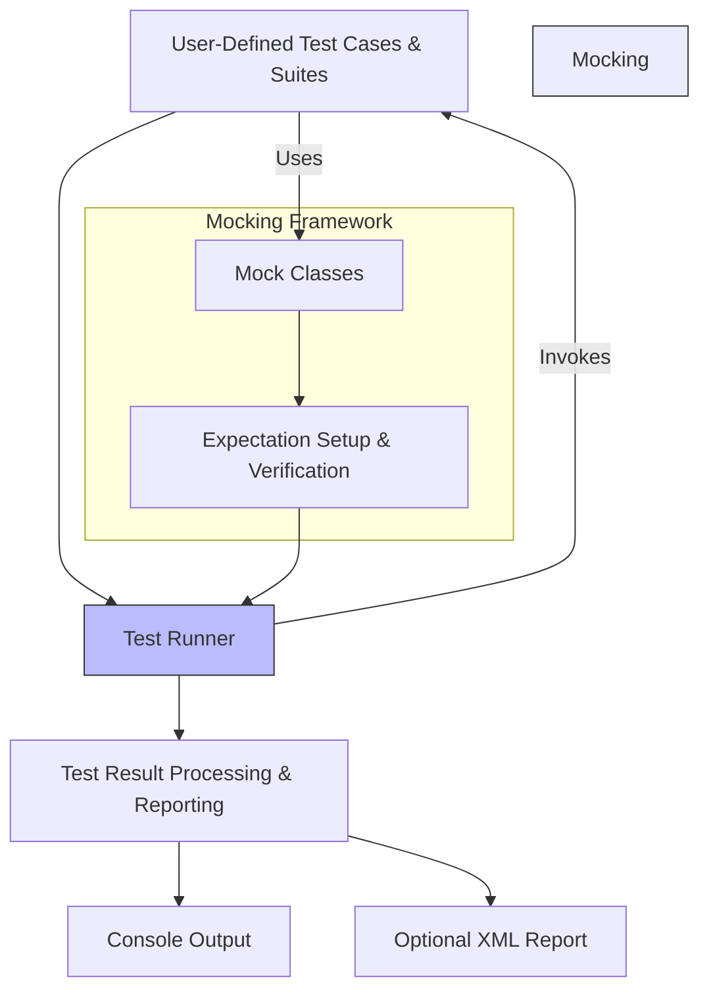

# System Architecture Overview

## Understanding GoogleTest's High-Level Architecture

Welcome to the System Architecture Overview of GoogleTest, Google's premier C++ testing and mocking framework. This document presents a clear, high-level view of the core components and workflows that drive GoogleTest, explaining how your tests, mock objects, and test runners collaborate to deliver a seamless and powerful testing experience.

Whether you're a developer writing your first test or integrating GoogleTest into a complex project, understanding this architecture will empower you to leverage the framework effectively and troubleshoot issues with confidence.

---

## Core Purpose of GoogleTest Architecture

GoogleTest is designed to support robust, isolated, and repeatable testing for C++ projects. To achieve this, the framework orchestrates multiple moving parts:

- **Test Cases and Test Suites** where users define the logic to verify correctness.
- **Test Runner** which discovers and executes tests, isolates their environment, and collects results.
- **Mocking Framework (gMock)** enabling simulation of dependencies and precise control over interactions.
- **Result Processing Pipeline** that accumulates and reports test outcomes.

This architecture ensures that your tests run reliably, results are clear, and integrating mocks is straightforward.

---

## Key Components and Their Roles

### 1. Test Cases & Test Suites

In GoogleTest, a test case consists of individual tests logically grouped into suites. Each test:

- Is a small, focused function that verifies one aspect of your code
- Runs independently with fresh fixture setup to guarantee isolation
- Uses assertions to confirm expected behavior

### 2. Test Runner

The test runner is the engine. It:

- Discovers all registered tests and test suites automatically, eliminating manual listing
- Manages setup and teardown sequences
- Runs tests one-by-one, capturing successes, failures, and any crashes
- Coordinates invocation of mock objects and manages verification of expectations

### 3. Mocking Framework (gMock)

Integrated tightly with GoogleTest, gMock lets you:

- Define mock classes using simple macros that generate test doubles
- Set detailed expectations on these mocks, such as call order, frequency, and argument constraints
- Control mock behaviors dynamically with actions like returning specified values or triggering side effects
- Verify interactions precisely, immediately reporting violations

This capability lets you isolate the unit under test from dependencies, test failure scenarios reliably, and design cleaner interfaces.

### 4. Test Result Processing

After execution,

- Test outcomes (pass/fail, skips, errors) are collected
- Aggregate statistics (counts, durations) are maintained
- Detailed failure messages and logs are prepared
- Results can be output to console or XML reports for CI/CD integration

The framework supports extensions through listeners for custom reporting and integration.

---

## How Do These Components Interact? A Typical Workflow

Imagine you're running your test program:

1. **Initialization:** GoogleTest initializes, parsing command-line flags and registering all tests.
2. **Discovery:** The test runner identifies all test suites and their tests.
3. **Test Execution Loop:** For each test:
   - The framework creates a fresh test fixture instance.
   - Runs the test body.
   - Executes any mocks, verifying expectation satisfaction in real time.
   - Records results and logs.
4. **Aggregated Reporting:** All results are summarized and output.

Throughout this flow, your mock objects work seamlessly as substitutes for dependencies, controlled by expectations set before execution.

---

## Visual Diagram of GoogleTest Architecture



---

## Practical Example: Running a Test with Mocks

Suppose you are testing a class `Painter` which draws shapes using a `Turtle` interface. Your test workflow with GoogleTest:

- You define `MockTurtle` inheriting from `Turtle` with mocked methods generated using `MOCK_METHOD` macros.
- In your test, you create a `MockTurtle` instance.
- Using `EXPECT_CALL`, you specify how many times and with what parameters `PenDown()` must be called.
- You pass the mock to `Painter` and invoke `DrawCircle`.
- GoogleTest runs the test, checking the calls to `MockTurtle` against expectations.
- Results are reported immediately if calls are missing or parameters are incorrect.

This interaction is orchestrated by the test runner and mocking framework working in tandem to provide instant feedback.

---

## Tips for Success

- **Write Isolated Tests:** Make each test independent to leverage GoogleTest's fixture isolation.
- **Set Expectations Before Execution:** Define all `EXPECT_CALL` statements before exercising mocks to avoid undefined behaviors.
- **Use Sequences for Call Ordering:** When specific call order matters, encapsulate expectations within `InSequence` to enforce it.
- **Leverage Default Actions:** Use `ON_CALL` to specify default mock behaviors for clean and flexible tests.

---

## Troubleshooting Common Architecture-Related Issues

<AccordionGroup title="Troubleshooting & Tips">  
<Accordion title="Test Not Being Discovered">If your tests are not discovered by the runner, ensure your test cases are defined using supported macros like `TEST()` or `TEST_F()` and that registration happens before `RUN_ALL_TESTS()` is called.</Accordion>  
<Accordion title="Mocks Not Verifying Expectations">Verify that all your expectations (`EXPECT_CALL`) are set up before running code that triggers mock calls, as late setup results in undefined behavior.</Accordion>  
<Accordion title="Unexpected Test Failures Due to Ordering">Use `InSequence` or `Sequence` objects to enforce call ordering if test failures point to unexpected call sequences.</Accordion>  
<Accordion title="Test Results Not Displayed as Expected">Check that no custom listeners are suppressing output and that your environment supports console or XML output integrations.</Accordion>
</AccordionGroup>

---

## Next Steps

Now that you understand GoogleTest’s system architecture, you are well prepared to dive into more specific topics:

- For practical coding, see [Writing & Running Your First Test](/getting-started/project-setup-first-run/writing-running-first-test)
- Explore [Mocking Framework](https://google.github.io/googletest/gmock_for_dummies.html) to harness mocks power
- Dive into test discovery and execution workflow in [Test Discovery & Execution Flow](/concepts/core-architecture/test-discovery-execution)

This architectural insight ensures you understand the "why" and "how" behind GoogleTest’s smooth operation, positioning you to master its full capabilities.

---

**Happy testing!**

---

<!-- Navigation Map Reference -->
*This page is part of the **Core Architecture & Concepts** section within the Overview tab.*

---

**Related Documentation:**
- [What is GoogleTest?](/overview/getting-started-with-googletest/what-is-googletest)
- [Product Value & Key Features](/overview/getting-started-with-googletest/value-proposition-and-key-features)
- [Writing & Running Your First Test](/getting-started/project-setup-first-run/writing-running-first-test)
- [Mocking Best Practices](guides/mocking-best-practices/creating-mocks)
- [Test Discovery & Execution Flow](/concepts/core-architecture/test-discovery-execution)

---

**Useful External Resources:**
- [GoogleTest Official GitHub Repository](https://github.com/google/googletest)
- [gMock for Dummies](https://google.github.io/googletest/gmock_for_dummies.html)
- [Mocking Cookbook](https://google.github.io/googletest/gmock_cook_book.html)

---

**Source Code Reference:**
```cpp
#include <gmock/gmock.h>
#include <gtest/gtest.h>

int main(int argc, char** argv) {
  testing::InitGoogleMock(&argc, argv);  // Initializes GoogleMock & GoogleTest
  return RUN_ALL_TESTS();                // Runs all registered tests
}
```

<System Architecture 'main' entry point from `googlemock/src/gmock_main.cc`>
