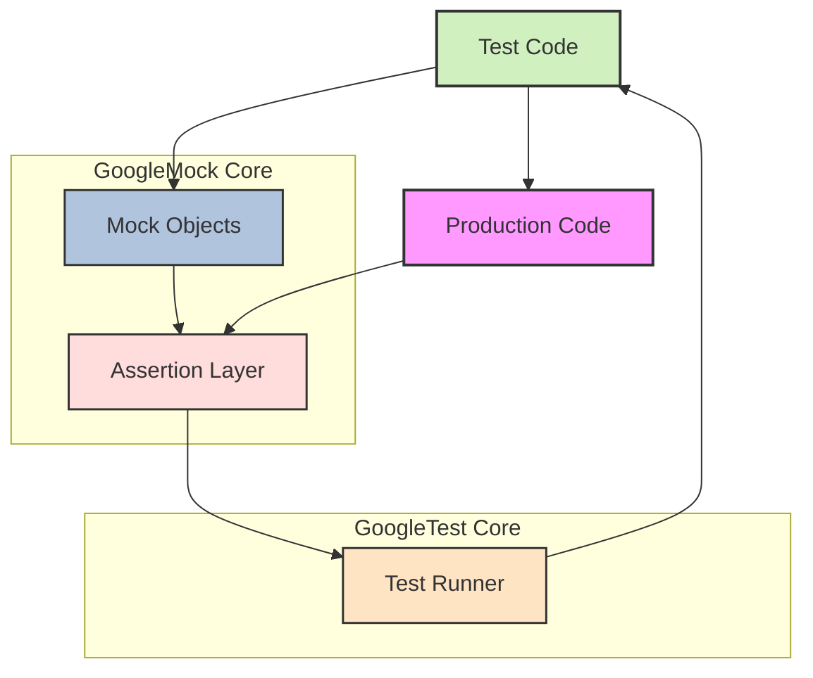

# System Architecture Overview

## Understanding the High-Level Structure of GoogleTest and GoogleMock

This chapter provides a comprehensive illustration of the high-level architecture of GoogleTest and GoogleMock. Whether you are new to this powerful testing framework or looking to deepen your understanding, this overview clarifies how core components interact to support effective unit testing in C++.

---

### What Is This Page About?

This page visualizes and explains the principal building blocks that compose GoogleTest and GoogleMock and highlights their relationship. You'll discover the flow between your test code, mock components, assertion layers, and test runners, all integrated to deliver seamless, robust test executions.

---

### Core Architecture

GoogleTest and GoogleMock work collaboratively to provide expressive and verifiable testing capabilities for C++ codebases. At a high level, the system architecture can be viewed as the interplay between several key components:

- **Test Code:** Your actual C++ test cases, written with GoogleTest macros and gMock expectations.
- **Mock Objects:** Simulated versions of dependencies created via GoogleMock, enabling interaction-based tests.
- **Assertion Layer:** Validates the outcomes and expectations encoded in your tests.
- **Test Runner:** The engine that discovers, executes, and reports results on your tests.

The flow begins with your test code making calls to mocks or real production code, assertions evaluate those interactions and results, and the test runner organizes the execution while presenting clear output.


### Component Details & Interaction Flow

| Component       | Role                                   | Benefits to User                      |
|-----------------|--------------------------------------|-------------------------------------|
| Test Code       | Defines test cases and mock setups   | Enables focused, maintainable tests |
| Mock Objects    | Substitute dependencies with controllable behavior | Isolate components under test, enable verification of interactions |
| Assertion Layer | Validates whether tests pass or fail | Provides clear feedback on correctness |
| Test Runner     | Manages test discovery and execution | Simplifies running tests and analyzing results |


### Visual Overview




### How It Works Together — User Flow

1. **Writing Tests:** You write test cases using GoogleTest macros (`TEST`, `TEST_F`) and create mock objects with GoogleMock.

2. **Setting Expectations:** Mocks have method expectations (`EXPECT_CALL`) set, defining how they should be called.

3. **Test Execution:** The test runner finds tests and executes them. It directs calls to real or mock objects.

4. **Verification:** Mock method calls are verified at runtime and on test teardown, ensuring expectations are met.

5. **Result Reporting:** Assertion outcomes, including failures or successes, are communicated through the test runner.


### Practical Example

Suppose you're testing a class `UserManager` that depends on an `EmailService`. You create a mock `MockEmailService` and set expectations like:

```cpp
EXPECT_CALL(mock_email_service, SendEmail(_, _)).Times(1);
```

When `UserManager` executes your test scenario, its calls to `EmailService` actually invoke the mock object. GoogleMock verifies the calls happened as expected. GoogleTest’s assertion layer evaluates the test success, and the test runner reports the result.

---

### Key Benefits of This Architecture

- **Separation of Concerns:** Cleanly separates test code, mocks, assertions, and execution control.
- **Enhanced Test Control:** Allows fine-grained control over mock behavior and precise verification.
- **Extensibility:** The modular components make it easy to extend mocking and testing capabilities.
- **Robust Feedback:** Clear error reporting aids rapid identification of issues.

---

### Tips for Working with GoogleTest and GoogleMock Architecture

- Always define mocks for interfaces or abstract classes and use `MOCK_METHOD` macros in public section.
- Set expectations early with `EXPECT_CALL` before exercising tested code to avoid undefined behaviors.
- Use sequences (`InSequence`) or `After` clauses to enforce ordering in complex interactions.
- Combine GoogleTest assertions with GoogleMock expectations for comprehensive test coverage.
- Leverage `NiceMock`, `StrictMock`, and `NaggyMock` wrappers to control warning verbosity about uninteresting calls.

---

### Troubleshooting Common Architecture Issues

- **Mock Methods Not Called:** Ensure expectations are set before invocation and mock methods are declared `virtual`.
- **Unexpected Calls on Mocks:** Check if `EXPECT_CALL` matchers accurately reflect argument expectations.
- **Test Runner Can't Discover Tests:** Verify correct use of GoogleTest test macros and that links are set up properly.

---

### Next Steps

Proceed to explore the [Core Concepts & Terminology](/overview/core-architecture-concepts/core-concepts-terminology) page to deepen your understanding of unit testing principles and terminology used throughout GoogleTest and GoogleMock.

For practical usage, visit the [Getting Started & Next Steps](/overview/integration-getting-started/getting-started-next-steps) to begin writing and running your first tests.

Additionally, check out the [gMock Cookbook](https://google.github.io/googletest/gmock_cook_book.html) for detailed examples and recipes on mock usage.

---

## Summary
- This page provides a high-level architectural overview of how GoogleTest and GoogleMock interact to enable effective C++ testing.
- It covers the primary building blocks — Test Code, Mock Objects, Assertion Layer, and Test Runner — and explains their interplay.
- Visual Mermaid diagram illustrates the flow between components.
- Emphasizes user workflow for writing tests, setting expectations, execution, and verification.
- Offers practical tips, common troubleshooting advice, and pointers to related documentation.

---

## References
- [gMock Cookbook](https://google.github.io/googletest/gmock_cook_book.html)
- [Core Concepts & Terminology](/overview/core-architecture-concepts/core-concepts-terminology)
- [Getting Started & Next Steps](/overview/integration-getting-started/getting-started-next-steps)
- [Mocking Reference](https://google.github.io/googletest/reference/mocking.html)

---

For full details and additional context, consult the other chapters in the GoogleTest documentation suite.