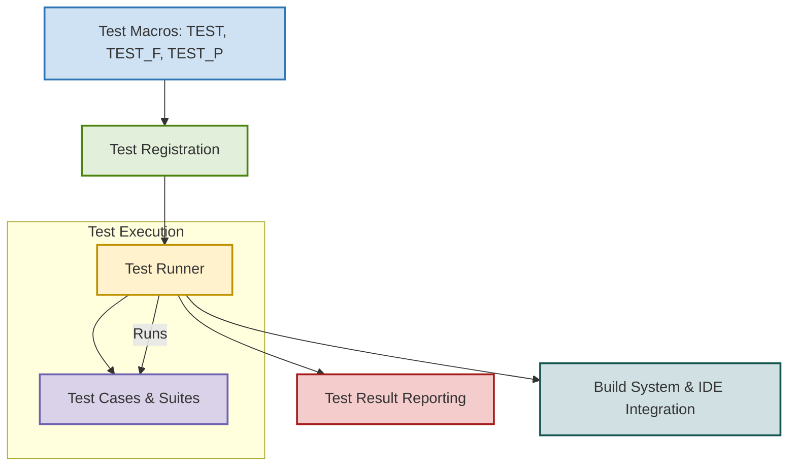

# System Architecture

## Overview

The System Architecture page provides a clear understanding of how GoogleTest structures, discovers, and executes tests. This foundational knowledge helps users appreciate the seamless integration of GoogleTest into their C++ development workflows and how tests interact internally during execution.

## Core Purpose

GoogleTest is designed to organize and run tests efficiently in C++ projects. This page details the components involved—from test macros that users write, through the test runners that schedule and execute these tests, to how GoogleTest integrates with build workflows and environments.

Understanding this architecture is crucial for anyone who wants to write reliable tests, troubleshoot test execution issues, or customize their integration for CI/CD pipelines.

---

## Key Components and Workflow

At its core, GoogleTest involves several key components working together:

- **Test Macros:** These are user-facing macros such as `TEST` and `TEST_F` which define test cases and test fixtures.
- **Test Runner:** The engine that discovers all tests registered via macros and orchestrates their execution.
- **Test Cases and Suites:** Logical groupings of tests that allow for organization and selective running.
- **Integration Hooks:** Interfaces and mechanisms that enable GoogleTest to work seamlessly with build tools, IDEs, and continuous integration systems.

The typical test execution flow is:

1. **Test Registration:** When the test binary starts, all registered tests from macros are collected.
2. **Test Discovery:** The test runner identifies available tests, their grouping, and metadata.
3. **Test Execution:** Tests are run sequentially (or in parallel as configured), respecting any dependencies or order constraints.
4. **Reporting:** After execution, results are compiled and reported in formats compatible with CI tools or for human consumption.

---

## Visual Architecture Diagram

*This diagram illustrates the linear but modular flow from test definitions in source code to discovery, execution by the test runner, and finally to reporting and integration.*

---

## Real-World Scenario: Running Your First Test

Imagine you have written a basic test using the `TEST` macro. Here's what happens:

1. The test macro registers the test during static initialization of your test binary.
2. When you run the test executable, the test runner gathers all registered tests, including yours.
3. The runner executes your test within the organized test case.
4. Results are printed on the terminal or reported back to your IDE.

This process is fully automated, letting you focus on test logic rather than test management.

---

## Integration with C++ Build Workflows

GoogleTest is designed to fit nicely into your existing C++ build and development process:

- **Test discovery happens at runtime, no build-time code generation is needed.**
- **Test runners can be invoked via command line or IDE actions.**
- **GoogleTest supports parallel test execution and filtering via command-line flags, aiding integration with CI/CD pipelines.**

This ensures that whether you use CMake, Bazel, or plain Makefiles, you can run tests in a manner that suits your environment.

---

## Practical Tips and Best Practices

- Always include descriptive names in your test macros so that discovery and reporting are meaningful.
- Familiarize yourself with test filtering options (`--gtest_filter`) to target specific tests.
- Use test fixtures (`TEST_F`) to group related tests and share setup/teardown logic.
- For large test suites, consider organizing tests into suites logically reflecting your code base.
- Leverage verbose output (`--gtest_verbose`) in CI to better diagnose test failures.

---

## Troubleshooting Common Issues

- If tests are not discovered, verify that the test macros are correctly used and linked.
- Unexpected test execution order? Use `InSequence` and other ordering features if needed (see mocking docs).
- Integration problems with IDE or build system usually arise from misconfiguration—ensure test binaries are built with GoogleTest and linked properly.

---

## Next Steps

- To start writing tests, visit [GoogleTest Primer](https://google.github.io/googletest/primer.html) and [Writing Your First Test](https://google.github.io/googletest/gtest-getting-started.html).
- For details on mocking, see [Mocking with GoogleMock](https://google.github.io/googletest/gmock_for_dummies.html) and the relevant cookbook.
- Explore [Running and Configuring Tests](https://google.github.io/googletest/api/gtest_core.html#running-and-configuring-tests) for fine-tuning test execution.

<Source url="https://github.com/google/googletest" paths={[{"path": "googlemock/test/gmock-nice-strict_test.cc", "range": "1-632"},{"path": "googlemock/test/gmock-spec-builders_test.cc", "range": "1-637"}]} />
