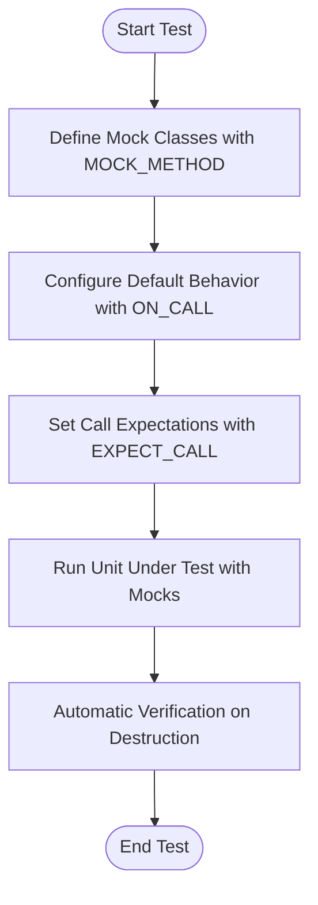

# Fundamental Concepts and Key Terminology

Understanding the foundational concepts and terminology of GoogleTest and GoogleMock is essential for effective testing in C++. This page defines the core terms—tests, test cases, fixtures, assertions, expectations, matchers, mocks, and actions—and explains their roles within the testing workflow. If you're new or need a refresher on how these concepts map to your tests and mocks, this guide will help you build a solid foundation.

---

## What Are Tests, Test Cases, and Fixtures?

- **Test**: The smallest unit of verification, representing a single scenario or condition you want to verify. A test consists of setup, execution, and verification steps.

- **Test Case (or Test Suite)**: A collection of tests grouped together logically, typically based on the code or functionality they cover.

- **Test Fixture**: A class that sets up the common environment or context for a set of tests. It defines shared data and setup/teardown procedures, letting you write concise and focused tests that reuse this environment.

Together, these concepts help organize your tests to be maintainable, reusable, and clear in intent.

## Assertions: Verifying Conditions

In GoogleTest, **assertions** check for conditions in your tested code. For example, you might assert that a function returns the expected value, or that an object is in a particular state.

- Assertions report failures when conditions are unmet, immediately alerting you to problems.
- They encapsulate logic like `EXPECT_EQ()`, `ASSERT_TRUE()`, and many more.

They serve the critical role of confirming that your code behaves correctly.

## Expectations: Defining Mock Behavior

GoogleMock introduces **expectations** on mock objects: you specify which calls are expected to occur, with what arguments, how many times, and in which order when necessary.

An expectation combines:
- The **method** you expect to be called.
- The **arguments** it should receive, defined by matchers.
- The **cardinality** or number of times it should be called.
- Optional **ordering constraints** via sequences or dependencies.
- The **actions** it should perform when invoked.

Expectations are declared using the `EXPECT_CALL()` macro and are verified automatically when mocks are destructed or can be manually verified.

## Matchers: Filtering Calls by Arguments

Matchers specify the conditions that function arguments must satisfy to match an expectation.

- The wildcard matcher `_` means "accept any value".
- You can use built-in matchers like `Eq()`, `Ge()`, or composite matchers like `AllOf()` and `AnyOf()`.
- Matchers can also inspect multiple arguments together using `.With()` and multi-argument matchers.

Matchers let you precisely control which calls your expectations apply to, ensuring tests check relevant interactions without over-specifying.

## Mocks: Test Doubles for Virtual Interfaces

A **mock** is a fake object that mimics the interface of real production objects but allows you to specify and verify interactions explicitly.

- You define mock classes with the `MOCK_METHOD` macro, which generates mocked methods.
- Mock objects support default behaviors (`ON_CALL`) and expectations (`EXPECT_CALL`).
- The mock methods track calls, verify expectations, and perform the specified actions.

By replacing dependencies with mocks, you isolate units under test and verify their collaborations precisely.

## Actions: Specifying Mock Method Behavior

Actions describe what a mock method should do when invoked.

- Common actions include returning values (`Return()`), invoking callbacks (`Invoke()`), or setting output arguments (`SetArgPointee()`).
- Actions are specified with `.WillOnce()` (for individual calls) and `.WillRepeatedly()` (for all subsequent calls).
- The default behavior is typically returning default-constructed values or zero equivalents.

Actions empower you to control mock method behavior dynamically and simulate diverse scenarios.

---

## How These Concepts Fit Together in the Workflow

1. **Define Mocks:** Use `MOCK_METHOD` to create mock classes that mirror your dependencies' interfaces.

2. **Set Default Behaviors:** Use `ON_CALL` to specify how mocks behave by default when their methods are called.

3. **Set Expectations:** Use `EXPECT_CALL` to define expectations on calls made to mock methods, including argument matchers, call count, call order, and actions.

4. **Run Tests:** Your test exercises the unit under test with mocks injected.

5. **Verification:** GoogleMock automatically verifies expectations when mocks are destroyed (or manually via `Mock::VerifyAndClearExpectations`).

This flow lets you write tests that verify both state (via assertions) and interactions (via expectations).

---

## Practical Example

Suppose you have a `Turtle` interface:

```cpp
class Turtle {
  virtual ~Turtle() {}
  virtual void PenDown() = 0;
  virtual void Forward(int distance) = 0;
};
```

You define a mock:

```cpp
#include <gmock/gmock.h>

class MockTurtle : public Turtle {
 public:
  MOCK_METHOD(void, PenDown, (), (override));
  MOCK_METHOD(void, Forward, (int distance), (override));
};
```

In a test, you set an expectation:

```cpp
using ::testing::AtLeast;

TEST(PaintingTest, DrawsLine) {
  MockTurtle turtle;
  EXPECT_CALL(turtle, PenDown()).Times(AtLeast(1));
  EXPECT_CALL(turtle, Forward(100));

  Painter painter(&turtle);
  EXPECT_TRUE(painter.DrawLine());
}
```

- You expect `PenDown()` to be called at least once.
- You expect `Forward(100)` once.
- If these aren't met, the test will fail immediately.

---

## Where to Learn More

- See the [EXPECT_CALL reference](../api-reference/mocking-framework/expectations-and-cardinality.md) for detailed syntax and modifiers.
- Learn about [matchers](../reference/matchers.md) to specify argument expectations.
- Explore [actions](../reference/actions.md) for controlling mock behavior.
- Understand the distinctions and correct usage between `ON_CALL` and `EXPECT_CALL` in the [gMock for Dummies](https://google.github.io/googletest/gmock_for_dummies.html).

---

## Key API & Headers

- All these concepts are primarily declared within `#include <gmock/gmock.h>`.
- For expectation and spec builders, see `gmock-spec-builders.h`.

Reviewing these APIs aids in writing advanced and precise mocks.

---

If you are new, start with setting simple expectations and use _matchers_ liberally to avoid brittle tests. As you grow more comfortable, explore sequences for ordered calls, multi-argument matchers, and custom actions for deeper control.

---

For the full testing workflow, see [How GoogleTest Works: Architecture Overview](/overview/core-architecture-concepts/architecture-diagram) and [Feature Highlights](/overview/core-architecture-concepts/feature-overview).


<Info>
Remember: Set expectations before exercising your mocks to ensure that violations report precise failure locations and easier debugging.
</Info>

---

### Summary Diagram: Conceptual Workflow



This linear flow demonstrates the central role these concepts play in your typical test cycle.

---

By mastering these fundamental concepts and terminology, you will be well positioned to leverage GoogleTest and GoogleMock effectively for reliable, maintainable, and robust C++ testing.

---

> For detailed syntax and usage examples, please explore the [Mocking Reference](../reference/mocking.md) and the [gMock Cookbook](../guides/mocking-techniques/intro-to-mocking.md).

---

## Troubleshooting & Tips

<AccordionGroup title="Common User Questions and Pitfalls">
<Accordion title="Why do newer EXPECT_CALL overrides shadow older ones?">
GoogleMock searches expectations in reverse order to allow setting broad defaults first, then more specific overrides. To avoid surprises, order expectations accordingly.
</Accordion>
<Accordion title="What if I get 'Uninteresting call' warnings?">
Use NiceMock to suppress warnings on calls without explicit expectations, or add catch-all EXPECT_CALLs with `Times(AnyNumber())`.
</Accordion>
<Accordion title="How to specify call order?">
Use `InSequence` objects or the `.After()` clause on expectations to enforce strict or partial call orders.
</Accordion>
<Accordion title="Can I mock non-virtual methods?">
Not directly. You can mock free functions by wrapping them in interfaces, or use `MockFunction` for std::function types.
</Accordion>
</AccordionGroup>


---