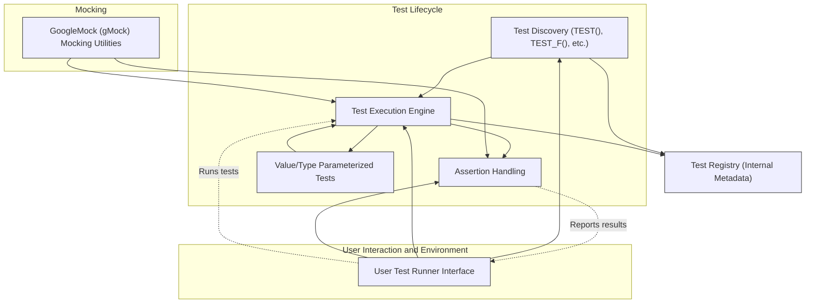

# System Architecture

Understand the high-level structure of GoogleTest, focusing on its core engine, test discovery process, assertion handling, value and type parameterization, and GoogleMock's mocking utilities. This overview connects the key modules, their relationships, and data flows, offering a concise map of how the components interact to deliver a robust C++ testing and mocking framework.

---

## Overview

GoogleTest is a comprehensive framework designed to help C++ developers write reliable, expressive, and maintainable tests. At its core lies a modular engine that manages test discovery, execution, assertion evaluation, and advanced features like value- and type-parameterized tests. GoogleMock (gMock) extends this core by enabling developers to create mock classes and verify interactions, seamlessly integrating mocking capabilities.

This page illustrates how these components fit together, enabling users to grasp the system's organization and data flow at a glance.

## Core Components & Workflow

### Test Discovery

GoogleTest automatically detects test cases and test fixtures, scanning for test macros such as `TEST()`, `TEST_F()`, and parameterized variants. This dynamic discovery frees developers from manual registration, enabling scalable test suites.

### Execution Engine

Once discovered, the framework schedules tests for execution, handling setup and teardown for each test or test suite. It manages control flow, isolates test environments, and aggregates results to provide comprehensive summaries.

### Assertion Handling

GoogleTest offers a rich suite of assertions, automatically capturing detailed failure information, including file names, line numbers, and comparison results. This engine supports simple assertions (`EXPECT_EQ`) through complex predicates and matcher-based checks from GoogleMock.

### Parameterization

Support for value- and type-parameterized tests lets users write flexible test templates that run across various data inputs and types. This promotes code reuse and ensures broad coverage with minimal duplication.

### GoogleMock Integration

GoogleMock (gMock) builds on top of GoogleTest's engine. It allows defining mock classes with declarative syntax, supporting creation, expectations, and automatic verification of mocks. It handles complex mocking scenarios including overloaded, templated, and partial mocks, all integrated into the testing lifecycle.

## Relationship and Data Flow Diagram

This diagram reflects how test discovery feeds the execution engine, which relies on assertion handling and supports parameterized tests. GoogleMock integrates tightly with the execution and assertion systems, enhancing the testing capabilities with flexible mocking.

## How GoogleTest Components Collaborate

- **Test Discovery** identifies all test cases automatically by scanning code definitions at runtime, eliminating manual bookkeeping.
- **Test Execution Engine** orchestrates how tests run, managing lifecycle events, environment setup, and teardown to isolate tests and collect results.
- **Assertion Handling** intercepts test-check failures, providing detailed diagnostic outputs that accelerate debugging.
- **Value/Type Parameterization** offers templates for tests to run using multiple data types or values seamlessly.
- **GoogleMock** extends the framework with mocking utilities, working in concert with the core engine to enable interaction verification.

## User Value & Scenarios

For users, this architecture means:

- Easy, automatic discoverability of tests, so writing more tests is hassle-free.
- Reliable test isolation and reporting, enabling rapid identification of failures.
- Powerful support for a variety of testing styles, including data-driven and interface-based testing.
- Full integration of mocking tools without switching frameworks or breaking test flow.

Imagine developing a feature where you need to verify edge cases with multiple input types while mocking out dependencies. GoogleTest’s architecture enables this outcome naturally, with clear separation of concerns and seamless integration.

## Tips for Navigating & Using this Architecture

- Begin writing tests using simple `TEST` macros and run them immediately; rely on automatic discovery.
- Use parameterized tests to reduce duplication and increase coverage.
- Apply GoogleMock's mocking utilities to isolate dependencies effectively.
- Observe assertion outputs closely; they are enriched by GoogleTest’s assertion handling engine.
- Leverage ordering, sequencing, and mock expectations to test interaction-heavy components reliably.

## Troubleshooting Common Issues

- **Tests Not Discovered:** Ensure `TEST()` macros are correctly used and linked; check test binary initialization.
- **Unexpected Assertion Failures:** Review detailed assertion messages; verify correctness of matcher expressions.
- **Mock Expectations Not Met:** Confirm expectations are set before exercising the code; understand the difference between `ON_CALL` and `EXPECT_CALL`.

Refer to the related guides for detailed patterns and troubleshooting.

## Next Steps

- Explore the [Feature Overview](/overview/core-architecture-features/feature-quicklook) to understand fine-grained functionality.
- Dive into [Mocking Reference](/api-reference/mocking-apis/expectations-actions) to master mocking capabilities.
- Get started with [Writing and Running Your First Test](/getting-started/first-test-experience/create-run-first-test).

---

<Info>
This page focuses exclusively on GoogleTest’s system architecture. For practical examples and detailed API guidance, consult the related documentation on mock creation, assertion usage, and parameterized testing.
</Info>
