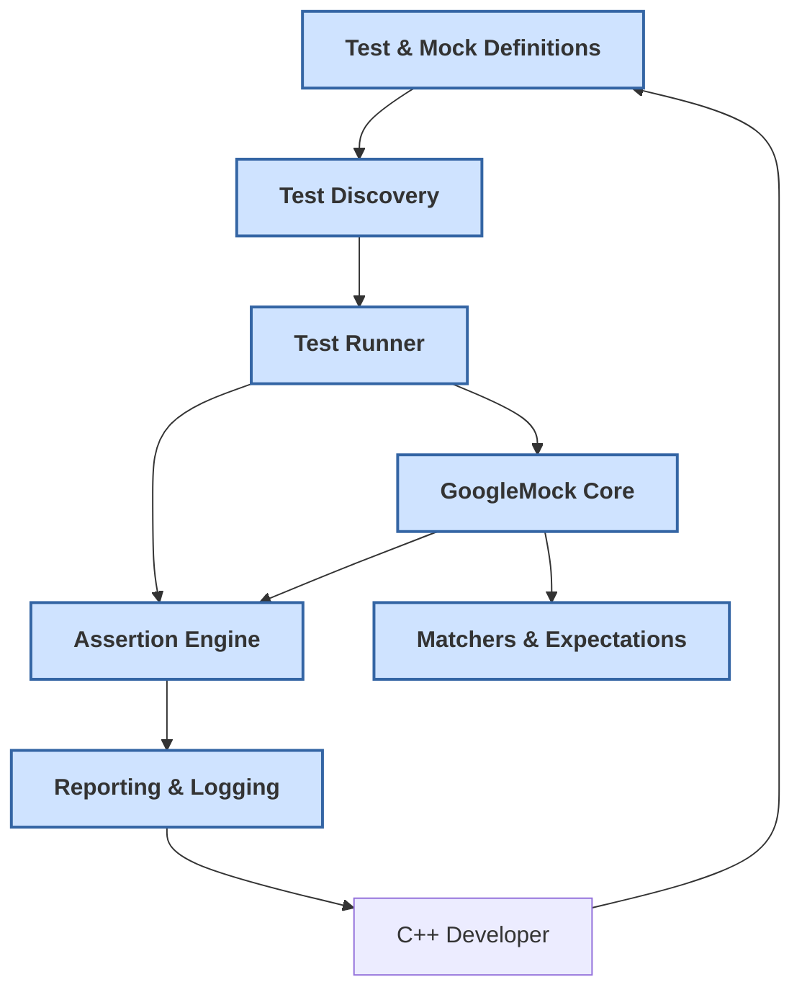

# How Does GoogleTest Work? (Architecture Diagram)

## Visualizing the Architecture of GoogleTest and GoogleMock

Understanding how GoogleTest and GoogleMock operate within your C++ development workflow is key to maximizing their effectiveness. This documentation page provides a clear visualization of the architecture that power these robust frameworks. By seeing how test and mock definitions flow through to execution, where components like test discovery and the test runner fit in, and how assertions, matches, and reporting are delivered, you’ll gain valuable insights to better integrate GoogleTest into your projects.

---

### Core Components in the GoogleTest Architecture

- **Test Definitions**: Your source test files define test cases using the expressive GoogleTest syntax. These include both standard tests and mocks defined via GoogleMock.

- **Test Discovery**: The framework automatically discovers all defined tests through macros and internal registries, eliminating manual test listing.

- **Test Runner**: This component orchestrates test execution, runs each test case and suite, applies configured filters, and controls execution flow.

- **Assertion Engine**: At the heart of verification, the assertion engine evaluates test expectations, conditions, and reports pass/fail outcomes.

- **GoogleMock Core**: The mocking subsystem enables defining mock classes, setting expectations, matching arguments, and verifying interactions with mocks.

- **Matchers and Expectations**: These components analyze method call arguments against complex criteria and organize expected call sequences.

- **Reporting and Logging**: Test results, failures, and status are collected and formatted into readable output for developers.

### How These Components Interact

1. **Writing Tests and Mocks**: You author test cases and mock classes in your code by leveraging the GoogleTest and GoogleMock APIs.

2. **Compilation and Linking**: Your test files link with GoogleTest and GoogleMock libraries, ensuring integration of all framework features.

3. **Run-time Test Discovery**: When you execute the test binary, GoogleTest auto-discovers all registered tests.

4. **Test Execution Control**: The test runner invokes each test, supporting filtering, sharding, parameterization, and parallelism as applicable.

5. **Mock Interaction Verification**: During test execution, GoogleMock intercepts calls to mock objects, checks argument matchers, enforces expectations, and triggers failures immediately if violated.

6. **Assertions and Result Reporting**: Test assertions are evaluated; results are gathered and reported with context such as stack traces and failure messages.

7. **Test Completion and Summary**: Once all tests have run, a summary of total tests run, passed, failed, and skipped is displayed.

---

### Typical User Workflow Illustrated

Imagine a C++ developer working on a module that has external dependencies. Using GoogleTest, they define unit tests, while GoogleMock helps simulate interactions with these dependencies precisely and reliably.

This developer writes both test cases and mock classes. On running their test executable, GoogleTest discovers and runs all the cases. GoogleMock checks that mocked method calls match expectations strictly, notifying the developer if anything is amiss.

This seamless flow ensures bugs are caught early, code behavior is thoroughly validated, and test maintenance is streamlined.

---

### Architecture Diagram

---

### Practical Tips

- **Keep Test Definitions Simple and Focused**: Structure tests clearly so discovery and execution flow smoothly.
- **Use Mocks to Isolate Dependencies**: Rely on GoogleMock's features to simulate external components effectively.
- **Observe Assertion Failures Immediately**: GoogleMock halts at the first expectation violation to streamline debugging.
- **Leverage Automatic Test Discovery**: Avoid manual test management; the framework handles this robustly.
- **Analyze Test Reports for Insights**: Failure reports include detailed info to pinpoint issues.

---

### Troubleshooting Common Issues

- **Tests Not Discovered?** Verify that test macros are used correctly and files are compiled and linked properly.
- **Mock Expectations Not Met?** Use `--gmock_verbose=info` runtime flag to trace mock calls and understand mismatches.
- **Unexpected Calls Warning?** Confirm if the calls were expected or add appropriate `EXPECT_CALL` or use `NiceMock` if ignoring uninteresting calls is intentional.
- **Build / Linking Errors?** Check your build environment aligns with GoogleTest’s C++17 requirement and that GoogleMock is included as needed.

---

### Getting Started Preview

To begin using GoogleTest and GoogleMock:

- Define your test cases and mocks using `TEST()`, `TEST_F()`, and `MOCK_METHOD`. (See [Writing and Running Your First Test](../getting-started/first-test-debugging/writing-running-first-test))
- Compile your test code linking against GoogleTest and GoogleMock.
- Run your tests and view reports; troubleshoot as needed.
- Dive deeper into concepts like matchers, actions, and sequences to craft powerful tests.

Explore related pages for installation details, core concepts, and extended guidance.

---

For the detailed API reference and step-by-step guides, see the [GoogleTest API Reference](../api-reference/core-apis/gtest-core-api) and [GoogleMock Mocking API](../api-reference/core-apis/gmock-mocking-api).

Thank you for choosing GoogleTest to make your C++ testing resilient, maintainable, and automated.
