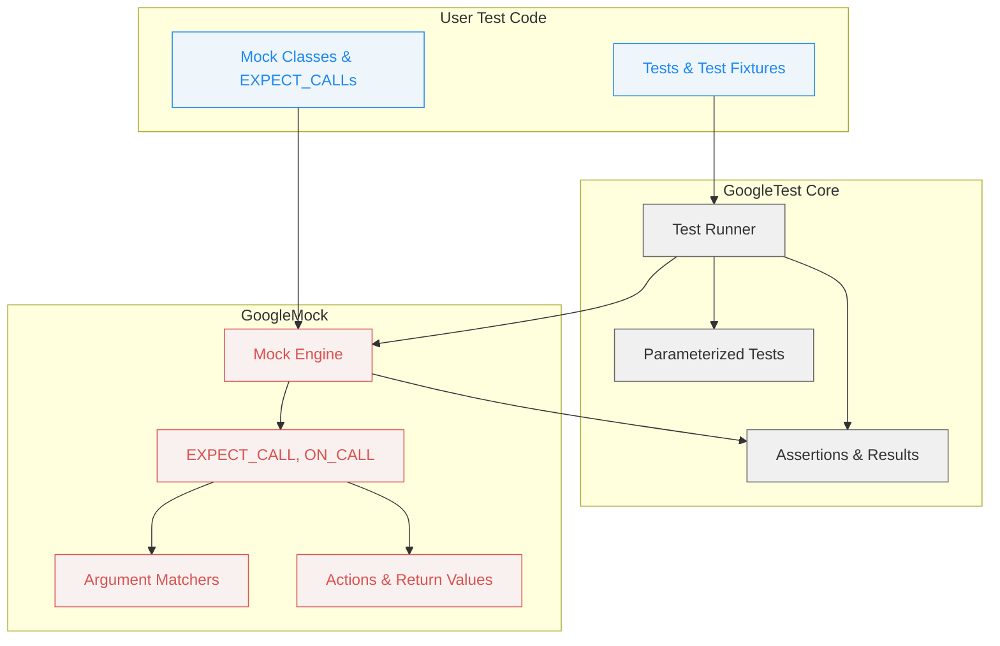

# GoogleTest/GoogleMock Architecture (Diagram)

## Visualizing the Core Architecture

Understanding how GoogleTest and GoogleMock interact under the hood is key to mastering test creation and debugging. This page presents a high-level Mermaid diagram that clearly maps out the core modules, showing where your user code plugs in and how components like the test runner, assertion handling, parameterized tests, and mocking work together.

## What You Will See Here

- How GoogleTest manages test execution and discovery
- The role of assertions and how they validate test outcomes
- How parameterized tests enable data-driven testing
- The integration point where GoogleMock intercepts and orchestrates mock objects and expectations

This architecture visualization helps you grasp the flow from defining tests to running them and verifying behavior with mocks.

---

## Architecture Overview

GoogleTest and GoogleMock form a cohesive testing framework. At a high level, the architecture organizes around these key modules:

- **Test Runner**: Discovers and runs tests, managing the lifecycle of each test execution.
- **Assertions**: Validates conditions inside tests, triggering successes or detailed failures.
- **Parameterized Tests**: Extends testing capabilities to run the same test logic with multiple data sets.
- **Mocking Engine (GoogleMock)**: Allows creation of mock objects that simulate interactions, letting you specify expectations and verify calls.
- **User Test Code**: Your test definitions, including tests and mock implementations, plugging into this framework.

The following diagram visually represents how these modules connect and interact:

## How to Read This Diagram

- The **User Test Code** box contains your test cases and mock class declarations.
- The **Test Runner** orchestrates test execution, coordinating with parameterized tests and assertions.
- **GoogleMock** components manage mocks: setting expectations (`EXPECT_CALL`), matching arguments, performing actions, and interacting with GoogleTest for verification.
- Arrows show the flow of control, data, or dependencies between these parts.

---

## Practical Insights

- Your test code calls into the test runner, which then delegates appropriate calls to parameterized tests if defined.
- Assertions validate test conditions and report any failures.
- When mocks are employed, GoogleMock's engine intercepts calls made by the code under test, checking them against expectations.
- Matchers and actions provide flexibility and powerful mechanisms to define how mock methods behave and validate arguments.

This visualization clarifies where to look when setting up or troubleshooting each piece of the framework.

---

## Tips for Effective Usage

- Use the diagram as a mental model when designing tests: know where your mocks will fit and how GoogleTest processes tests.
- When tests fail unexpectedly, trace back through the flow to see if expectations or assertions are the cause.
- Explore parameterized tests to maximize coverage with minimal code duplication.
- Leverage GoogleMock's expressive matchers and actions to write clear and robust mocks.

## Troubleshooting Common Pitfalls

- Ensure mock classes properly override virtual methods; otherwise, mocks may not intercept calls.
- Remember that `EXPECT_CALL` sets expectations that must be met; missing or extra calls lead to failures.
- Use verbosity flags (e.g., `--gmock_verbose=info`) to trace the interaction of mock calls.

---

## Next Steps

Explore these complementary documentation pages to deepen your understanding and start implementing tests:

- [What is GoogleTest?](/overview/product-intro-and-value/what-is-google-test)
- [Core Concepts and Terminology](/overview/core-concepts-and-architecture/core-concepts-terminology)
- [Test Discovery and Assertions](/overview/feature-summary-and-workflows/test-discovery-assertions)
- [Mocking: Mock Objects & Expectations](/overview/feature-summary-and-workflows/mocking-mock-objects-overview)

## References

- [GoogleTest GitHub Repository](https://github.com/google/googletest)
- [gMock Cookbook](https://google.github.io/googletest/gmock_cook_book.html)
- [GoogleMock for Dummies](https://google.github.io/googletest/gmock_for_dummies.html)

---

*Visualizing this architecture is essential to mastering GoogleTest and GoogleMock, helping you write efficient tests and understand the framework’s flow from test creation to execution and verification.*
