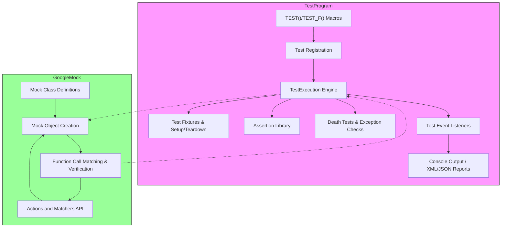

# Feature Overview

Discover the essential features that empower GoogleTest and GoogleMock to make your C++ testing workflow efficient, expressive, and scalable. This overview guides you through the capabilities that streamline writing, organizing, and running tests as well as building robust mocks for effective unit testing.

## Core Testing Architecture — The Foundation

GoogleTest follows the renowned xUnit architecture, organizing tests into test suites and tests that are automatically discovered and executed. This foundation promotes clear structure and independence, letting you write tests that are easy to maintain and fast to run.

### Automatic Test Discovery and Execution

- No manual registration required: Tests defined via macros like `TEST()` and `TEST_F()` are automatically registered.
- Unified execution model: Call `RUN_ALL_TESTS()` to execute all registered tests seamlessly.

### Rich Assertion Library

GoogleTest provides an extensive set of assertion macros to validate your code’s behavior:

- **Fatal assertions** (`ASSERT_*`): abort current test on failure.
- **Nonfatal assertions** (`EXPECT_*`): continue running tests despite failures.
- Assertions cover equality, inequality, boolean checks, exceptions, floating-point comparisons, string matches, and more.
- Custom assertions allow you to define domain-specific checks with informative failure messages.

## Advanced Test Constructs

Enhance test structure and reusability with these constructs:

### Test Fixtures

- Share common setup and teardown logic across multiple tests.
- Define objects and helper functions in fixture classes with `TEST_F()`.

### Parameterized Tests

- Data-driven testing using `TEST_P()` combined with `INSTANTIATE_TEST_SUITE_P()` allows running the same test with varied inputs.
- Multiple parameter generators such as `Values()`, `Range()`, `Combine()`, and `Bool()` offer flexible parameter variation.
- Customizable test naming for clearer test reports.

### Typed and Type-Parameterized Tests

- Use `TYPED_TEST_SUITE` and `TYPED_TEST` for running tests on a list of types.
- Type-parameterized tests (`TYPED_TEST_SUITE_P`, `TYPED_TEST_P`, and registration macros) support defining test logic separately and instantiating with multiple type lists.

## Death Tests and Exception Assertions

- Verify that your code crashes or exits correctly in error conditions using death test macros like `ASSERT_DEATH()` and `EXPECT_EXIT()`.
- Exception assertions check whether code throws expected exceptions or no exceptions.

## Mocking API — GoogleMock Integration

- Define mock classes easily with support for overloaded and templated functions.
- Matchers enable expressive validation of function calls and arguments.
- Actions specify behavior of mocked methods, including side effects and call sequences.
- Automatic verification of call expectations eliminates manual record-and-replay steps.
- Control mock behavior and lifecycles with strict, nice, and naggy mocks.

## Test Event Listeners and Output Customization

- Extend or replace default console and XML/JSON outputs via Event Listener interfaces.
- Create custom printers or loggers tied to test events.
- Generate detailed XML or JSON reports for integration with CI systems.

## Execution Controls and Test Selection

- Command-line flags and environment variables allow filtering tests, sharding test execution, repeating tests, and randomizing order.
- Disable tests or run disabled tests explicitly.
- Flags to stop on first failure, set colors in output, control verbosity, and manage UTF-8 printing.

## Practical Examples

```cpp
// Basic test
TEST(FactorialTest, HandlesZeroInput) {
  EXPECT_EQ(Factorial(0), 1);
}

// Test fixture example
class QueueTest : public testing::Test {
 protected:
  Queue<int> q_;
  void SetUp() override {
    q_.Enqueue(1);
  }
};

TEST_F(QueueTest, IsNotEmptyAfterEnqueue) {
  EXPECT_GT(q_.size(), 0);
}

// Parameterized test
class FibonacciTest : public testing::TestWithParam<std::pair<int, int>> {};

TEST_P(FibonacciTest, ComputesCorrectly) {
  auto param = GetParam();
  EXPECT_EQ(Fibonacci(param.first), param.second);
}

INSTANTIATE_TEST_SUITE_P(
    KnownValues, FibonacciTest,
    testing::Values(std::make_pair(0, 0), std::make_pair(1, 1),
                    std::make_pair(2, 1), std::make_pair(3, 2))); 
```

## Why These Features Matter to You

- **Efficiency & Maintenance:** Auto registration and fixtures reduce boilerplate.
- **Scalability:** Parameterized and typed tests minimize duplication.
- **Robustness:** Death tests and rich assertions catch errors precisely.
- **Expressiveness:** GoogleMock's API lets you simulate complex scenarios.
- **Integration:** Custom event listeners and flexible output support automation and reporting workflows.

With these capabilities, GoogleTest and GoogleMock form a comprehensive suite that helps you ship reliable, well-tested C++ software faster.

---

### Diagram: Simplified GoogleTest & GoogleMock Architecture Overview


