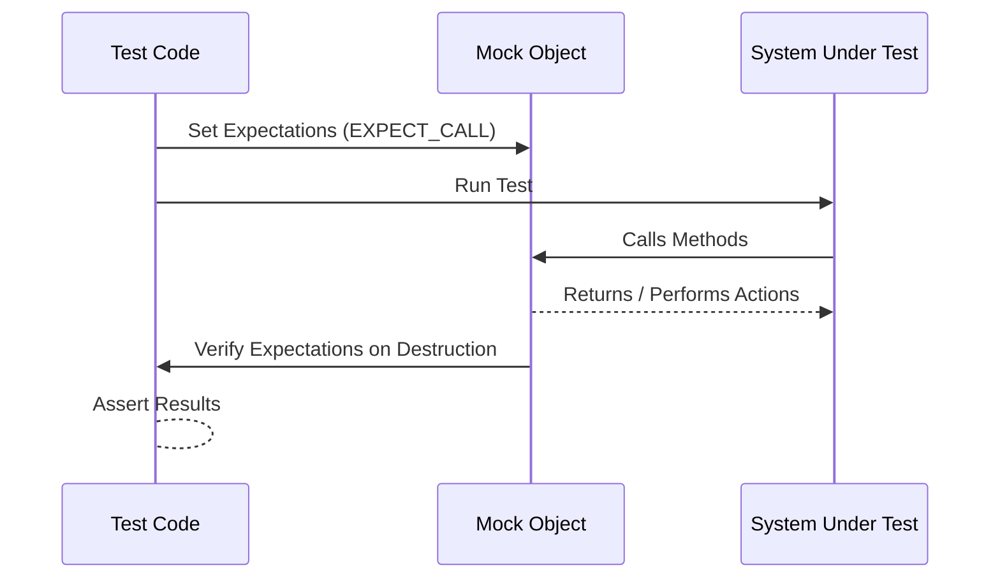

# Primary Terminology

## Introduction to Key Terms

Understanding GoogleTest and its framework starts with mastering the fundamental terminology that permeates the system. This clarity empowers you to write better tests, interpret feedback swiftly, and utilize the framework effectively.

This page introduces you to the essential vocabulary used throughout GoogleTest and GoogleMock documentation and tooling.

---

## Test

A **Test** is a function that exercises a particular piece of code with a given input, checks the output or behavior, and reports success or failure accordingly.

Example:

```cpp
TEST(MathTest, Factorial) {
  EXPECT_EQ(Factorial(5), 120);
}
```

This defines a test named `Factorial` in the `MathTest` suite.

---

## Test Suite

A **Test Suite** is a collection of tests grouped together typically by a common feature or functionality, facilitating organized structure and shared setup.

Tests within the same suite share common names and themes, making results easier to interpret.

---

## Test Fixture

A **Test Fixture** is a class that provides a shared environment for multiple tests, allowing setup and teardown of common resources.

By defining a test fixture subclassing `testing::Test`, you can write related tests that reuse initialization logic:

```cpp
class DatabaseTest : public testing::Test {
 protected:
  void SetUp() override {
    // Initialize database connection
  }
  void TearDown() override {
    // Clean up database connection
  }
};

TEST_F(DatabaseTest, QueryValidUser) {
  ...
}
```

Here, all tests using `DatabaseTest` share the same environment.

---

## Assertion

An **Assertion** is a statement within a test that checks if a condition holds. GoogleTest supports two main types:

- **Fatal assertions** (`ASSERT_*`), which abort the current test on failure.
- **Nonfatal assertions** (`EXPECT_*`), which record failures but let the test continue.

Example:

```cpp
ASSERT_EQ(result, expected_value);
EXPECT_TRUE(is_valid);
```


---

## Mocks and Mock Objects

**Mock Objects** simulate parts of a system within a test to control and verify interactions with dependencies.

Using GoogleMock, mocks implement interfaces or classes with methods that you can:

- Set **expectations** about how they should be called.
- Specify custom **behaviors** like return values or side effects.

Example defining a mock class:

```cpp
class MockFoo : public Foo {
 public:
  MOCK_METHOD(int, GetSize, (), (const, override));
  MOCK_METHOD(bool, Process, (int x), (override));
};
```

---

## Expectations

An **Expectation** is a specification that a mock object should receive a particular method call with certain arguments, a number of times, optionally followed by a specified behavior.

Created using `EXPECT_CALL`:

```cpp
EXPECT_CALL(mock_foo, Process(42))
    .Times(3)
    .WillRepeatedly(Return(true));
```

This tests that `Process` will be called exactly three times with `42`.

---

## Matchers

**Matchers** define flexible criteria to match arguments passed to mock methods.

- Match specific values (`Eq(5)`, `Ge(10)`) or arbitrary values with `_` (wildcard).
- Combine or customize matching logic for complex validation.

Example:

```cpp
EXPECT_CALL(mock, Foo(AllOf(Ge(5), Lt(10))));
```

Matches calls where the argument is greater or equal to 5 and less than 10.

---

## Actions

**Actions** specify what a mock method does when it is called: returning values, modifying arguments, invoking callbacks, etc.

Used in clauses like `WillOnce()` or `WillRepeatedly()`.

Example:

```cpp
EXPECT_CALL(mock, GetValue())
    .WillOnce(Return(42));
```

Actions can also be custom functions or lambdas to simulate complex behavior.

---

## Cardinalities

**Cardinalities** describe how many times an expected method call should occur.

GoogleMock provides:

- `Exactly(n)` or `Times(n)` for exact counts.
- `AtLeast(n)`, `AtMost(n)` for bounds.
- `AnyNumber()` for unconstrained calls.

Example:

```cpp
EXPECT_CALL(mock, DoWork())
    .Times(AtLeast(1));
```

---

## Sequences

**Sequences** let you impose ordering constraints on mock calls.

Using `InSequence` or linking expectations with `After()`, you can require calls to occur in specific orders.

Example:

```cpp
{
  InSequence s;
  EXPECT_CALL(mock, Initialize());
  EXPECT_CALL(mock, Process());
  EXPECT_CALL(mock, Cleanup());
}
```

Requires `Initialize()` before `Process()`, and `Process()` before `Cleanup()`.

---

## Death Tests

**Death Tests** verify that code crashes (or otherwise terminates) as expected under certain conditions.

They isolate failures, ensuring that crashes don't affect other tests.

Example:

```cpp
EXPECT_DEATH(Foo(-1), "invalid argument");
```

Checks that calling `Foo` with `-1` causes the process to exit with a message matching "invalid argument".

---

## Parameterized Tests

**Parameterized Tests** allow running the same test logic on different inputs.

You define a test fixture and supply parameters externally, enabling broad coverage with concise code.

Example:

```cpp
class MyParamTest : public ::testing::TestWithParam<int> {};

TEST_P(MyParamTest, ReturnsTrueForPositive) {
  EXPECT_GT(GetParam(), 0);
}

INSTANTIATE_TEST_SUITE_P(PositiveValues, MyParamTest, Values(1, 2, 3));
```

---

## Putting It All Together

These terms form the language you need to effectively write tests with GoogleTest and GoogleMock. Knowing them helps you specify what your tests want to verify, mock dependencies precisely, and interpret test outcomes clearly.

---

## Related Topics and Next Steps

- Learn how to [Write and Run Your First Test](primer.md).
- Explore [Setting Expectations and Using Matchers](docs/gmock_for_dummies.md) in detail.
- Dive into [Mock Classes Creation and Usage](docs/creating-and-using-mocks.md).
- Master [Actions, Cardinalities, and Ordering](docs/actions-and-expectations.md).
- Understand advanced [Parameterized and Typed Tests](primer.md#Parameterized_and_Typed_Tests).

For an overview of key concepts, see the [Fundamental Concepts](overview/core-concepts-and-capabilities/fundamental-concepts.md) page.

---

## Diagram: Primary Testing Workflow



This simple flow shows how expectations on mocks are set before the code under test is exercised, the mock responds to calls, and verification automatically occurs.

---

## Troubleshooting Tips

- Always set `EXPECT_CALL` before exercising mock objects to avoid undefined behavior.
- Use `NiceMock` if you want to suppress warnings about uninteresting calls during test development.
- Use `StrictMock` to ensure no unexpected calls occur but be aware this can cause brittle tests.
- Remember to define mock methods in the `public:` section regardless of their access in the base class.
- Use matchers like `_` to relax argument expectations and prevent over-specification.

---

## Summary

This terminology is the foundation of GoogleTest and GoogleMock functionality. Mastery here unlocks powerful, maintainable testing strategies that break complex C++ code into testable units with precise control and clear feedback.

For deeper understanding, continue with the rest of the GoogleTest documentation and relevant guides listed above.

---