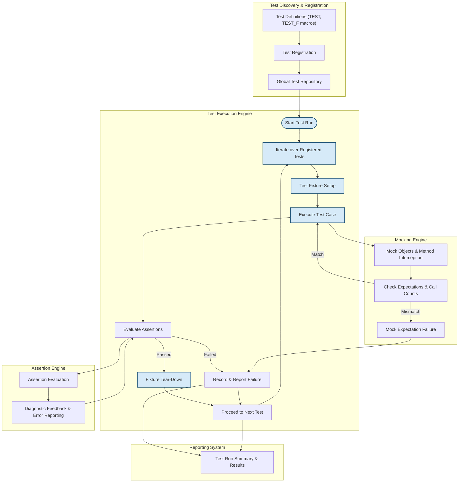

# Architecture Overview (with Diagram)

## Visualizing the High-Level Architecture of GoogleTest and GoogleMock

Understanding how GoogleTest and GoogleMock operate beneath the surface enables you to utilize these tools more effectively and troubleshoot with confidence. This page presents a comprehensive, mermaid-rendered diagram that captures the core components of GoogleTest and GoogleMock, revealing how tests are discovered, executed, and reported, alongside how key internal engines such as assertion and mocking interact.

---

## Why This Architecture Matters to You

Whether you are writing your first test or managing a large testing suite, grasping the architecture is invaluable. It helps you understand the flow of control during test execution, what happens when assertions are evaluated, and how mocks verify your code behavior. Visualizing these elements clarifies many underlying behaviors that might otherwise seem mysterious, like test order, failure reporting, and mock verification.

---

## Overview of GoogleTest and GoogleMock Architecture

GoogleTest is a unified framework that automates test discovery, running, and results reporting based on standardized test cases and assertions. GoogleMock complements this by providing a powerful mocking engine that enables interaction-based testing with declaratively defined mock objects and behavior expectations.

At a high level, the architecture consists of:

- **Test Discovery Module:** Detects test cases and suites during runtime.
- **Test Execution Engine:** Orchestrates running each test, managing fixtures and lifecycle events.
- **Assertion Engine:** Handles evaluation of test validity checks, recording pass/fail status.
- **Mocking Engine:** Provides facilities for creating mocks, setting expectations, and verifying interactions.
- **Reporting System:** Gathers test results and outputs detailed feedback to the user.

Throughout the test lifetime, these components collaborate seamlessly to provide the fast, reliable, and expressive testing experience you depend on.

---

## Architecture Flow Breakdown

### 1. Test Discovery & Registration

Your compilation units include test definitions using GoogleTest macros like `TEST()` and `TEST_F()`. These register their test cases during static initialization. GoogleTest collects these registrations into a global repository enabling automatic discovery.

### 2. Test Execution

When you run your test binary, GoogleTest's main event loop executes each registered test in sequence, optionally filtering tests based on command-line parameters. For each test:

- Setup occurs using test fixtures, if any.
- The test case method runs.
- Assertions are evaluated dynamically.
- Tear-down procedures clean up after the test.

### 3. Assertion Handling

Assertions are proactively checked. On failure, the assertion engine immediately reports errors with detailed diagnostic data and halts the current test, enabling early feedback.

### 4. Mocking Behavior

GoogleMock extends this by enabling mock classes to intercept method calls and verify expectations on these calls. When mocks are used:

- Mock objects monitor interactions.
- GoogleMock checks if method calls match defined expectations including arguments, call count, and order.
- Violations of expectations cause test failures with precise messages.

### 5. Test Result Reporting

At each test’s conclusion, results including success, failure, and skipped tests accumulate and are reported comprehensively. This final summary helps you quickly identify and address issues.

---

## Mermaid Diagram: GoogleTest & GoogleMock High-Level Architecture

---

## Practical Insights

- **You don't need to manually register tests:** GoogleTest handles discovery by simply using the macros in your source code.
- **Tests run independently:** Each test runs with its own setup and teardown, avoiding state leaks and ensuring test isolation.
- **Mock expectations guide test validation:** When mocks are involved, method invocation sequences and argument values become part of the contract tested.
- **Failures trigger immediate feedback:** Both assertion and mock failures instantly report detailed information to help diagnose issues.

---

## Tips for Successful Testing with GoogleTest & GoogleMock Architecture

- Organize your tests clearly using test suites and fixtures for reusable setup.
- Use mocks when you need to isolate your component and verify interaction patterns explicitly.
- Be mindful of the order and cardinality of expectations in mocks — improper ordering can lead to unexpected failures.
- Leverage GoogleTest’s filtering and reporting flags to focus your test runs and streamline debugging.

---

## Next Steps

Understanding this architecture lays the foundation for diving deeper into specific topics:

- Explore the [Core Concepts & Terminology](/overview/core-concepts-architecture/core-concepts-terminology) page to familiarize yourself with fundamental GoogleTest concepts like test cases, fixtures, assertions, and mocks.
- Try your hand at writing and running tests using the [Getting Started Guides](/getting-started).
- Learn how to create and control mocks with detailed examples in the [GoogleMock Documentation](https://google.github.io/googletest/gmock_for_dummies.html).

---

Embracing this architecture insightfully empowers you to write robust, expressive tests that scale easily with your projects.

---

## References

- [GoogleTest GitHub Repository](https://github.com/google/googletest)
- [GoogleMock Documentation](https://google.github.io/googletest/gmock_for_dummies.html)
- Related Documentation Pages:
  - [What Is GoogleTest?](/overview/introduction-and-value/what-is-googletest)
  - [Core Concepts & Terminology](/overview/core-concepts-architecture/core-concepts-terminology)
  - [Target Audience & Primary Use Cases](/overview/introduction-and-value/target-audience-use-cases)

---

*This overview captures the essence and flow of GoogleTest and GoogleMock to enhance your understanding, enabling you to leverage their powerful functionality confidently and effectively.*
