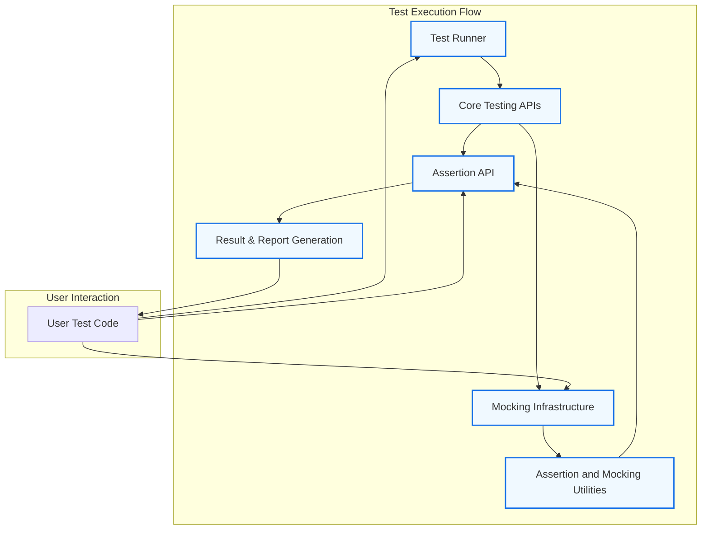

# System Architecture Overview

Explore a high-level architecture diagram of GoogleTest, illustrating component relationships such as test runners, assertion APIs, mocking infrastructure, and their supporting utilities. This visual guide will help you understand the data flow and extensibility points within the system.

---

## Introduction

The System Architecture Overview provides a visual and conceptual roadmap of how GoogleTest operates internally to offer its powerful testing and mocking capabilities. Understanding the interactions between core components like the test runner, assertion API, and mocking framework enables users to appreciate how GoogleTest processes tests, executes assertions, and allows extensibility.

Whether you are integrating GoogleTest into complex projects or exploring its extensibility points, this guide illustrates the critical components working together behind the scenes.

## Architectural Components

### Test Runner
- **Role:** Orchestrates test discovery, execution, and reporting.
- **Workflow:** Loads test cases, invokes test methods, and aggregates results.
- **User Impact:** Enables running tests selectively or in bulk, with detailed progress and failures.

### Assertion API
- **Role:** Provides expressive assertion macros for validating conditions.
- **Capabilities:** Supports various types of assertions - fatal, non-fatal, and parameterized.
- **User Benefits:** Immediate feedback on test failures with informative messages and stack traces.

### Mocking Infrastructure
- **Role:** Facilitates creation of mock objects and expectations.
- **Key Features:**
  - Declarative macros to define mock methods in user classes.
  - Support for setting expectations about method calls and their sequence.
  - Configurable strictness modes for handling unanticipated method calls.
- **User Advantage:** Precise control over dependency interactions in tests.

### Assertion and Mock Utilities
- **Supporting Components:** Include matchers, actions, default values, and call expectations.
- **Functionality:** Enable flexible argument matching, complex behaviors, and default return values.
- **Extensibility:** Users can extend with custom matchers and actions to suit specific testing needs.

### Core Testing APIs
- Foundation for writing and structuring tests, handling fixtures, and grouping test cases.

## Data Flow Overview

The diagram below illustrates the flow from test discovery through execution to result reporting, highlighting how mock objects and assertions interplay within this flow.

This flow depicts:

- The user's test code initiates tests through the Test Runner.
- The Test Runner interacts with core testing APIs to execute test fixtures and cases.
- During test execution, assertions and mocks intercept calls to validate behavior.
- Mocking infrastructure leverages utilities for matching arguments and defining actions.
- Assertions and mocks report results back to the runner, which generates reports.

## Extensibility Points

GoogleTest's architecture allows users to extend and customize:

- **Custom Matchers:** Implement complex argument verification beyond built-ins.
- **Actions:** Define specific behaviors mock methods should perform.
- **Strictness Modes:** Choose between nice, naggy, or strict mocks to control test sensitivity.
- **Sequences & Expectations:** Orchestrate call order and dependencies among mocks.

Users can plug into the mocking utilities to tailor test doubles to complex scenarios.

## Best Practices & Tips

- Use the test runner's selective test execution to scope large test suites.
- Leverage mocking strictness modes to balance between test maintainability and strict validation.
- Utilize assertion and mocking utilities progressively, starting simple.
- Reference the [Mocking Reference](../api-reference/mocking-framework/defining-mocks) and [gMock Cookbook](../guides/core-workflows/mocking-best-practices) for deep dives into mocking workflows.

## Troubleshooting Common Issues

- **Unexpected Mock Calls:** Use strict mocks or enable verbose output to identify unexpected interactions.
- **Test Discovery Problems:** Verify the test runner configurations and naming conventions.
- **Assertion Failures:** Examine stack traces and error messages generated through the assertion API.

## Next Steps

After familiarizing yourself with this architecture overview, explore:

- [Core Concepts & Terminology](./core-concepts-terminology) to understand fundamental definitions.
- [Defining Mock Objects](../api-reference/mocking-framework/defining-mocks) to master mocking basics.
- [Writing and Running Your First Test](../../getting-started/configuration-validation/first-test) to put theory into action.

---

### References

- [Mocking Reference](../docs/reference/mocking.md) for detailed mocking constructs.
- [gMock Cookbook](../docs/gmock_cook_book.md) for practical usage patterns.
- [gMock Cheat Sheet](../docs/gmock_cheat_sheet.md) for quick syntax reminders.

---

Explore and experiment with GoogleTest's components through this architectural lens to gain confidence in managing testing complexity and unlocking GoogleTest's full potential.
