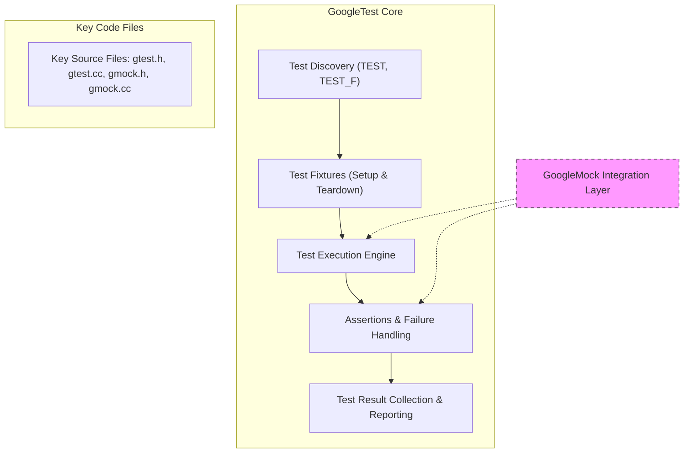

# How GoogleTest Works (Architecture Diagram)

## Visualizing the Core Architecture

This page provides a clear visualization of the main components within GoogleTest and their interplay. It maps out key elements such as test discovery, fixtures, assertions, result reporting, and how GoogleMock integrates optionally, helping you understand the flow and responsibilities of each part.

---

## What You Will Learn Here

- How GoogleTest discovers and organizes test cases.
- The role and lifecycle of test fixtures.
- How assertions are evaluated and propagated.
- How test results are collected and reported.
- The optional integration and layering of GoogleMock for mocking within tests.
- An architectural diagram that illustrates data flow and key files.

---

## Understanding GoogleTest's Architecture

At its core, GoogleTest structures the testing process as a clear flow from test discovery to execution and reporting:

1. **Test Discovery:** GoogleTest automatically locates test cases within your codebase by scanning for tests defined with its macros (`TEST` and `TEST_F`).

2. **Test Fixtures:** These set up and tear down the environment needed for tests, ensuring isolated and repeatable test scenarios.

3. **Assertions:** Assertions validate conditions within your tests. When an assertion fails, GoogleTest captures the failure and controls test flow accordingly.

4. **Result Reporting:** After running tests, GoogleTest collects results and outputs detailed reports, enabling efficient debugging and verification.

5. **GoogleMock Integration:** Optional mocking support is layered on top of the architecture, allowing you to create mock objects, specify expectations, and verify interactions in your unit tests seamlessly.

This modular breakdown helps simplify test management while providing powerful capabilities.

---

## Architecture Diagram

---

## How to Interpret This Diagram

- **Sequential Flow:** Testing begins with discovering your tests, followed by setting up fixtures.

- **Execution and Assertion:** Each test runs, performing assertions that validate code behavior.

- **Reporting:** After execution, results are accumulated and presented clearly for analysis.

- **Mocking Layer:** GoogleMock sits optionally on top, allowing detailed control and verification of interactions in your tests without disturbing the core test flow.

- **Key Source Files:** The core implementation resides mainly in the `gtest` and `gmock` headers and source files.

---

## Practical Example: Running a Test Suite

Imagine you have a set of unit tests for a class `Calculator`. Here's what happens under the hood:

- GoogleTest locates all your defined tests via `TEST` macros.
- For any test that uses a fixture (`TEST_F`), it automatically calls the fixture setup code.
- The test runs and assertions check the returned results from your code.
- If any assertion fails, GoogleTest captures it and continues or aborts based on failure severity.
- Results from every test are collected.
- Finally, GoogleTest outputs a summary and detailed report.
- If you use mocks, GoogleMock verifies expected interactions during execution.

---

## Best Practices & Tips

- **Design Tests with Fixtures:** Use fixtures (`TEST_F`) to reduce duplication and manage test setup and cleanup precisely.
- **Leverage Assertions Wisely:** Choose the right assertion macros to express your expectations clearly.
- **Use GoogleMock for Dependencies:** When your tests depend on external components or complex behavior, integrate GoogleMock to simulate and verify interactions.
- **Monitor Test Reports:** Regularly review GoogleTest's detailed reports to quickly identify failures and unexpected behaviors.

---

## Troubleshooting

- **Test Discovery Not Working:** Ensure you have properly defined tests with `TEST` or `TEST_F` macros.
- **Fixture Setup Not Running:** Confirm that your test uses the fixture syntax `TEST_F` and that the setup methods are correctly overridden.
- **Unexpected Assertion Failures:** Check the test logic and ensure assertions match expected conditions.
- **GoogleMock Expectations Not Met:** Make sure `EXPECT_CALL` statements precede code execution and that your mocks are correctly configured.

---

## Next Steps

After understanding how GoogleTest works and its architecture:

- Explore the **[Fundamental Concepts & Terminology](../core-concepts-architecture/core-terminology)** page to deepen your knowledge of core testing principles.
- Learn about **[Platform Support, Integrations & Dependencies](../core-concepts-architecture/integration-dependencies)** for adapting GoogleTest to your environment.
- Dive into **[Writing Your First Test Case](../../getting-started/first-test-experience/writing-your-first-test)** to see practical usage.

---

## Additional Resources

- [GoogleTest Primer](https://github.com/google/googletest/blob/main/docs/primer.md) — A comprehensive starting point.
- [GoogleMock Cookbook](https://github.com/google/googletest/blob/main/docs/gmock_cook_book.md) — Practical recipes to get the most from GoogleMock.
- [API Reference for Core Testing](../../api-reference/core-testing-apis) — Detailed specs of GoogleTest APIs.

---

Understanding the architecture helps you use GoogleTest and GoogleMock effectively, build reliable test suites, and improve code quality with confidence.

---