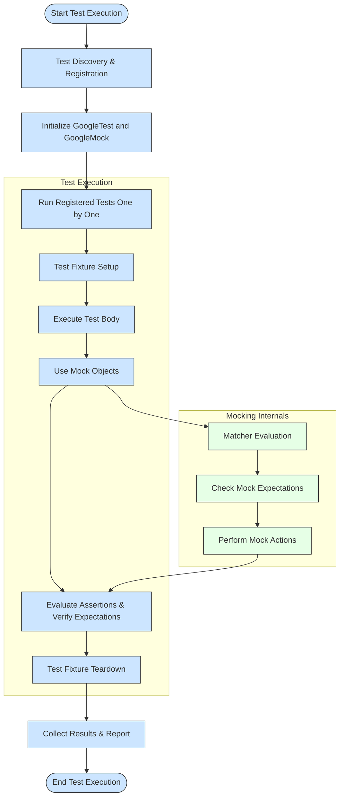

# Framework Architecture (with Diagram)

## Introduction

Welcome to the architectural overview of GoogleTest and GoogleMock, the core C++ testing and mocking frameworks developed by Google. This page is dedicated to visualizing and explaining how the key architectural components collaborate to empower your testing workflow. Understanding this will give you clarity on why the framework behaves the way it does and how control flows through your tests.

By exploring this architecture, you’ll gain insight into the roles of the test runner, assertion engine, matchers, mocking APIs, and integration points. A concise Mermaid.js diagram will illustrate the typical data and control flow during test execution, making abstract concepts concrete.

---

## Architectural Components Overview

### Test Runner

The test runner orchestrates the execution of all your tests. It discovers registered tests, runs them sequentially or in parallel, and collects results. It interacts closely with both GoogleTest and GoogleMock components to manage the test lifecycle.

### Assertion Engine

Assertions are the backbone of test validation. The assertion engine evaluates conditions you specify in your tests, signaling success or failure. It provides the infrastructure for expressive and portable assertions that GoogleTest is known for.

### GoogleMock Matchers

Matchers form the expressive language to specify expected argument values in mock function calls. They are predicates that validate the parameters passed during mock invocations. GoogleMock offers a rich, extensible set of built-in matchers and supports custom matchers for domain-specific needs.

### Mocking APIs

The GoogleMock API lets you create mock classes, define mock methods, set expectations for method calls, and specify behaviors. This API abstracts the complexity of mocking, making it straightforward to define interactions and validate them in your tests.

### Integration Points

GoogleMock is tightly integrated with GoogleTest — the frameworks share initialization, test registration, and the test runner. This integration ensures a seamless experience when using mocks within your tests.

---

## Typical Test Execution Flow

The flow below captures a typical control path when running tests using GoogleTest with GoogleMock enabled.

This diagram demystifies test execution by showing how GoogleTest's test runner initiates and manages tests, while GoogleMock components dynamically evaluate mock interactions during the test body execution.

---

## Practical User Scenario

Imagine you are writing a unit test for a graphics class that depends on a `Turtle` interface for drawing. In your test, you create a `MockTurtle` object. During the test execution:

- The test runner initializes and prepares to run your test.
- Your test fixture sets up necessary preconditions.
- Inside the test, when `MockTurtle` methods are called, GoogleMock intercepts these calls.
- Matchers verify the passed arguments against your expectations.
- Expectation checks validate call counts, order, and argument correctness.
- Actions associated with mock methods execute, such as returning predefined values.
- Assertions test outcomes and all expectations are verified before test teardown.
- The test runner aggregates results and moves to the next test.

This seamless interplay empowers you to write more expressive, reliable tests.

---

## Tips for Success

- **Understand the test lifecycle:** Familiarize yourself with how GoogleTest manages test discovery and execution to better structure your tests.
- **Use matchers effectively:** Leveraging GoogleMock’s expressive matchers minimizes brittle tests and maximizes clarity.
- **Set clear expectations:** Define precise but not overly strict expectations to avoid fragile tests.
- **Leverage integration:** Remember GoogleMock is designed to work smoothly within GoogleTest’s framework; use both features together for best results.

---

## Troubleshooting Common Issues

- **Unexpected calls:** If a mock method is called more times than expected or with unexpected arguments, verify your `EXPECT_CALL` usage and argument matchers.
- **Unverified expectations:** Ensure that expectations are set before exercising mock objects to avoid undefined behavior.
- **Order violations:** When ordering matters, use `InSequence` or `After` clauses to enforce sequences.
- **Runtime Initialization:** Always initialize GoogleMock through `testing::InitGoogleMock()` before running tests to avoid startup problems.

---

## Next Steps

- Visit [What is GoogleTest?](../welcome-introduction/what-is-googletest) to deepen your understanding of foundational concepts.
- Explore [Using Assertions and Matchers Effectively](../../guides/core-testing-patterns/using-assertions-and-matchers) for practical usage tips.
- Check [Defining and Using Mocks](../../api-reference/mocking-framework-api/defining-mocks) to get started writing mocks.

---

This architectural insight sets the foundation for mastering GoogleTest and GoogleMock's powerful testing capabilities.
