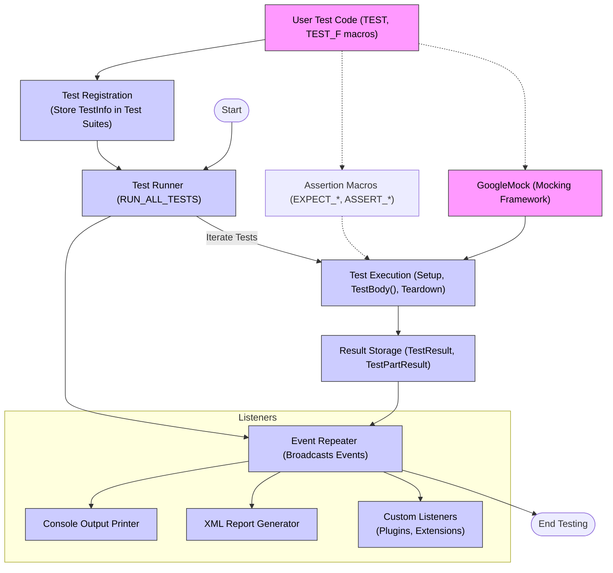

# System Architecture Overview

## Understanding GoogleTest's Architecture

GoogleTest is designed as a robust, scalable framework that orchestrates the entire lifecycle of C++ testing. This overview guides you through its key components and illustrates how they collaborate to turn your test code into verified results.

At the core, GoogleTest bridges your test code and the runtime environment, providing seamless discovery, execution, assertion evaluation, and result reporting. This page visualizes those major building blocks and their interactions, helping you to comprehend where your extensions and customizations fit.

---

## High-Level Components and User Flow

Your test programs use GoogleTest's API—primarily the public `TEST()`, `TEST_F()`, `ASSERT_*`, and `EXPECT_*` macros—to define tests and assertions. These macros internally translate into objects and calls that GoogleTest manages throughout runtime.

The test execution begins via the test runner, which orchestrates setup, test execution, and teardown. Each test case is run independently, making failures isolated and easy to debug.

### Core Components:

- **User Test Code**: Contains test and fixture definitions using GoogleTest macros.
- **Test Registration**: Automatically stores tests in **Test Suites**.
- **Assertion Macros**: Used inside tests to verify conditions, delivering success or failure results.
- **Test Runner**: Executes tests, manages lifecycle events.
- **Result Storage**: Collects outcomes including failures, skips, and test properties.
- **Event Listeners**: Allow integration points for custom reporting or logging.
- **Reporting Modules**: Console printer and XML generator output overall results.
- **Extensibility**: GoogleMock integration for mocking workflows.

---

## Mermaid Diagram: GoogleTest Architecture and Workflow

---

## Detailed Component Descriptions

### 1. User Test Code

You write tests using macros such as `TEST()`, `TEST_F()`, and related APIs. These macros define the test logic and internally register the tests with GoogleTest's framework for later execution.

### 2. Test Registration

Tests register themselves during program initialization. GoogleTest organizes these tests into **Test Suites**, grouping logically related tests together, reflecting your code structure.

### 3. Assertion Macros

Your assertion macros (`EXPECT_EQ`, `ASSERT_TRUE`, etc.) generate _test parts_ representing success, non-fatal failures, or fatal failures within tests. GoogleTest captures these outcomes, enabling detailed diagnostics and test continuation when appropriate.

### 4. Test Runner

Triggered by calling `RUN_ALL_TESTS()`, the test runner drives the entire lifecycle:
- Set up test suites and environments
- Run each test independently
- Gather results
- Tear down test suites and environments

This process ensures isolation, repeatability, robust failure handling, and comprehensive reporting.

### 5. Result Storage

Each test's results—including all assertion outcomes and auxiliary data like properties—are stored in `TestResult` and `TestPartResult` objects. This structured capturing supports detailed querying and reporting post-execution.

### 6. Event Listeners

GoogleTest uses an event-driven architecture for test lifecycle notifications. The **TestEventListeners** interface allows multiple listeners to subscribe to events like test start, test end, assertion results, and environment setup or teardown.

This mechanism enables:
- Default console output
- XML output generation
- Customized integrations, such as CI tools or enhanced logging

### 7. Reporting Modules

Two key built-in listeners:
- **Console Printer**: Delivers readable, real-time output during test runs.
- **XML Generator**: Produces structured XML reports compatible with common CI systems.

### 8. Extensibility with GoogleMock

GoogleTest seamlessly integrates with GoogleMock, its complementary mocking framework. This integration helps you build mock objects, define expectations, and verify mock behaviors alongside your normal test cases.

---

## Why This Architecture Matters to You

- **Simplicity and Power**: You write straightforward test code while GoogleTest manages complex runtime mechanics.
- **Isolation and Precision**: Each test runs independently, preventing unintended interference.
- **Extensibility**: Custom listeners and mocking enable integration into complex workflows.
- **Cross-Platform Compatibility**: The architecture abstracts platform differences, empowering consistent test behavior across environments.

Understanding this architecture enables you to extend or integrate GoogleTest confidently and troubleshoot test issues effectively.

---

## Next Steps

To proceed with practical application, consider exploring:

- [Writing and Organizing Tests](../api-reference/core-testing-apis/writing-tests) to learn how to structure your test suites and cases.
- [Assertions and Matchers](../api-reference/core-testing-apis/assertions) for detailed assertion usage.
- [Mocking Workflows with GoogleMock](../guides/advanced-testing-patterns/mocking-workflows) to build sophisticated mock scenarios.
- [Feature Overview](../overview/product-introduction/feature-overview) for a broad capabilities snapshot.

This foundational understanding of GoogleTest's components and their interplay will empower you to maximize its power in your C++ development.
