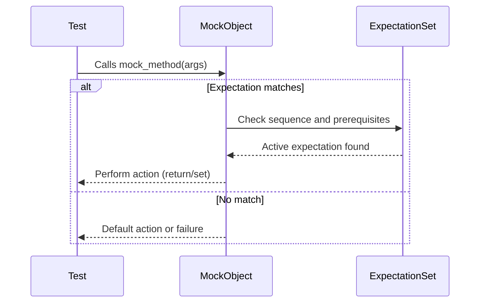

# Fundamental Concepts & Terminology

This page clarifies the essential terms you will encounter when using GoogleTest's mocking framework, GoogleMock. Understanding these concepts is crucial for navigating the documentation and effectively designing, writing, and maintaining tests with mocks. Each term is explained in the context of how it enables you to describe and verify the behavior of your C++ code in tests.

---

## Test Case

A **test case** is an individual scenario or condition that you want to verify about your code. In the context of GoogleTest, a test case corresponds to a function or method annotated as a test (e.g., via `TEST` or `TEST_F` macros). It exercises a unit of code and asserts expected results.


## Test Suite

A **test suite** is a collection of related test cases grouped logically, often by the component or feature being tested. In GoogleTest terminology, the test suite provides a structure and lifecycle for running multiple related tests together, sharing setup and teardown steps.


## Fixture

A **test fixture** is a class that sets up the common context (variables, environment, objects) shared by multiple test cases within a test suite. Using fixtures helps avoid duplication and enables more focused, maintainable tests. GoogleTest's `TEST_F` macro allows writing tests that use fixtures.


## Assertion

An **assertion** verifies that a certain condition holds true during a test. It is the basic building block for validating the correctness of code behavior. GoogleTest provides a rich set of assertions including `EXPECT_CALL` to verify mock method invocations and `ASSERT_EQ`, `EXPECT_TRUE`, etc., for general checks.


## Mock

A **mock** is a special object that simulates a real class or interface's behavior for testing purposes. It lets you define **expectations** about how it should be called, including which methods are called, with what arguments, how often, and what they return.

In GoogleMock, mock classes are created by inheriting interfaces and declaring mocked methods with the `MOCK_METHOD` macro. Mocks enable interaction-based testing by verifying how your code interacts with its dependencies rather than just the output.


## Expectation

An **expectation** sets the rules on a mock method call using the `EXPECT_CALL` macro. It specifies which method is expected to be called, what arguments it should receive, how many times it should be called, in what order, and what return actions or side effects it should produce.

Expectations can be customized with several clauses:

- `.With()` to match multiple arguments as a tuple.
- `.Times()` to specify how often the call is expected.
- `.InSequence()` and `.After()` to define call order.
- `.WillOnce()` and `.WillRepeatedly()` to set the call's behavior.
- `.RetiresOnSaturation()` to deactivate expectations after they are met.


## ExpectationSet

An **ExpectationSet** is a collection of `Expectation` objects used when you want to specify that a mock method call must happen **after** multiple other expectations have been met. It is especially helpful to define complex ordering constraints.


## Sequence

A **Sequence** object represents an explicit ordered chain of expectations. By assigning multiple expectations to sequences using `.InSequence()`, you constrain the order in which those mock calls must occur during the test.

Sequences can be combined or nested to express complex partial orders of interactions.


## InSequence

The **InSequence** class is a simple RAII helper that automatically creates an anonymous `Sequence` and assigns all expectations declared inside its scope to it. This encloses expectations in a sequence, requiring them to be matched in order.

Example:

```cpp
{
  InSequence s;
  EXPECT_CALL(mock, Foo());
  EXPECT_CALL(mock, Bar());
}
```

In this example, `Foo()` must be called before `Bar()`, or the test fails.


## ON_CALL

The `ON_CALL(mock, Method(args))` macro defines the **default behavior** of a mock method when it is called but not explicitly expected. `ON_CALL` does not set any expectations that the call will happen; it only instructs how to behave.

The default action specified by `ON_CALL` can be overridden by matching expectations (`EXPECT_CALL`).

Example:

```cpp
ON_CALL(mock, GetValue())
    .WillByDefault(Return(42));
```

This means that if no `EXPECT_CALL` matches a call to `GetValue()`, the mock will return 42.


## EXPECT_CALL

The `EXPECT_CALL(mock, Method(args))` macro **creates an expectation** that the mock object's method will be called with arguments matching the specified matchers or values. It also allows you to specify how many times it is expected and what action it should perform.

Example:

```cpp
EXPECT_CALL(mock, SetValue(5))
    .Times(3)
    .WillRepeatedly(Return(true));
```

This expects that `SetValue(5)` is called exactly three times, returning true each time.


## MockFunction

A specialized mock class template `MockFunction<R(Args...)>` provides a generic way to mock standalone callbacks or `std::function`-style callables. It has a single mock method `Call` corresponding to the signature `R(Args...)`, which can be monitored and controlled.

This is useful when you want to verify or simulate callback invocations without writing a dedicated mock class.


## Death Test

A **death test** verifies that certain code terminates (or "dies") as expected, usually due to fatal errors like assertions or exceptions. GoogleTest supports death tests for safety-critical checks.

Though not directly tied to mocking, understanding death tests helps in comprehensive testing workflows.

---

## Visual Diagram: Mock Expectation Workflow



---

## Practical Tips

- Use **`EXPECT_CALL`** to verify interactions you care about, but avoid excessive expectations that over-constrain your tests.
- Use **`ON_CALL`** to set default behavior for mock methods where you do not care about explicit expectations.
- Define test **fixtures** to share common mock setup across multiple tests.
- Use **`Sequence`**, **`.InSequence()`**, or **`.After()`** to ensure call order matters in your tests.
- Specialized mocks like **`MockFunction`** enable easy mocking of callback interfaces.
- Remember: Expectations must be set before the code under test exercises mocks; otherwise behavior is undefined.

---

For a deeper exploration of these terms and how to apply them effectively, refer to the [Mocking Reference](../reference/mocking.md), [gMock for Dummies](../gmock_for_dummies.md), and the [gMock Cookbook](../gmock_cook_book.md).

<Info>
This page fits within the "Core Concepts & Architecture" documentation group, providing foundational knowledge that helps users interpret the examples and API references in other documentation sections.
</Info>
