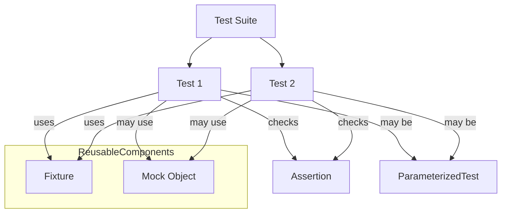

# Core Concepts & Terminology

## Building Your Testing Mental Model

Welcome to the foundational page of GoogleTest focused on core terminology and concepts. Understanding these will empower you to design modular, maintainable, and expressive tests for your C++ code. This page introduces essential terms such as **test case**, **test suite**, **assertion**, **fixture**, **mock**, and **parameterized test** and explains how they interconnect to form a robust testing workflow.


---

## Key Concepts Explained

### Test Case and Test Suite

- **Test Case** (now being replaced by the preferred term **Test Suite**): A grouping of related tests that share common context or purpose.
- **Test**: An individual unit of testing code, verifying a specific behavior or scenario in your codebase.

GoogleTest encourages organizing tests into test suites to mirror the structure of your production code, enabling more coherent test management.

### Assertion

An assertion is a statement that checks a condition in your code. GoogleTest provides a rich set of assertions allowing you to verify the correctness of values, states, and behaviors. Assertions can be fatal (`ASSERT_*`) or nonfatal (`EXPECT_*`), affecting whether the test continues after a failure.

**Example:**

```cpp
EXPECT_EQ(result, expected_value);  // Nonfatal assertion
ASSERT_TRUE(pointer != nullptr);  // Fatal assertion
```

### Fixture

A **test fixture** is a class that sets up the test environment shared by multiple tests. It provides:

- Setup and teardown capabilities before and after each test
- Shared objects, resources, and helper methods

This promotes reusability and reduces duplication.

**Example Skeleton:**

```cpp
class MyTestFixture : public ::testing::Test {
 protected:
  void SetUp() override {
    // Prepare shared resources
  }

  void TearDown() override {
    // Cleanup
  }

  // Shared test data
  SomeClass obj_;
};
```

Tests using fixtures are defined with `TEST_F()` allowing access to fixture members.

### Mock

A **mock** simulates the behavior of a real object for testing purposes. GoogleMock (`gMock`) integrates tightly with GoogleTest. It allows you to:

- Declare mock classes that imitate interfaces
- Specify expected calls, their order, number of invocations, and behaviors
- Validate interactions between the code under test and its dependencies

Mocks are especially valuable for testing parts of the system that interact with external components, complex dependencies, or nondeterministic behavior.

### Parameterized Test

Parameterized tests allow running the same test logic with different input data sets. This helps cover more scenarios concisely.

GoogleTest supports multiple types of parameterized tests, enabling you to specify inputs and expected outcomes externally, driving the test through a uniform interface.

---

## How These Concepts Connect

The following diagram outlines their relationship in a testing workflow:



In this flow:

- A test suite groups multiple tests.
- Tests generally leverage test fixtures for shared setup.
- Within tests, assertions verify correctness.
- Tests may use mocks to replace real dependencies.
- Parameterized tests reuse test logic for different inputs.

---

## Practical Tips and Best Practices

- **Use Fixtures to avoid duplication:** If multiple tests share setup or teardown code, a fixture is your best friend.
- **Mock only what you own or control:** Mocking external or third-party code you don’t own can cause maintenance headaches.
- **Prefer focused assertions:** Aim to verify one aspect per assertion or test for clearer, maintainable tests.
- **Apply parameterized tests for repetitive scenarios:** Avoid copying test code that only differs in input values.
- **Understand Mock Strictness Levels:** To manage behavior when unexpected calls occur, learn about `NiceMock`, `NaggyMock` (default), and `StrictMock`. They let you suppress warnings, show warnings, or treat unexpected calls as failures respectively.


---

## Getting Started with Mocks (Brief Intro)

GoogleMock extends GoogleTest by letting you create mock classes easily using `MOCK_METHOD` macros. Here’s a quick overview for your reference:

- **Defining a Mock:** Derive from an interface and declare mocked methods with `MOCK_METHOD`.

```cpp
class Foo {
 public:
  virtual ~Foo() {}
  virtual int GetSize() const = 0;
  virtual void Process(int x) = 0;
};

class MockFoo : public Foo {
 public:
  MOCK_METHOD(int, GetSize, (), (const, override));
  MOCK_METHOD(void, Process, (int x), (override));
};
```

- **Setting Expectations:** Use `EXPECT_CALL` to define how your mock should be used in a test.

```cpp
MockFoo mock;
EXPECT_CALL(mock, GetSize())
    .Times(1)
    .WillOnce(Return(42));

// code under test that calls mock.GetSize()
```

- **Adjusting Behavior:** Use `ON_CALL` to specify default behavior without enforcement of call counts.


For a more thorough guide, explore the [gMock Cheat Sheet](https://google.github.io/googletest/gmock_cheat_sheet.html) and [gMock Cookbook](https://google.github.io/googletest/gmock_cook_book.html).


---

## Troubleshooting Common Conceptual Pitfalls

- **Confusing Test Case vs Test Suite:** GoogleTest moves toward using *Test Suite* consistently to reduce confusion.
- **Overly Strict Expectations Causing Flaky Tests:** Use `ON_CALL` for default behavior, and `EXPECT_CALL` only where you want to verify calls.
- **Uninteresting Calls Warnings:** If you see warnings about uninteresting calls to mock methods, consider using `NiceMock` to suppress them or add catch-all expectations with `EXPECT_CALL(...).Times(AnyNumber())`.
- **Virtual Destructors Needed:** Ensure interfaces or base classes have virtual destructors to avoid undefined behavior when mocks are destructed.


---

## Summary of Terms

| Term                | Description
|---------------------|----------------------------------------------------
| Test                | An individual unit that validates a specific behavior.
| Test Suite          | A group of related tests sharing context.
| Assertion           | A statement verifying a condition, success or failure.
| Fixture             | A shared environment setup for a group of tests.
| Mock                | A simulated object that mimics real interfaces to validate interactions.
| Parameterized Test  | A test that runs the same logic with multiple input data sets.


---

## Next Steps

If you’re ready to advance from concepts to implementation, explore these pages:

- [Writing Your First Test](../../getting_started/first_test_run_validation/write_first_test) – Learn how to create and run basic tests.
- [Feature Overview](../product-introduction/feature-overview) – Deepen knowledge of test structures and capabilities.
- [Using Mock Classes](../../api-reference/mocking-apis/defining-mocks) – Understand how to define and use mocks effectively.


---

## Additional Resources

- [GoogleTest Overview & Introduction](../product-introduction/what-is-googletest) – The essence and value proposition of GoogleTest.
- [Target Audience & Use Cases](../product-introduction/target-audience-use-cases) – Who benefits from GoogleTest, and why.
- [GoogleMock Documentation](https://google.github.io/googletest/gmock_for_dummies.html) – Beginner-friendly gMock tutorial.
- [gMock Cheat Sheet](https://google.github.io/googletest/gmock_cheat_sheet.html) – Quick reference for mocking syntax and options.
- [gMock Cookbook](https://google.github.io/googletest/gmock_cook_book.html) – Recipes and advanced mocking patterns.


---

## Troubleshooting Quick Tips

<AccordionGroup title="Common Conceptual Questions">  
<Accordion title="What exactly is the difference between a mock and a fixture?">  
A fixture sets up shared context for tests; a mock is a simulated object to control and verify behavior in tests. Fixtures prepare test environments; mocks validate interactions.
</Accordion>  
<Accordion title="How do I decide when to mock or when not to mock?">  
Mock what you own or control to isolate behavior. Avoid mocking complex third-party code unless absolutely necessary to avoid brittle tests.
</Accordion>  
<Accordion title="Why am I seeing warnings about uninteresting calls?">  
It's because a mock method was called without an active expectation. Add `EXPECT_CALL(...).Times(AnyNumber())` or switch to `NiceMock` to suppress warnings.
</Accordion>  
<Accordion title="What is the recommended way to organize tests?">  
Group logically-related tests into a test suite with shared fixtures if needed. Keep tests focused and manageable.
</Accordion>  
</AccordionGroup>


---

_By mastering these foundational concepts, you set yourself up for success using GoogleTest’s rich set of tools to build reliable and maintainable C++ tests._


---