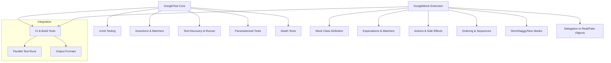

# Feature Overview

GoogleTest delivers a powerful and flexible C++ testing framework with a rich set of capabilities tailored to streamline test development, execution, and maintenance. This page offers a concise presentation of GoogleTest's major features, helping you understand what it brings to your C++ projects and how these features serve your needs.

---

## Core Testing Features

### xUnit-Based Testing Model
GoogleTest adheres to the industry-standard xUnit architecture, offering a familiar setup for organizing tests into test cases (test suites) and individual test functions. This structured approach makes it easy to write, categorize, and run tests efficiently.

### Flexible Assertions
GoogleTest provides a comprehensive set of assertions to verify program behavior precisely. These include fatal and non-fatal assertions, rich matchers for expressive conditions, and value-parameterized tests to cover many input scenarios with minimal code duplication.

### Automatic Test Discovery and Execution
Simply write your test cases and GoogleTest will automatically find and run them without manual registration. Combined with detailed reporting and configurable command-line options, this makes running and maintaining large test suites straightforward.

### Value and Type Parameterization
You can write tests that run multiple times with different values (`Value-parameterized tests`) or different types (`Type-parameterized tests`), significantly reducing boilerplate and improving coverage.

### Death Tests
GoogleTest allows you to verify that your code aborts or crashes under specific conditions, ensuring your program handles fatal errors safely and as expected.

---

## Mocking Facilities via GoogleMock

While GoogleTest covers core unit testing, its companion library GoogleMock extends functionality to support mocking.

### Rich Mocking Capabilities
- Define mocks with simple declarative syntax using the `MOCK_METHOD` macro.
- Handle overloaded functions, const qualifiers, and class templates gracefully.
- Control mock behavior precisely via expectations (`EXPECT_CALL`) with cardinalities, sequences, and call order control.

### Matchers and Actions
- Use expressive matchers to specify argument expectations, including combining matchers and custom predicates.
- Set mock methods' actions for returned values, side effects, exceptions, or invoking callbacks.

### Strictness Modes
Choose between `NiceMock`, `NaggyMock`, and `StrictMock` to control how your mocks react to uninteresting calls, enabling cleaner test output or enforcing stricter checks.

### Delegation Patterns
Easily delegate calls to real objects or fakes for partial mocking or to reuse existing implementations.

---

## Integration and Continuous Testing

GoogleTest integrates well with Continuous Integration (CI) systems, supporting command-line options for filtering tests, running tests in parallel, and outputting results in various formats for CI consumption.

---

## Practical Examples

```cpp
// Basic Test Case
TEST(MathTest, SimpleAdd) {
  EXPECT_EQ(4, 2+2);
}

// Mock Class Definition
class MockFoo {
 public:
  MOCK_METHOD(int, GetSize, (), (const, override));
  MOCK_METHOD(std::string, Describe, (int type), (override));
};

// Using Mocks in Test
TEST(FooTest, UsesMock) {
  MockFoo foo;
  EXPECT_CALL(foo, GetSize()).WillOnce(Return(5));

  ASSERT_EQ(5, foo.GetSize());
}
```

---

## Best Practices and Tips

- **Use `ON_CALL` for default behavior:** Set default mock method behavior without enforcing call counts, minimizing brittle tests.
- **Use `EXPECT_CALL` to verify interactions:** Apply expectations only when you intend to verify that a mock method is called in specific ways.
- **Leverage sequences and cardinalities:** Control call order and cardinality to rigorously specify expected interactions.
- **Suppress noisy warnings:** Use `NiceMock` to silence warnings about uninteresting calls when appropriate.
- **Return live or dynamic values:** Use `ReturnRef`, `ReturnPointee`, or lambdas for dynamic behavior instead of static return values.
- **Delegate to real or fake implementations:** When mocking complex behaviors, delegate calls for realistic responses.

---

## Troubleshooting Common Issues

- **Unexpected calls:** Ensure all expected calls are set up before exercising code; unmatched calls lead to failures.
- **Uninteresting calls warnings:** Use `NiceMock` or add general expectations (`Times(AnyNumber())`) to suppress.
- **Multiple matches:** Remember the last matching `EXPECT_CALL` overrides previous ones.
- **Action exhaustion:** If `WillOnce` clauses run out, mock methods revert to default behaviors, which might be unintended.

---

## Diagram: GoogleTest Feature Suite Overview



---

## Next Steps

- Explore the [Writing and Running Your First Test](../guides/getting-started/first-test) guide to get hands-on.
- Dive into [Using Assertions and Matchers Effectively](../guides/core-testing-patterns/using-assertions-and-matchers) to write more expressive tests.
- For mocking scenarios, see [Mocking Framework API Reference](../api-reference/mocking-framework-api/defining-mocks).

---

By mastering these features, you will accelerate your development of reliable, maintainable C++ tests with GoogleTest and GoogleMock.