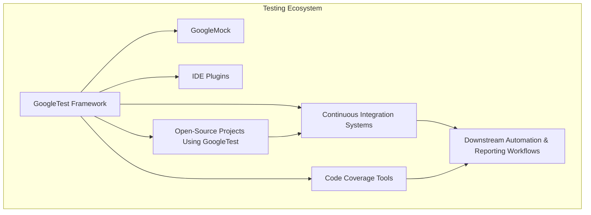

# Ecosystem & Integration Points

GoogleTest is more than just a C++ testing and mocking framework — it's a vital component within a rich ecosystem of tools that enhance and extend its capabilities. This page explains how GoogleTest integrates seamlessly with related tools like GoogleMock, continuous integration (CI) systems, code coverage utilities, IDE plugins, and how it's adopted by significant open-source projects. Understanding these integration points helps you unlock the full potential of GoogleTest beyond writing standalone tests.

---

## GoogleMock: Complementing GoogleTest with Powerful Mocking

GoogleMock (gMock) is Google's C++ mocking framework tightly integrated with GoogleTest, enabling detailed verification of interactions between components.

### Why GoogleMock Matters

- Lets you create mock objects easily, specifying expected calls, argument matchers, return values, and call sequences.
- Enables interaction testing, not just state validation, improving test focus on collaboration correctness.
- Offers a rich set of matchers and actions that let you precisely define expected behavior.

### Integration Highlights

- **Shared namespace and headers:** Both GoogleTest and GoogleMock live under the `testing` namespace, and mocking features are accessed via `#include <gmock/gmock.h>`, making usage uniform.
- **Mock classes in tests:** Use GoogleMock-generated mock classes within GoogleTest test cases with full support for EXPECT_CALL, ON_CALL, and verification semantics.
- **Verbose diagnostics:** GoogleMock enhances test output with detailed failure messages indicating precisely which mock call failed and why.

#### Example: Basic Mock Setup within GoogleTest

```cpp
#include <gtest/gtest.h>
#include <gmock/gmock.h>

class Foo {
 public:
  virtual ~Foo() {}
  virtual int GetValue() const = 0;
};

class MockFoo : public Foo {
 public:
  MOCK_METHOD(int, GetValue, (), (const, override));
};

TEST(FooTest, ReturnsExpectedValue) {
  MockFoo mock_foo;
  EXPECT_CALL(mock_foo, GetValue())
      .WillOnce(::testing::Return(42));

  EXPECT_EQ(mock_foo.GetValue(), 42);
}
```

## Continuous Integration (CI) Systems

GoogleTest is designed to fit effortlessly into modern CI workflows, supporting automation and fast feedback.

### Benefits of Integration

- **Automated test execution:** CI systems like Jenkins, GitHub Actions, GitLab CI, and others can run GoogleTest suites on every code push.
- **Standard exit codes:** GoogleTest returns `0` on success and non-zero on failures, which CI pipelines use to detect and report test failures.
- **Detailed output parsing:** Build and test summary reports can parse GoogleTest's XML output (via `--gtest_output=xml:` flag) for dashboards and reporting.

### Typical CI Usage Flow

1. Checkout source code and dependencies.
2. Build GoogleTest and product code.
3. Run tests with `RUN_ALL_TESTS()`.
4. Collect and publish test reports and trends.

---

## Code Coverage Tools

GoogleTest integrates with coverage tools to help assess how much of your code is exercised by tests.

### Common Coverage Tools

- **lcov/gcov:** For GCC-based builds, works smoothly with GoogleTest.
- **Visual Studio Code Coverage:** Supports coverage collection for projects with GoogleTest on Windows.
- **Other third-party tools:** Such as Codecov, Coveralls which consume coverage reports generated from instrumented tests.

### Workflow Tips

- Instrument your build with coverage flags (e.g., `-coverage` in GCC).
- Run GoogleTest test suites to generate coverage data.
- Use coverage reports to identify and fill test gaps.

## IDE Plugins

GoogleTest is supported by multiple IDE plugins, enabling enhanced development experience:

- **CLion:** Has built-in GoogleTest integration, offering test creation, execution, and debugging within the IDE.
- **Visual Studio:** Through extensions or native support, enabling test discovery and run/debug.
- **VS Code:** Extensions like `GoogleTest Adapter` facilitate test running and debugging.

### Key Advantages

- Intelligent test discovery and navigation.
- Simplified test execution with feedback in the IDE.
- Debugging support attached directly to failed tests.

## Adoption in Significant Open-Source Projects

GoogleTest's robustness and accessibility have led to wide adoption in prominent open-source initiatives.

### Examples

- **TensorFlow:** Uses GoogleTest for unit and integration tests.
- **Chromium:** Integrates GoogleTest and GoogleMock for testing browser components.
- **Abseil:** Google's supplementary C++ library also uses GoogleTest extensively.

This widespread use confirms its reliability and flexibility across diverse C++ projects.

## Downstream Automation and Reporting Workflows

Within the ecosystem, GoogleTest acts as the core testing engine feeding data into automation pipelines.

### Reporting Flow

- Tests generate detailed reports (console logs, XML, JSON).
- CI systems aggregate test results and trigger notifications.
- Dashboards update to reflect test pass rates, failures, flaky tests, and performance metrics.

### Automation

- Conditional test triggering based on code changes.
- Integration with code review tools to prevent merging failing tests.
- Automated regression tracking and alerting.

## Summary Diagram: Ecosystem Overview



---

## Tips for Success

- **Use GoogleMock to gain deeper insight** into component interactions beyond simple assertions.
- **Integrate GoogleTest into your CI early** to catch issues immediately.
- **Generate and monitor coverage reports** to maintain high quality and test completeness.
- **Leverage IDE plugins** to make writing and debugging tests efficient.
- **Study open-source projects' use of GoogleTest** for best practices and patterns you can leverage.

## Common Pitfalls

- Running tests outside of CI without consistent environment setup can cause false negatives.
- Overly strict expectations in mocks can lead to brittle tests; balance precision and flexibility.
- Neglecting to configure code coverage with test execution may mislead quality assessment.
- Avoid mixing testing frameworks unnecessarily to maintain simplicity in automation.

## Getting Started from Here

To start integrating GoogleTest effectively within your development lifecycle:

- Explore the [GoogleMock Cheat Sheet](gmock_cheat_sheet.md) and [Mocking Reference](reference/mocking.md) to harness mocking power.
- Set up your CI pipeline as described in Continuous Integration best practices.
- Configure coverage tools matching your build environment.
- Install IDE plugins suitable for your workflow.

Next, visit the [System Architecture Overview](/overview/core-concepts-architecture/architecture-overview) page to understand where the ecosystem fits in the broader GoogleTest architecture.

---

For detailed guides on mocking patterns, assertion usage, and advanced test writing, see [gMock for Dummies](gmock_for_dummies.md) and [Mocking Cookbook](gmock_cook_book.md).


<Info>
This page explains GoogleTest's broad ecosystem and integration points with related tools, CI systems, code coverage, IDEs, and significant projects — focusing on user benefits and practical workflows.
</Info>
