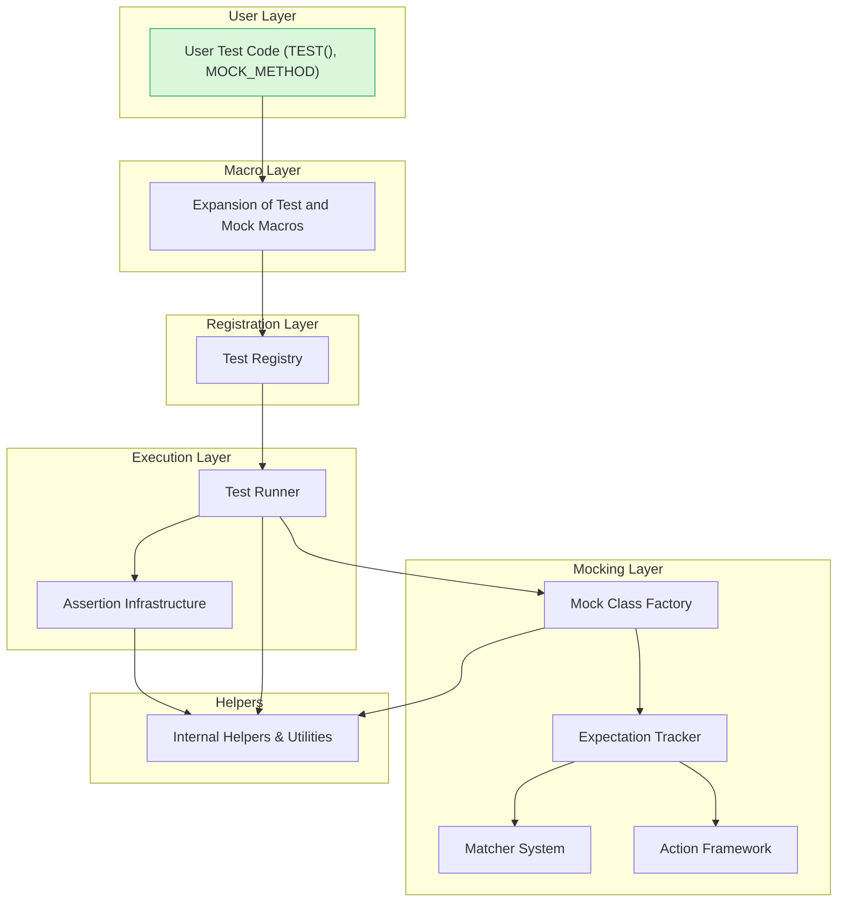

# High-Level Architecture

Understanding the internal flow and component relationships within the GoogleTest framework is essential for navigating and effectively using its full capabilities. This High-Level Architecture page offers a conceptual map of how GoogleTest and GoogleMock work together to allow developers to write reliable, repeatable, and maintainable tests.

---

## Overview

This page visualizes the journey of a test within the GoogleTest and GoogleMock framework—from user test code through macro expansion, test registration, assertion checking, and mock interaction handling. By emphasizing component boundaries, extension points, and internal helpers, it guides you conceptually rather than following the source code file structure.

By the end of this section, you will have a clear mental model of the test processing workflow and how mocking integrates into it, enabling you to utilize and extend the framework more effectively.

---

## Core Flow of a Test Execution

From a user's perspective, writing a test involves simple macros and assertions. Under the hood, GoogleTest and GoogleMock transform this straightforward source code into complex sequences involving multiple framework components.

Here’s a high-level user-to-framework workflow:

1. **User Writes Test Source Code:** Using macros like `TEST()` or `TEST_F()`, and mock-related macros like `MOCK_METHOD()`, users declare test cases and mocking behavior.

2. **Macro Expansion:** These macros expand into code that interacts with GoogleTest’s and GoogleMock’s internal registration and execution systems.

3. **Test Registration:** At program start or during static initialization, user tests are registered with the framework’s central test registry.

4. **Test Execution Engine:** When the test binary runs, the GoogleTest runner discovers registered tests and executes them one by one or based on filters.

5. **Assertion and Expectation Evaluation:** Assertions in the test code (e.g., `EXPECT_EQ`, `ASSERT_TRUE`) are evaluated. For mocks, GoogleMock tracks expectations and verifies calls.

6. **Mock Machinery Interaction:** When mock methods are called, GoogleMock intercepts these calls, matches them against expectations, executes prescribed actions, and records any violations.

7. **Test Outcome Reporting:** The framework reports success, failures, and errors along with detailed diagnostics.

---

## Component Breakdown

### 1. User Test Code
- **Test Macros:** Entry points like `TEST()`, `TEST_F()` simplify test writing by encapsulating boilerplate.
- **Mock Definitions:** Through `MOCK_METHOD` macros, mock classes implement interfaces with synthesized methods.

### 2. Macros & Preprocessing Layer
- Translates user-friendly macros into complex C++ code for registering, running tests, and mocking functions.

### 3. Test Registry
- Holds all registered tests in a global collection.
- Supports filtering and querying tests.

### 4. Test Runner
- Drives the sequence of running individual tests.
- Manages setup, teardown, and overall execution flow.

### 5. Assertions Infrastructure
- Provides runtime checks using assertion macros.
- Integrates with the test runner to report results.

### 6. Mocking Core (GoogleMock)
- **Mock Class Factory:** Processes `MOCK_METHOD` macros to generate mock implementations.
- **Expectation Tracker:** Stores expected calls and verifies actual calls.
- **Matcher System:** Allows flexible argument matching.
- **Action Framework:** Specifies return values or side effects on mock calls.

### 7. Internal Helper Utilities
- Support functions and classes that handle lifecycle, error reporting, and thread safety.

---

## Architectural Diagram



This diagram maps the user-visible test constructs to the framework’s internal pathways, highlighting how mocks integrate into the test execution.

---

## Extension Points and Internal Boundaries

- **Macros** act as the front door: users interact only with macros, not internal classes.
- **Test Registry and Runner** create a clean separation between test declaration and execution.
- **Mocking system** is modular, with distinct roles for class creation, expectation tracking, matching, and action handling. This separation allows for custom matchers and actions.
- **Internal helpers** ensure thread safety and manage resources invisible to most users.

---

## Practical Example Story

Imagine you write a mock class for an interface `Foo`:

```cpp
class MockFoo : public Foo {
public:
  MOCK_METHOD(int, DoWork, (int a), (override));
};
```

During compilation, `MOCK_METHOD` expands to code that registers this method with GoogleMock's machinery. When your test calls `mock_foo.DoWork(5)`, the call travels through the mock object to `ExpectationTracker`, which checks if this call was expected, runs the correct `Action`, and records the call.

Simultaneously, the test runner tracks assertions, reporting mismatches if expectations were not met or unexpected calls happened.

Understanding this flow helps you debug test failures better and implement custom extensions like new matchers or actions.

---

## Tips and Best Practices

- **Focus on the Interface:** Write tests and mocks through interfaces, letting GoogleMock handle the complexities internally.
- **Use Macros Carefully:** Macros are the user-facing contract—understand their role, but avoid digging into their expansions unless necessary.
- **Monitor Test Registration:** Ensure your tests are correctly registered; otherwise, they won’t execute.
- **Leverage Custom Matchers and Actions:** Build reusable components that plug into the mock machinery rather than altering core framework code.
- **Understand Mock Strictness:** Use `NiceMock`, `StrictMock`, or base mocks strategically to control warnings and errors.

---

## Troubleshooting Common Issues

- **Test Not Running:** Check if tests are properly registered with the registry.
- **Mock Calls Not Detected:** Verify that mock methods are declared public and use correct macros.
- **Unexpected Mock Call Failures:** Inspect call sequences and expectation ordering.

If deeper investigation is needed, this architecture page helps you trace where your test encounters issues in the flow.

---

## Next Steps

- Explore [Core Concepts & Terminology](/overview/core-concepts/concepts-terminology) to build vocabulary.
- Deep dive into [Test Registration & Execution](/api-reference/core-testing/test-registration-execution) for lifecycle insights.
- See detailed [Mock Classes & Methods](/api-reference/mocking-framework/mock-classes-methods) and [Setting Expectations & Actions](/api-reference/mocking-framework/expectations-actions) for mock usage.


---

<Info>
This conceptual understanding bridges your practical usage of GoogleTest and GoogleMock with their internal mechanics, empowering more effective test design and debugging.
</Info>
