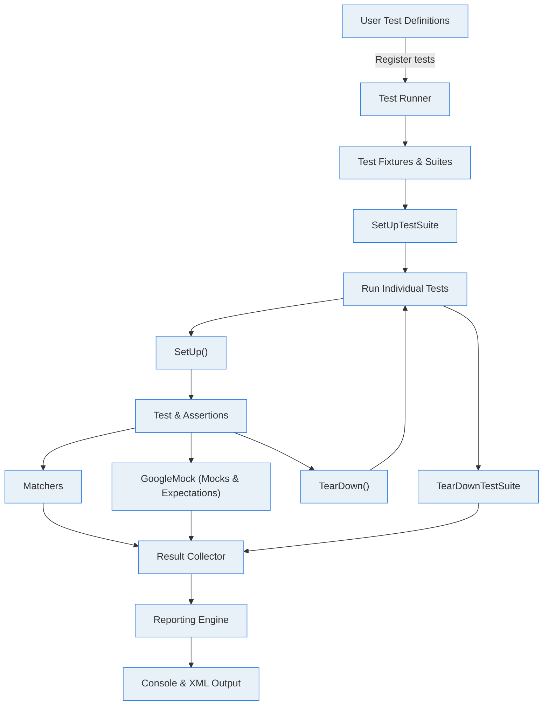

# System Architecture of GoogleTest

## Understand the Core Components and Their Interactions

GoogleTest is a robust C++ testing framework meticulously designed to streamline test writing, execution, and reporting. This page offers an insightful visualization of GoogleTest’s key architectural components — including test runners, matchers, mock frameworks, and reporting engines — and explains how they collaborate within typical testing workflows. By unpacking these modules and their data flows, you gain a clear perspective on GoogleTest’s modularity and extensibility, empowering you to use and extend the framework effectively.

---

## What Is This Page About?

This System Architecture page presents a high-level overview of GoogleTest’s principal components and their interactions during a testing cycle. Unlike the detailed API references or tutorials on writing tests, this page focuses on illustrating the **structural design** that makes GoogleTest powerful and flexible.

It elucidates how GoogleTest orchestrates the journey of a test case — from definition and execution through verification via matchers, mocking behaviors, to final reporting of outcomes. To help visualize this process, a comprehensive Mermaid diagram depicts the flow of data and control among the core modules.

---

## Core Components of GoogleTest Architecture

Each component in GoogleTest serves a specific purpose in the testing lifecycle.

- **Test Runner**: Manages discovery, scheduling, and execution of test suites and cases. The runner initializes test fixtures, invokes tests, and handles setup/teardown calls.

- **Matchers**: Provide expressive and rich conditions that assertions validate against. They interpret diverse expressions, enabling precise verification of complex data.

- **Mock Framework (GoogleMock)**: Implements mock objects, function stubs, and expectation verifications. It integrates seamlessly with the core test runner to allow interaction-based testing.

- **Reporting Engine**: Captures and formats test outcomes, including success, failure, skips, and crashes. Produces human-readable console output and machine-readable XML reports for CI/CD integration.

- **Test Fixtures and Suites**: Define reusable context and shared resources for grouped tests. Facilitate isolation and organization by controlling test environment lifecycles.

---

## How These Components Interact: The Testing Workflow

When you run your tests, GoogleTest progresses through several coordinated phases:

1. **Test Discovery and Initialization**
   - Test runner locates all registered test suites and individual tests.
   - For each suite, fixtures are created and `SetUpTestSuite()` hooks run at the start.

2. **Test Execution**
   - Each test case is instantiated with fresh fixtures.
   - `SetUp()` initializes the test environment.
   - The test body executes, running your assertions.
   - Assertions leverage matchers to verify conditions.
   - GoogleMock intercepts and mocks call interactions if used.
   - `TearDown()` cleans up after each test.

3. **Result Aggregation and Reporting**
   - Test results including success, failure, and skipped tests are recorded.
   - Reporting engine formats results for console output and XML logs.
   - Summary output aggregates overall results and timings.

4. **Suite and Global Tear Down**
   - `TearDownTestSuite()` finalizes test suites.
   - Any registered global environments are cleaned up.

---

## Visualizing the Architecture

Below is a Mermaid diagram illustrating the main components and their data/control flow during a typical test cycle.

This flowchart clearly demonstrates how each phase and component is invoked throughout the testing lifecycle.

---

## Practical Scenarios Illuminated by the Architecture

- **Writing tests with fixtures and mocks:** When you define tests that reuse setups (fixtures) and simulate dependencies (mocks), GoogleTest coordinates the lifecycle of these objects seamlessly, while validating expected behaviors through matchers.

- **Extending capabilities:** Developers looking to add custom matchers or reporters see precisely where to hook their code, ensuring clean integration with the existing modular design.

- **Integrating in CI pipelines:** Reporting components produce detailed XML outputs consumable by CI/CD tools, and test runners support selective test execution and result aggregation.

---

## Best Practices & Tips

- Structure your tests into suites with clean fixtures to leverage GoogleTest’s lifecycle optimizations.
- Use GoogleMock only inside your test bodies to take advantage of automatic mock management.
- Customize reporting by extending the TestEventListener interface to hook into reporting pipelines.
- Pay attention to setup and teardown hooks (`SetUpTestSuite()`, `TearDownTestSuite()`) for managing expensive, shared resources.

---

## Troubleshooting Common Pain Points

- **Tests not running:** Verify tests are properly registered through the test runner by checking your use of `TEST()`, `TEST_F()`, or other macros.
- **Unexpected test fixture reuse:** GoogleTest guarantees fixture isolation per test, so ensure any persistent test state is not relying on shared static variables.
- **Reports missing data:** Confirm your reporting engine is enabled or not overridden by custom listeners.

---

## Next Steps

- Dive into the [GoogleTest Primer](https://github.com/google/googletest/blob/main/docs/primer.md) to get started with writing your first tests.
- Explore the [Core Concepts and Terminology](https://yourdocslink/overview/core-concepts/concepts-terminology) to deepen your understanding of GoogleTest’s design.
- Review the API reference for [Test Fixtures and Test Cases](https://yourdocslink/api-reference/core-testing-apis/test-fixture-and-test-case-apis) to master writing complex tests.

---

For full source, see the [GoogleTest GitHub repository](https://github.com/google/googletest).

<Source url="https://github.com/google/googletest" branch="main" paths={[{"path": "googletest/src/gtest-all.cc", "range": "1-100"}]} />
