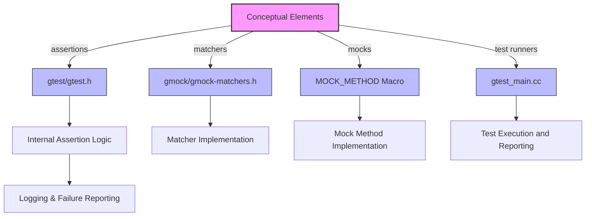

# Mapping Concepts to the Codebase

## Bridging Conceptual Understanding with Implementation

Welcome to the "Mapping Concepts to the Codebase" documentation page, where the abstract becomes concrete. This guide helps you connect the core ideas you’ve learned about GoogleTest’s testing framework — such as assertions, matchers, and test runners — to the actual source files and header locations that implement them.

Whether you're new to GoogleTest and want to see how high-level testing concepts are wired up, or a power user looking to extend or debug the system's core idioms, this page shows you how to navigate and make sense of the codebase efficiently.


---

## Why This Matters to You

Understanding where and how abstract testing concepts like assertions or mocks are implemented empowers you to:

- **Customize behavior:** Knowing where to plug in your extensions or overrides.
- **Debug with confidence:** Trace test failures or behavior to the exact source.
- **Contribute effectively:** Pinpoint files and components to modify or enhance.

You’ll gain clarity on the interplay between conceptual elements and their code representations, making your experience with GoogleTest more productive and confident.


---

## Core Elements and Their Corresponding Code

| Concept               | Code Artifact(s)                                                        | Purpose                                                               |
|-----------------------|------------------------------------------------------------------------|-----------------------------------------------------------------------|
| **Assertions**        | `gtest/include/gtest/gtest.h` and implementation files                 | Provide macros like `EXPECT_EQ`, `ASSERT_TRUE` to compare test data. |
| **Matchers**          | `gmock/include/gmock/gmock-matchers.h`, `gmock/gmock-matchers.cc`     | Define flexible criteria for matching arguments in tests.            |
| **Test Runners**      | `gtest/src/gtest_main.cc`, `gtest/src/gtest.cc`                       | Orchestrate discovery and execution of tests.                         |
| **Test Fixtures**     | Users define in their test code; GoogleTest code supports via headers  | Setup/teardown environment for grouped tests.                         |
| **Test Discovery**    | `gtest/src/gtest.cc`, internal registries                            | Automatically find and run tests using registration APIs.             |
| **Report Generation** | `gtest/src/gtest_xml_out.cc`, `gtest/src/gtest.cc`                   | Generate test output reports in various formats.                      |

This is a high-level map. Each area expands into multiple classes and functions, but these are your primary entry points.


---

## Practical Tips for Navigating the Codebase

- **Start at header files:** `gtest/gtest.h` for testing APIs and `gmock/gmock.h` for mocking APIs are the main public interfaces.
- **Follow source roots:** Implementation is in `googletest/src` and `googlemock/src` corresponding to headers.
- **Use the test main:** Invoking tests via `gtest_main.cc` shows how tests bootstrap.
- **Explore the matcher system:** Matchers are a cornerstone and reside mainly under `gmock/matchers`.
- **Check out the `MOCK_METHOD` macro:** Found in `gmock/gmock-function-mockers.h` and related headers, it auto-generates mock implementations.


---

## Extending Core Idioms

To extend or contribute, consider these approachable steps:

1. **Identify the concept you want to tweak or add** (e.g., a new matcher).
2. **Locate the closest header and source files** — for matchers, start with `gmock-matchers.h`.
3. **Look for tests as examples** — test files illuminate API usage and implementation interaction.
4. **Follow GoogleTest's modular structure** — most components are cleanly separated.


---

## Example: Tracing an Assertion Macro

When you write an assertion in your test like:

```cpp
EXPECT_EQ(value1, value2);
```

Here’s how that relates to code:

- **Macro Expansion:** Begins in `gtest/gtest.h`, which provides the `EXPECT_EQ` macro.
- **Internal Call:** Calls functions in `gtest-internal` (such as `AssertHelper`) which perform actual comparison.
- **Failure Reporting:** Uses utilities from `gtest-port.h` for logging and reporting failures.

This realization empowers you to modify or debug assertions by following this chain.


---

## Example: Understanding a Mock Method

A mocked method defined as:

```cpp
MOCK_METHOD(int, GetValue, (), (const, override));
```

Maps to:

- Generated code that lives in `gmock/gmock-function-mockers.h`.
- Uses `ExpectCall`, `Invoke` machinery to match and respond to calls.
- Interacts with internal expectations and actions defined across `gmock` source.

You can locate and alter mock behavior by examining these components.


---

## Visualization: Concept to Implementation Relationship




---

## Troubleshooting Common Navigation Scenarios

### Why can’t I find the source for a particular matcher?
Matchers can be polymorphic and are often declared in header files with templates. Implementation may be inline or split across `.h` and `.cc` files inside the `gmock` folder.

### Tests don’t run as expected — should I look at the runners?
Yes. The runners handle lifecycle and environment. Begin with `gtest_main.cc` which launches the process, and `gtest.cc` for test handling.

### Can I just extend Googletest by adding new mocking macros?
GoogleMock is designed for extension. Consult the `gmock_cook_book.md` and mock-related headers for adding new mocking idioms.


---

## Next Steps

- Explore the [Essential Concepts & Terminology](https://github.com/google/googletest/blob/main/docs/overview/core-concepts/key-concepts.mdx) page to reinforce your conceptual foundation.
- Deep dive into the [System Architecture](https://github.com/google/googletest/blob/main/docs/overview/inside-googletest/architecture-overview.mdx) for a complete picture.
- Try the [Getting Started Guide](https://github.com/google/googletest/blob/main/docs/overview/getting-started/product-intro.mdx) if you are new to GoogleTest.


---

## Reference Links

- [GoogleMock for Dummies](https://google.github.io/googletest/gmock_for_dummies.html) - Learn mocking basics.
- [gMock Cookbook](https://google.github.io/googletest/gmock_cook_book.html) - Recipes for advanced mocking.
- [GoogleTest GitHub Repository](https://github.com/google/googletest) - Source code and issues.


---

Empowered with this mapping between ideas and files, you are ready to explore and tailor GoogleTest to your testing workflow with clarity and precision.