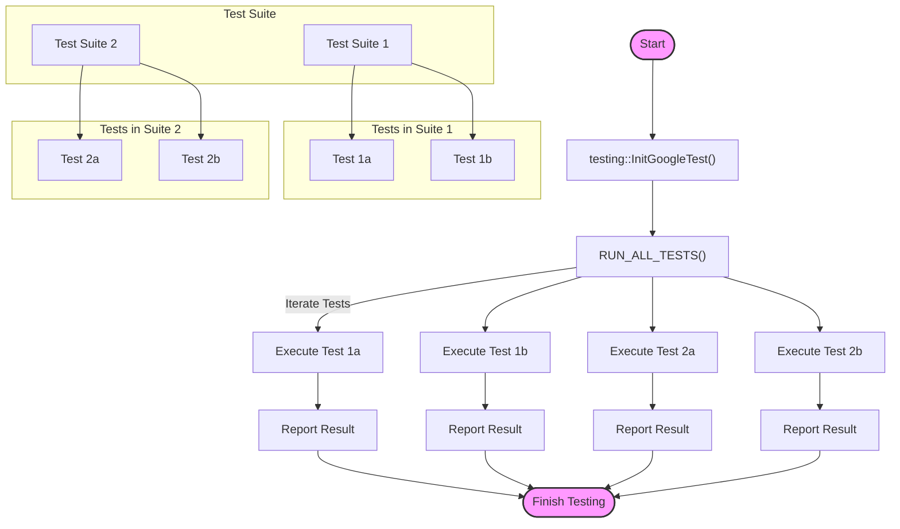

# Test Structure and Discovery

## Introduction: Why Understanding Test Structure Matters

Understanding how tests are organized in GoogleTest is crucial for creating maintainable, scalable, and effective test suites. GoogleTest employs a structured, xUnit-inspired architecture that automatically discovers, compiles, and executes tests, allowing developers to focus on writing meaningful tests instead of managing test registrations or execution flows.

This page walks you through how GoogleTest organizes tests internally, the hierarchy it uses, and the process behind discovering and running tests. Equipped with this knowledge, you'll be empowered to build robust test suites quickly and effectively.

---

## Core Concepts: The Hierarchy of Tests in GoogleTest

GoogleTest adapts the classical xUnit architecture to C++ with a clear hierarchy that helps organize tests logically:

- **Test Suite (formerly called Test Case):** A collection of related tests. Typically groups tests for a particular class or module.
- **Test:** The individual test itself, defined by a specific input and expected outcome.

Your test programs contain one or more test suites, and each suite contains one or more tests. This organization supports modular testing and helps maintain a clear overview of your code’s test coverage.

### Test Fixtures

For tests that share common setup or teardown procedures, GoogleTest offers *test fixtures*. A test fixture is a class derived from `testing::Test` that provides shared data and functions for a test suite. Using fixtures avoids code duplication and ensures consistent initial conditions.

For example:

```cpp
class QueueTest : public testing::Test {
 protected:
  QueueTest() {
    // Common setup
    q1_.Enqueue(1);
  }

  Queue<int> q0_;
  Queue<int> q1_;
};

TEST_F(QueueTest, IsEmptyInitially) {
  EXPECT_EQ(q0_.size(), 0);
}

TEST_F(QueueTest, DequeueWorks) {
  int* n = q1_.Dequeue();
  ASSERT_NE(n, nullptr);
  EXPECT_EQ(*n, 1);
  delete n;
}
```

Here, `TEST_F` indicates a test using the fixture `QueueTest`.

---

## Automatic Test Discovery and Registration

Unlike some frameworks where tests need explicit registration, GoogleTest automatically discovers and registers all tests declared with its macros (`TEST()`, `TEST_F()`, `TEST_P()`, etc.).

This is achieved via the use of static variables and constructor magic behind the macros:

1. When you write a test using `TEST()` or `TEST_F()`, GoogleTest expands macros that instantiate static objects.
2. These static objects register themselves in a global registry when the test binary starts.
3. When you call `RUN_ALL_TESTS()`, GoogleTest iterates through this registry and executes each registered test.

This convenience lets developers add tests anywhere in their code base without worrying about manual registration or updating lists.

---

## The Compilation and Execution Flow of Tests

### 1. Source Code Parsing and Macro Expansion

Writing a test with `TEST()` or `TEST_F()` macros expands into a test class with methods specially set up for execution.

### 2. Static Registration

Each test class creates a static variable instance that registers the test with a global internal registry used by GoogleTest.

### 3. Initialization

When the test binary runs, the `main()` function usually calls `testing::InitGoogleTest(&argc, argv)` to initialize GoogleTest. Then it calls `RUN_ALL_TESTS()`.

### 4. Test Execution

`RUN_ALL_TESTS()` traverses the registry, instantiates a fresh test fixture object for each test, runs `SetUp()`, executes the test code, runs `TearDown()`, and destroys the fixture.

### 5. Reporting

GoogleTest reports the outcomes of each test (pass or fail) and aggregates the results for the entire test suite.

---

## Benefits of This Structure

- **Isolation:** Each test runs independently in its own fixture instance, ensuring no cross-test interference.
- **Automatic discovery:** No manual updates needed when adding or removing tests.
- **Organization and readability:** Grouping tests logically improves clarity and maintenance.
- **Extensibility:** Supports parameterized, typed, and value-parameterized tests, in addition to fixtures.

---

## Practical Tips for Using GoogleTest’s Test Structure

- Use consistent naming conventions for test suites and tests for better readability.
- Employ test fixtures when tests share common setup/teardown logic.
- Avoid putting too much logic in one test; keep them focused to make failures easier to diagnose.
- Use `TEST_F()` when accessing fixture data or helper functions.
- Run tests individually by name using `--gtest_filter=` during debugging.

---

## Common Pitfalls & Troubleshooting

<AccordionGroup title="Common Issues in Test Structure and Discovery">
<Accordion title="Tests Not Running or Being Discovered">
Make sure you use the `TEST()` or `TEST_F()` macros correctly.
Avoid defining tests in source files not included in the build.
Use `RUN_ALL_TESTS()` **only once** in your `main()`.
Verify the test binary is the one you expect and is rebuilt after adding tests.
</Accordion>
<Accordion title="Test Fixtures Not Working as Expected">
Ensure your fixture class inherits from `testing::Test`.
Remember that `SetUp()` and `TearDown()` functions are used for setup and cleanup.
GoogleTest creates a fresh fixture object per test — don't try to preserve state between tests.
</Accordion>
<Accordion title="Failures to Launch Individual Tests via Filter">
Check test suite and test names are correct and match the filter syntax.
Use `--gtest_list_tests` to see all registered tests.
</Accordion>
</AccordionGroup>

---

## Getting Started Preview

To start writing tests with GoogleTest's structure:

1. Define tests with `TEST()` and/or `TEST_F()` macros.
2. Group related tests into test suites.
3. Use fixtures to share setup/teardown code.
4. Build and run your test executable.

See the [GoogleTest Primer](overview/introduction-value/what-is-googletest) and [Writing Your First Test](getting-started/first-test-experience/writing-your-first-test) for detailed steps.

---

## Next Steps

Proceed to learn about:

- [Assertions and Failure Handling](overview/core-concepts/assertions-and-failures) to verify test correctness.
- [Parameterized and Typed Test Patterns](overview/core-concepts/parameterized-and-typed-tests) for more advanced test data coverage.
- Integrate mocks via [Introduction to Mocking](overview/core-concepts/mocking-basics).

Check out the [Mocking Guide](guides/core_workflows/creating-mocks) to combine testing with mocks.


---

# diagram: Test Structure



---

# Summary

This page explains how GoogleTest organizes tests using an xUnit-inspired hierarchical model comprising test suites and tests, including the use of test fixtures for shared setup. It details automatic test discovery and registration that frees users from manual bookkeeping and describes how tests are compiled and executed under the hood. The documentation also provides practical advice, common pitfalls to avoid, and pointers to related documentation for a comprehensive understanding.

Main Sections:
- Core Concepts: Test hierarchy and fixtures
- Automatic Test Discovery mechanics
- Compilation and execution flow
- Practical tips and troubleshooting
- Next Steps for deeper understanding

Important Links:
- [GoogleTest Primer](overview/introduction-value/what-is-googletest)
- [Writing Your First Test](getting-started/first-test-experience/writing-your-first-test)
- [Assertions and Failure Handling](overview/core-concepts/assertions-and-failures)
- [Parameterized and Typed Test Patterns](overview/core-concepts/parameterized-and-typed-tests)
- [Introduction to Mocking](overview/core-concepts/mocking-basics)
- [Mocking Guide](guides/core_workflows/creating-mocks)

Users are encouraged to build their tests using these structures and progressively explore assertions, parameterized testing, and mocking for robust test development.