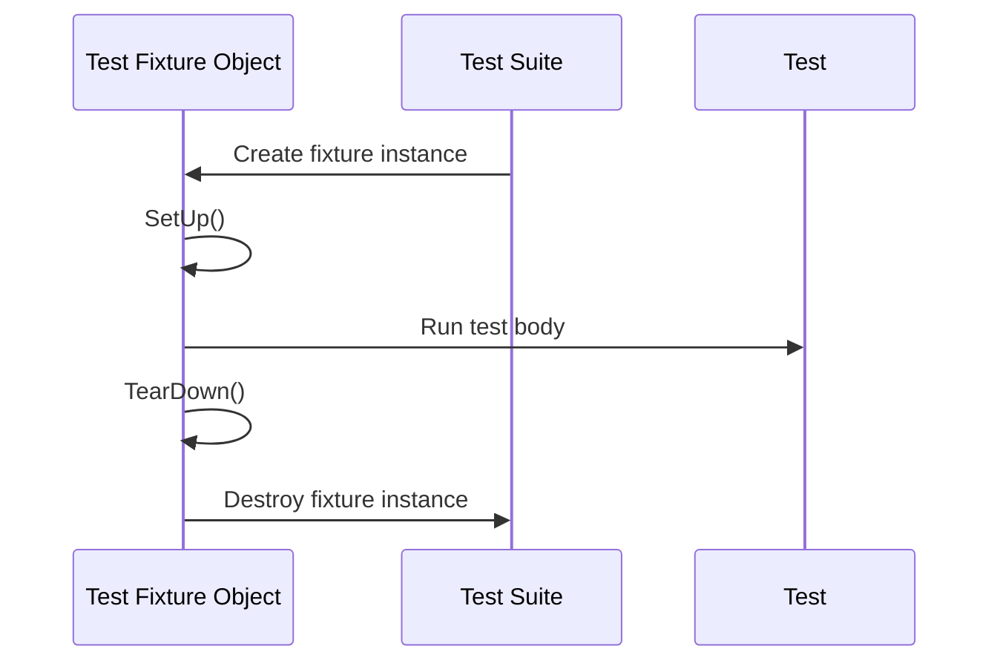

# xUnit Fundamentals

## Understanding GoogleTest's xUnit Architecture

GoogleTest is built upon the proven **xUnit architecture**—a framework style designed to help you organize and execute tests in a clear, structured manner. This architecture elegantly models tests as *suites* composed of individual *test cases*, supported by *fixtures* that provide reusable contexts and setup logic.

Whether you're maintaining a simple library or a complex C++ application, grasping xUnit fundamentals will empower you to write organized, maintainable, and scalable tests.

---

## The Core Components of xUnit

### 1. Test Suites

A **Test Suite** is a logical collection of related tests. It reflects the grouping of tests that share context or test a particular unit of functionality.

- Each Test Suite contains multiple tests focused on a related set of features or behaviors.
- It aligns closely to a class, function, or component under test.

### 2. Tests (Test Cases)

An individual **Test** (often called a Test Case) is a function that validates a specific behavior or scenario.

- Tests are atomic and independently executable.
- Each test uses assertions to verify expected outcomes.
- Tests are named uniquely within their suite.

### 3. Test Fixtures

Fixtures are classes that provide common setup and teardown for the tests in a suite.

- Encapsulate shared data, objects, and helper functions.
- The fixture lifecycle ensures that each test runs in a fresh environment to avoid interference.
- Typical procedure: construct fixture → `SetUp()` → run test → `TearDown()` → destroy fixture.


---

## Why xUnit Matters: Simplifying Test Organization and Execution

Imagine you are testing a `Queue` class. You want to check that:

- New queues start empty.
- Enqueueing an item increases size.
- Dequeueing returns items in FIFO order.

Using xUnit:

- You collect these tests in a `QueueTest` suite.
- You write a fixture class that prepares queues in various states.
- Each test uses this fixture to run isolated checks.

This pattern ensures your tests are organized for readability and maintainability, allowing fast execution and clear diagnostics.


---

## User Flow: Writing Tests with GoogleTest's xUnit Model

1. **Define a Test Fixture (optional but recommended for shared context)**

   ```cpp
   class QueueTest : public testing::Test {
    protected:
     void SetUp() override {
       // Common setup
       queue_.Clear();
     }

     Queue<int> queue_;
   };
   ```

2. **Write Individual Tests Using `TEST` or `TEST_F` Macros**

   - `TEST` macro defines a test without a fixture.
   - `TEST_F` macro defines a test that inherits the fixture.

   ```cpp
   TEST_F(QueueTest, IsEmptyInitially) {
     EXPECT_EQ(queue_.size(), 0);
   }

   TEST_F(QueueTest, EnqueueIncreasesSize) {
     queue_.Enqueue(42);
     EXPECT_EQ(queue_.size(), 1);
   }

   TEST_F(QueueTest, DequeueReturnsFirstElement) {
     queue_.Enqueue(10);
     queue_.Enqueue(20);
     EXPECT_EQ(queue_.Dequeue(), 10);
     EXPECT_EQ(queue_.size(), 1);
   }
   ```

3. **Run Your Tests**

   Invoke `RUN_ALL_TESTS()` after initializing GoogleTest. Each test runs independently.

4. **Analyze Results**

   Pass or failure is indicated per test. Failure messages include source locations and failed assertions.


---

## Key Benefits of GoogleTest's xUnit Model

- **Isolation of tests:** Each test runs with a fresh fixture instance to avoid shared state bugs.
- **Easy grouping:** Organize tests logically by functionality, making test code easier to navigate.
- **Clear diagnostics:** Failures point explicitly to specific tests with detailed assertion messages.
- **Flexible fixture setup:** Use constructor, `SetUp()`, and `TearDown()` to control test lifecycle.
- **Extends to advanced testing:** Base for parameterized tests, typed tests, and death tests.


---

## Advanced Concepts

### SetUpTestSuite and TearDownTestSuite

- Static methods on fixtures to manage costly shared resources used by many tests.
- Called once before the first test and after the last test of a suite, respectively.

### Handling Test Naming

- Avoid underscores `_` in test suite and test names due to internal naming conventions.
- Naming convention: `TEST(TestSuite, TestName)` and `TEST_F(FixtureClass, TestName)`.

### Test Execution Lifecycle Summary




---

## Practical Tips

- Prefer `TEST_F` when tests share common setup or helper methods.
- Use `SetUp()`/`TearDown()` for complex initialization/cleanup.
- Make use of `SetUpTestSuite`/`TearDownTestSuite` to share expensive resources.
- Name your tests clearly to describe behavior being tested.
- Group logically related tests in the same suite to improve discoverability.
- Avoid test order dependencies; each test should be self-contained.


---

## Troubleshooting Common Issues

<AccordionGroup title="Common Pitfalls with xUnit Testing in GoogleTest">
<Accordion title="Mixing TEST() and TEST_F() with the same suite name">
Avoid defining `TEST` and `TEST_F` with the same test suite name. GoogleTest requires all tests in a suite to share the same fixture class.
</Accordion>
<Accordion title="Underscores in Test Suite or Test Names">
Do not include underscores `_` in test suite or test names. They can cause internal clashes or name mangling errors.
</Accordion>
<Accordion title="Using non-default constructors in fixture classes">
GoogleTest needs a default constructor to create fixture instances for each test. Ensure your fixture either has a default constructor or one that allows default construction.
</Accordion>
<Accordion title="Resource leaks due to fixture reuse">
Remember GoogleTest creates a fresh fixture for each test. Be sure that all allocated resources are cleaned up properly to avoid leaks.
</Accordion>
</AccordionGroup>

---

## Next Steps: Exploring More of GoogleTest

Having mastered the essentials of xUnit Fundamentals, you can:

- Dive into [Assertions and Matchers](/overview/core-concepts/assertions-and-matchers) to write precise checking conditions.
- Learn to use [Parameterized and Type-Parameterized Tests](/overview/core-concepts/parameterized-and-type-tests) to reduce test duplication.
- Understand [Mocking and GoogleMock](/overview/core-concepts/mocking) to test complex dependencies.


---

## References & Further Reading

- [GoogleTest Primer](../primer.md#xunit-fundamentals)
- [Testing Reference: Test Definition and Execution](docs/reference/testing.md#test)
- [FAQ: Why avoid underscores in test names](docs/faq.md#why-should-test-suite-names-and-test-names-not-contain-underscore)
- Official GoogleTest repository: [https://github.com/google/googletest](https://github.com/google/googletest)


---

# Summary Diagram

```mermaid
graph TD
  subgraph GoogleTest xUnit Model
    Suite[Test Suite]
    Test1[Test Case 1]
    Test2[Test Case 2]
    Fixture[Test Fixture]
  end

  Suite --> Test1
  Suite --> Test2

  Test1 --> Fixture
  Test2 --> Fixture

  subgraph Fixture Lifecycle
    Construct[Construct]
    Setup[SetUp()]
    Run[Test Body]
    TearDown[TearDown()]
    Destruct[Destruct]
  end

  Fixture --> Construct --> Setup --> Run --> TearDown --> Destruct

  classDef suite fill:#eef6ff,stroke:#3399ff,stroke-width:2px;
  class Suite suite;
```

This diagram illustrates the relationship between test suites, test cases, and fixtures, showing the lifecycle of each test fixture instance.

---

### Code Example: Basic Fixture and Tests

```cpp
#include <gtest/gtest.h>

// Fixture for Queue tests
class QueueTest : public testing::Test {
 protected:
  void SetUp() override {
    queue_.Clear();
  }

  Queue<int> queue_;
};

// Tests
TEST_F(QueueTest, IsEmptyInitially) {
  EXPECT_EQ(queue_.size(), 0);
}

TEST_F(QueueTest, EnqueueAddsElement) {
  queue_.Enqueue(42);
  EXPECT_EQ(queue_.size(), 1);
}

TEST_F(QueueTest, DequeueReturnsElementsInFIFO) {
  queue_.Enqueue(1);
  queue_.Enqueue(2);
  EXPECT_EQ(queue_.Dequeue(), 1);
  EXPECT_EQ(queue_.Dequeue(), 2);
}

int main(int argc, char **argv) {
  testing::InitGoogleTest(&argc, argv);
  return RUN_ALL_TESTS();
}
```

This minimal example demonstrates how to create a fixture to share a queue object and how to write tests that operate on it independently.
