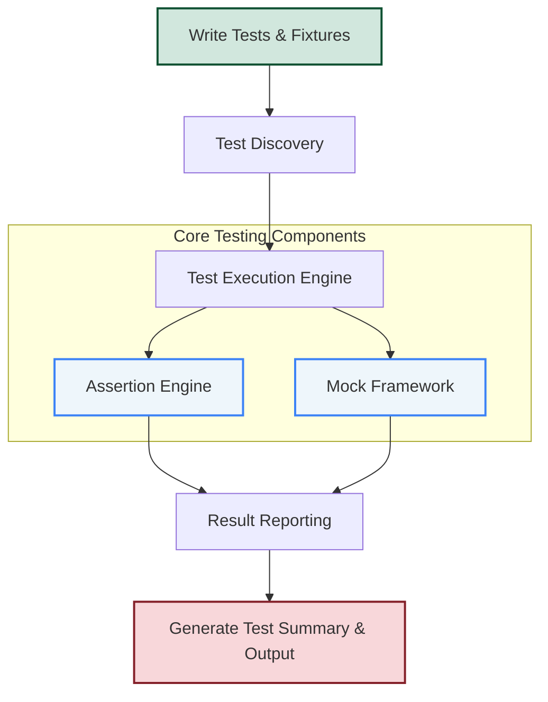

# System Architecture Overview

## See How Everything Fits Together at a Glance

GoogleTest offers a robust and flexible framework for writing, discovering, executing, and reporting C++ tests. This page unveils the inner workings of GoogleTest's system architecture through a clear and concise mermaid diagram, providing you with a high-level understanding of how the major components interconnect. You'll learn how your test code flows through the layers—from writing tests to final reports—and get insights into key subsystems like the assertion engine and mock framework.

---

## Understanding GoogleTest's Architecture

GoogleTest is designed to streamline C++ testing by automating the discovery of test cases, grouping related tests into test suites, managing test execution lifecycles, and elegantly reporting results. Behind the scenes, several core components collaborate seamlessly:

- **Test Definitions:** Your handwritten test cases and fixtures define expected behaviors and conditions.
- **Test Discovery:** The framework automatically discovers all tests and prepares them for execution.
- **Test Execution:** Tests run in an orchestrated manner, with setup and teardown handled gracefully.
- **Assertion Engine:** When tests expect specific outcomes, assertions validate results and report successes or failures.
- **Mocking Framework:** GoogleMock integrates here, allowing you to mock dependencies and specify behavior and expectations.
- **Result Reporting:** Summarizes everything, clearly showing which tests passed, failed, or were skipped, including detailed messages.

This architecture enables you to focus on writing meaningful tests while GoogleTest manages the complexities of execution and verification.

---

## Mermaid Diagram: GoogleTest System Flow

---

## Component Flow Explanation

1. **Write Tests & Fixtures:**
   You author tests using GoogleTest macros and utilities including test fixtures that set up reusable contexts.

2. **Test Discovery:**
   GoogleTest automatically finds all defined tests in your codebase without manual registration, simplifying integration and scaling.

3. **Test Execution Engine:**
   Manages the orderly execution of tests, respecting setup and teardown phases, and integrates with the assertion and mocking subsystems.

4. **Assertion Engine:**
   Validates conditions in your tests, immediately reporting success or failure with rich diagnostics.

5. **Mock Framework:**
   Enables sophisticated mocking of dependencies via GoogleMock, allowing for interaction testing alongside state verification.

6. **Result Reporting:**
   Aggregates the outcomes, producing comprehensive logs and summaries accessible in multiple formats.

7. **Test Summary & Output:**
   Presents a human-readable and machine-parsable report on your test results, facilitating continuous integration and debugging.

---

## Why Is This Important for You?

Understanding this system architecture lets you effectively leverage GoogleTest and GoogleMock in your projects. It ensures you grasp how your tests move through stages, helping you debug errors, optimize test suites, and extend the framework’s capabilities. Knowing where the assertion engine and mock framework fit enables better design decisions, like when to use mocks or how to organize your tests.

---

## Practical Tips

- Organize your tests clearly, so GoogleTest's discovery mechanism picks them up easily.
- Use GoogleMock to simulate dependencies, knowing it integrates tightly within the execution engine.
- View results immediately, appreciating the seamless flow from assertions to reporting.
- Consult linked pages to dive deeper into each stage (writing tests, assertions, mocking, and workflows).

---

## Next Steps

- Start writing your first test with the [Welcome to GoogleTest](https://google.github.io/googletest/overview/introduction_and_value/welcome_to_googletest) guide.
- Configure your project and build system with step-by-step instructions in [Basic Configuration](https://google.github.io/googletest/getting-started/setup-usage-validation/basic-configuration).
- Explore advanced testing patterns including mocks in [gMock for Dummies](https://google.github.io/googletest/docs/gmock_for_dummies.html).
- Learn to interpret test reports to enhance your continuous integration workflows.

---

## References & Related Documentation

- [What is GoogleTest?](https://google.github.io/googletest/overview/introduction_and_value/welcome_to_googletest) – Intro and getting started
- [Core Concepts & Terminology](https://google.github.io/googletest/overview/core_concepts_and_architecture/key_concepts_and_terminology) – Understand key testing abstractions
- [Mocking Reference](https://google.github.io/googletest/reference/mocking) – Guide to mocking APIs
- [Feature Highlights & Use Cases](https://google.github.io/googletest/overview/feature_overview_and_use_cases/feature_highlights) – Learn practical applications

---

This page fits naturally within the **Core Concepts & Architecture** group, helping you visually connect writing, discovery, execution, asserting, mocking, and reporting.

Harness this overview to become more confident navigating GoogleTest’s powerful toolset.
