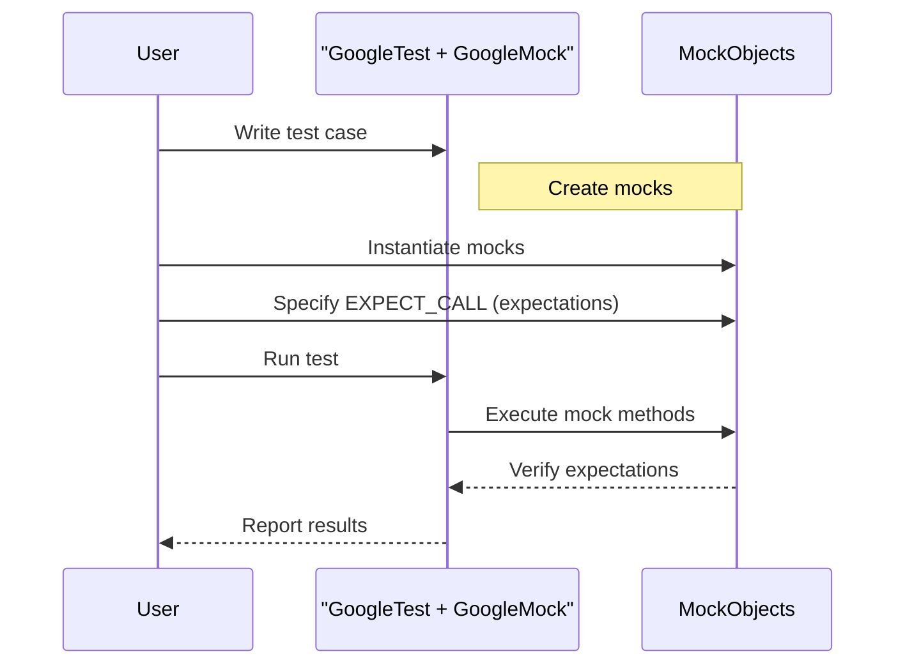

# Core Concepts & Terminology

Welcome to an essential guide to the foundational concepts behind GoogleTest and GoogleMock. Whether you're new to testing or specifically new to these frameworks, this page equips you with the critical vocabulary and ideas you need to confidently write, read, and maintain effective tests.

---

## Understanding Tests and Test Cases

At its heart, GoogleTest helps you define *test cases* which are specific units of testing. A test case checks the behavior of your code under certain conditions and validates that it produces correct results.

- **Test Case**: A named logical grouping of tests for a particular functionality or class.
- **Test**: A single, isolated unit of validation within a test case, verifying a particular behavior or output.

Tests generally follow a user-centric flow:

1. Set up the necessary input or state.
2. Exercise the code or function under test.
3. Verify outcomes using assertions.

This ensures your testing is clear, focused and reliable.

---

## Fixtures: Reusing Setup and Cleanup Logic

GoogleTest supports *test fixtures*, reusable classes that contain shared setup and teardown code used by multiple tests. This avoids duplication and ensures consistent environment preparation.

- Use fixtures when several tests need the same state or resource.
- Define a class derived from `::testing::Test` with setup and teardown methods.
- Each test then inherits and runs the shared methods automatically.

Example flow using fixtures:

```cpp
class MyTestFixture : public ::testing::Test {
 protected:
  void SetUp() override { /* common setup code */ }
  void TearDown() override { /* common cleanup code */ }
};

TEST_F(MyTestFixture, TestName) {
  // test body exercises tested code
}
```

---

## Assertions: Confirming Expected Behavior

Assertions check whether expected conditions hold. GoogleTest offers powerful macros, such as `EXPECT_EQ`, `ASSERT_TRUE`, and more specialized ones, to verify values, states, or logic in your tests.

- **EXPECT_** assertions record failures but continue the test.
- **ASSERT_** assertions abort the current test immediately on failure.

Use assertions to clearly express what your code should do in a particular test.

---

## Mocks: Simulating Collaborating Objects

When your code depends on other classes, databases, hardware, or external services, validating it directly can be hard, slow, or flaky. *Mocks* solve this by simulating those collaborators, letting you specify how they're expected to be called and control their responses.

- A *mock object* impersonates an interface or class your code depends on.
- You specify **expectations** about which methods should be called, with which arguments, how many times, and what they return.
- Mocks verify interactions immediately, pinpointing failures in contract early.

GoogleMock is GoogleTest's framework for easily creating and using mocks in C++.

### Key Terminology

- **Mock Class**: A class created with GoogleMock macros containing mock methods.
- **Mock Method**: A mocked version of a real method, generated by `MOCK_METHOD`.
- **Expectation**: A specification attached to a mock method that defines expected calls.
- **Matcher**: A predicate to specify which arguments are acceptable when a method is called.
- **Action**: What a mock method does when called (return value, side effects, etc).

By modeling interactions as expectations on mocks, you verify not just *state* but the *correctness of communication* between components.

---

## Matchers: Expressive Argument Validation

Matchers describe precisely the allowable parameters for mock method calls. They range from simple checks like equality or wildcards, to complex predicates.

- `_` (underscore) matches anything, often used to ignore less relevant arguments.
- `Eq(value)`, `Ge(value)` (greater or equal), `Ne(value)`, `NotNull()`, `Pointee(m)`, and many others are built-in.
- Custom matchers can be written to capture specific validation logic.

Examples:

```cpp
EXPECT_CALL(mock_obj, Method(Eq(5), _));  // First argument exactly 5, second anything
EXPECT_CALL(mock_obj, Method(NotNull()));  // Expects a non-null pointer
```

Smart use of matchers helps tests focus on behavior rather than rigid parameter specifics, reducing brittleness.

---

## Parameterized Tests: Run Once, Test Many Variants

GoogleTest supports running the same test logic across multiple inputs. This improves coverage with less duplication and clearer intent.

- Define a test suite templated over parameters.
- Provide sets of inputs, and GoogleTest runs the test case once per set.

This is ideal for boundary testing, equivalence classes, or any scenario needing multiple data variants.

---

## User Workflow Overview: From Code to Verified Contract

1. **Write test cases** describing what behavior to verify.
2. **Create mocks** for dependent interfaces to isolate the code under test.
3. **Set expectations with `EXPECT_CALL`** to precisely control and validate interactions.
4. **Exercise your code**, triggering calls on mocks.
5. **Assert outcomes** via GoogleTest assertions.
6. **Observe verification** when mocks are destroyed or explicitly checked.

This user-driven workflow lets you design robust, fast, and maintainable tests that confirm *what your code does*, *how it does it*, and *how it collaborates*.

---

## Practical Tips and Best Practices

- **Mock interfaces you own**: Reduces maintenance pain and surprises.
- **Use the right level of expectation strictness**: Avoid overspecification to prevent brittle tests.
- **Leverage `ON_CALL` for common behavior, `EXPECT_CALL` for verification**: This balances resilience with correctness.
- **Use sequences and ordering only when needed**: Tests become readable and less flaky.
- **Prefer `NiceMock` for suppressing benign warnings** to keep test outputs clean.
- **Verify that destructors are virtual on interfaces** you mock: Prevent leaks and undefined behavior.
- **Utilize parameterized tests for broad coverage with minimal code**.

---

## Visualizing the Core User Flow



---

## Related Concepts and Further Reading

- [Using Assertions and Matchers](/guides/core-testing-workflows/using-assertions-and-matchers): Dive deeper into validation techniques.
- [Test Doubles with GoogleMock](/guides/core-testing-workflows/test-doubles-with-googlemock): Practical usage of mocks, fakes, stubs, and more.
- [Writing Custom Matchers and Actions](/guides/advanced-usage-and-integration/writing-custom-matchers-and-actions): Extend GoogleMock's capabilities.
- [Mocking Reference](../docs/reference/mocking.md): Comprehensive API details.

---

Mastering these core concepts and terminology lays the foundation for all your work with GoogleTest and GoogleMock. Armed with this knowledge, you will design tests that are expressive, maintainable, and deterministically verify your code's behavior and interactions.