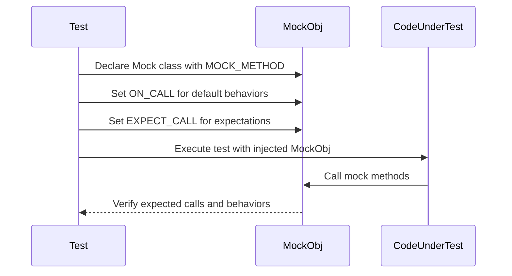

# Mocking and Matchers

Master the art of isolating your C++ code under test using GoogleMock by harnessing the power of mocking, matchers, and stubs. This page dives into the principles of mocking—how to replace dependencies with controlled, programmable objects—and demonstrates how matchers and stubs express expectations and validate behaviors. These techniques are essential for writing robust unit and integration tests across complex C++ codebases.

---

## Why Mocking Matters

Imagine testing a module that depends on a complex database or network API. Real dependencies can be slow, non-deterministic, or difficult to configure for specific test conditions. Mocking allows you to substitute real components with mock objects that mimic behaviors under your control. This way, you focus on testing your code's logic in isolation, ensuring reproducibility, speed, and precision.

GoogleMock provides a rich and expressive framework to create such mock objects seamlessly with C++.

## Defining Mock Methods with `MOCK_METHOD`

At the core of mocking lies `MOCK_METHOD`, the macro for declaring mock methods inside your mock classes. It mimics the interface of the original method, allowing GoogleMock to intercept calls.

### Basic Usage

```cpp
class MockTurtle {
 public:
  MOCK_METHOD(void, PenUp, (), (override));
  MOCK_METHOD(void, Forward, (int distance), (override));
  MOCK_METHOD(int, GetX, (), (const, override));
};
```

Each mock method declaration requires:

- Return type
- Method name
- Argument list (in parentheses)
- Optional qualifiers (e.g., `const`, `override`)

Use `MOCK_METHOD` in the `public` section regardless of the original method's access level.

### Handling Complex Signatures and Templates

Arguments or return types containing commas (e.g., `std::pair<bool, int>`) require special handling:

```cpp
MOCK_METHOD((std::pair<bool, int>), GetPair, ());
```

Alternatively, use type aliases:

```cpp
using BoolAndInt = std::pair<bool, int>;
MOCK_METHOD(BoolAndInt, GetPair, ());
```

Mocking class templates and overloaded methods follow the same principles.

### Mocking Non-Virtual Methods

GoogleMock supports mocking non-virtual methods for dependency injection by defining mock classes unrelated to the real classes but matching method signatures.

---

## Setting Expectations with `EXPECT_CALL`

Once mock methods are declared, you specify what calls you expect with `EXPECT_CALL`.

```cpp
EXPECT_CALL(mock_turtle, Forward(100)).Times(AtLeast(1));
```

This statement during test setup says:

- Expect `Forward(100)` to be called at least once
- You can chain other clauses to control order, frequency, and behavior

### Matchers: Flexible Argument Matching

Matchers specify what arguments to expect. You can match exact values or patterns:

```cpp
EXPECT_CALL(mock_turtle, GoTo(50, _));  // X must be 50, Y can be anything
EXPECT_CALL(mock_foo, DoThis(Gt(5)));   // Argument must be greater than 5
EXPECT_CALL(mock_foo, DoThat(NotNull()));  // Argument must not be null
```

Use `_` to match any value if the argument is unimportant.

### Cardinalities: How Often?  
Control how many times you expect the call with `.Times()`:

| Cardinality        | Behavior                                               |
|--------------------|--------------------------------------------------------|
| `Exactly(n)` or `n`| Call occurs exactly *n* times                           |
| `AtLeast(n)`       | Call occurs at least *n* times                         |
| `AtMost(n)`        | Call occurs at most *n* times                          |
| `Between(m, n)`    | Call occurs between *m* and *n* times, inclusive      |
| `AnyNumber()`      | Call occurs any number of times (including zero)      |

If omitted, GoogleMock infers cardinality from actions like `WillOnce`.

### Actions: What Should Happen?

By default, mock methods return default-constructed values or zero. To customize:

- `.WillOnce(action)`: Defines behavior for one matching call
- `.WillRepeatedly(action)`: Defines behavior for all subsequent matching calls

Example:

```cpp
EXPECT_CALL(mock, GetX())
    .WillOnce(Return(100))
    .WillOnce(Return(200))
    .WillRepeatedly(Return(300));
```

This means the first call returns 100, the second 200, and then all others 300.

*Common built-in actions include*: `Return(value)`, `ReturnRef(variable)`, `Invoke(function)`, and many others.

### Specifying Call Order

Use `InSequence` or `After` to impose order constraints:

```cpp
{
  InSequence s;
  EXPECT_CALL(mock, FirstCall());
  EXPECT_CALL(mock, SecondCall());
}
```

OR

```cpp
auto e1 = EXPECT_CALL(mock, FirstCall());
EXPECT_CALL(mock, SecondCall()).After(e1);
```

GoogleMock supports complex partial orders for sophisticated testing scenarios.

---

## Using `ON_CALL` for Default Behavior

Sometimes you're not interested in verifying that a method is called, but want to specify what it does if called. Use `ON_CALL` to set default actions without imposing call expectations.

```cpp
ON_CALL(mock, GetSize()).WillByDefault(Return(10));
```

*Tip:* Combine `ON_CALL` for defaults and sparse `EXPECT_CALL` for essential verification to avoid over-specifying tests.

---

## Matchers: The Language of Expectations

Matchers are predicates that verify argument values when calls happen. GoogleMock includes a rich set of built-in matchers, including:

- Exact match: `Eq(value)`
- Wildcard match: `_`
- Comparison: `Lt()`, `Le()`, `Gt()`, `Ge()`, `Ne()`
- Pointer checks: `IsNull()`, `NotNull()`, `Pointee(matcher)`
- Container checks: `ElementsAre()`, `UnorderedElementsAre()`, `Contains()`
- Property checks: `Field()`, `Property()`
- Composite matchers: `AllOf()`, `AnyOf()`, `Not()`

You can combine matchers for complex validation:

```cpp
EXPECT_CALL(foo, Bar(AllOf(Ge(5), Ne(10))));
```

For unmatched requirements, you can write custom matchers using `MATCHER` macros or fully custom classes.

---

## Stubs and Delegation: Customizing Mock Behavior

Mocks can forward calls to fakes or real implementations when appropriate to reuse existing behavior while monitoring calls.

Example:

```cpp
class FakeFoo : public Foo {
  ...
};

class MockFoo : public Foo {
 public:
  MOCK_METHOD(int, DoSomething, (), (override));

  void DelegateToFake() {
    ON_CALL(*this, DoSomething).WillByDefault(
      [this]() { return fake_.DoSomething(); });
  }

 private:
  FakeFoo fake_;
};
```

This technique blends the benefits of mocks and fakes but should be used carefully to avoid complexity.

---

## Handling Uninteresting Calls and Strictness Modes

By default, calls to mock methods without expectations result in warnings ("uninteresting calls"). GoogleMock provides three modes:

- `NiceMock`: suppresses warnings on uninteresting calls
- `NaggyMock`: (default) warns on uninteresting calls
- `StrictMock`: treats uninteresting calls as errors

Choose the mode that best fits the test reliability trade-offs.

```cpp
using ::testing::NiceMock;
NiceMock<MockFoo> mock;
```


---

## Best Practices for Using Mocking and Matchers

- **Set expectations _before_ exercising the code** to get clear failure points.
- Use `ON_CALL` to define default behaviors and keep `EXPECT_CALL` focused on verification.
- Avoid over-specifying expectations; only check what's relevant for the tested behavior.
- Prefer `NiceMock` for general use; employ `StrictMock` only when necessary to enforce strict interaction contracts.
- Use sequences and ordering constraints prudently to avoid brittle tests.
- Consider delegating to real or fake objects if the logic to simulate is complex.

---

## Troubleshooting Common Issues

- **Mock methods invoking real method instead of mock:** Ensure methods are virtual, or use the high-perf dependency injection technique.
- **Ambiguous overloads:** Use explicit matchers or cast to specify the target overload.
- **Too rigid test failures after refactor:** Check for overly strict expectations or ordering constraints.
- **Warning about uninteresting calls despite `ON_CALL`:** Remember, `ON_CALL` sets behavior but no call expectation; add `EXPECT_CALL(...).Times(AnyNumber())` if calls are permitted.

---

## Getting Started with Mocking and Matchers

1. Define your mock class using `MOCK_METHOD` for methods you want to mock.
2. Use `ON_CALL` in test setup for default behaviors.
3. Specify call expectations using `EXPECT_CALL` with matchers and cardinalities.
4. Exercise your code to trigger mock interactions.
5. Let GoogleMock verify interactions automatically on mock destruction.

For practical examples and advanced patterns, explore:

- [Using Mocks in Unit Tests](../guides/mocking-and-advanced-testing/using-mocks-in-unit-tests)
- [Setting Expectations and Actions](../guides/mocking-and-advanced-testing/setting-expectations-and-actions)
- [Matchers Reference](reference/matchers.md)

---

### Code Snippet: Simple Mock and Expectation

```cpp
#include <gmock/gmock.h>

class MockTurtle : public Turtle {
 public:
  MOCK_METHOD(void, PenDown, (), (override));
  MOCK_METHOD(void, Forward, (int distance), (override));
};

TEST(PainterTest, DrawsLine) {
  MockTurtle turtle;
  EXPECT_CALL(turtle, PenDown()).Times(1);
  EXPECT_CALL(turtle, Forward(::testing::Ge(10))).Times(AtLeast(1));

  Painter painter(&turtle);
  painter.DrawLine();
}
```

---

### Diagram: Simplified Mocking Interaction Flow



---

You are now equipped to delve deeper into the powerful mocking features GoogleMock offers. With this foundation, write reliable, fast, and maintainable tests that isolate behaviors precisely and catch integration issues early.

---