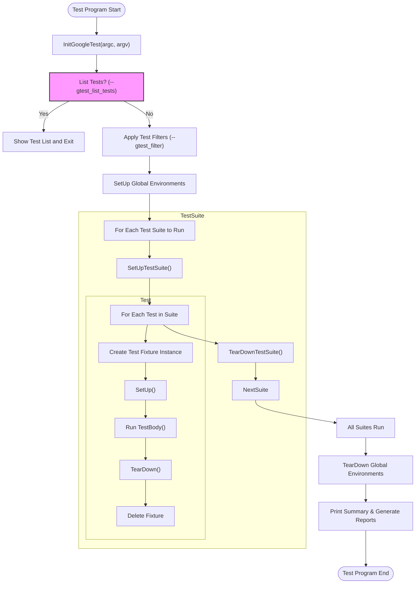

# Test Discovery and Execution

GoogleTest automatically detects and runs your tests without requiring manual registration. This page explains how the GoogleTest test runner discovers tests, orchestrates their execution, reports results, and integrates with build systems to streamline your testing workflow.

---

## How Test Discovery Works

GoogleTest does away with the tedious need to enumerate each test manually. By simply adding tests using macros like `TEST`, `TEST_F`, `TEST_P`, and their variants, GoogleTest registers each test behind the scenes during static initialization.

Each test is associated with a test suite (a logical group of related tests). GoogleTest maintains a registry, mapping these suites and their contained test cases.

This automatic discovery means:

- You can freely add or remove tests without updating any registration list.
- The test runner dynamically queries which tests exist and should run.
- Test filtering and selective execution are easily supported.

**Example:**

```cpp
TEST(MathTest, Addition) {
  EXPECT_EQ(2 + 2, 4);
}

TEST_F(MyFixture, SetupWorks) {
  EXPECT_TRUE(is_initialized_);
}
```

Both these tests are automatically registered and discovered when you run `RUN_ALL_TESTS()`.

---

## The Test Runner: Orchestration and Execution

The core of running tests is the `RUN_ALL_TESTS()` function, which you typically call at the end of your main program. This function drives the entire process of executing tests, managing lifecycles, and reporting outcomes:

- Initializes test environments and global setups.
- Runs tests one by one, creating fresh instances of test fixtures for isolation.
- For each test:
  - Sets up the fixture (`SetUpTestSuite`, `SetUp`, etc.).
  - Runs the test body.
  - Tears down the fixture (`TearDown`, `TearDownTestSuite`).
- Accumulates statistics on passed, failed, disabled, and skipped tests.
- Supports advanced execution options such as sharding, repeating tests, and filtering.


You do not need to manually invoke or manage individual tests — GoogleTest handles all this with guaranteed independence and safety across tests.

---

## Filtering and Selective Execution

GoogleTest allows users to run only a subset of tests matching filters specified via command-line flags such as `--gtest_filter` or environment variables. Filters match based on the test's fully qualified name `TestSuiteName.TestName` and can include wildcards and exclusions.

For example:

```shell
./my_test --gtest_filter=FactorialTest.*     # Run all tests in FactorialTest suite
./my_test --gtest_filter=*HandlesZeroInput  # Run any test with HandlesZeroInput in its name
./my_test --gtest_filter=FooTest.*-FooTest.Bar  # Run FooTest suite except the Bar test
```

The test runner evaluates these filters at runtime before executing tests and runs exactly those that satisfy the filter.

---

## Reporting Test Results

During execution, GoogleTest reports detailed test outcomes, including:

- Passed, failed, and skipped tests.
- Rich failure messages with source location and assertion info.
- Aggregate statistics per test suite and overall.

The output can be customized and extended using event listeners. GoogleTest also supports generating XML and JSON reports for integration with CI systems.


---

## Integration With Build and Continuous Integration Systems

Because tests are automatically discovered and executed by the runner, GoogleTest seamlessly fits into automated build pipelines:

- Build systems need only compile and link your test binaries.
- Running tests is as simple as launching the test binary with proper flags.
- Filtering allows running targeted tests to speed up feedback loops.
- XML and JSON output formats enable easy integration with dashboards and reporting tools.

---

## Practical Tips & Best Practices

- **Always call `testing::InitGoogleTest(&argc, argv);` before `RUN_ALL_TESTS()`** to correctly initialize filter flags and environment.
- **Avoid tests with underscores in names** due to internal naming conventions.
- Use `GTEST_SKIP()` to gracefully skip tests based on runtime conditions.
- Encapsulate shared expensive resources with `SetUpTestSuite()` and `TearDownTestSuite()` for efficiency.
- Use `EXPECT_*` for non-fatal checks and `ASSERT_*` for fatal conditions that should prevent further execution in a test.

---

## Troubleshooting Common Issues

- **Tests Not Being Run:** Confirm tests aren’t disabled (no `DISABLED_` prefix) and that your filter includes them.
- **Default main() Issues:** If writing your own `main()`, ensure it calls `InitGoogleTest()` and returns the value of `RUN_ALL_TESTS()`.
- **Test Fixture Construction Errors:** Test fixtures must have default constructors accessible by GoogleTest.
- **Filtering Misbehavior:** Complex filters might exclude tests unintentionally; double-check filter expressions.

---

## Example Test Runner Main Function

```cpp
int main(int argc, char** argv) {
  testing::InitGoogleTest(&argc, argv);
  return RUN_ALL_TESTS();
}
```

This simple main function will discover and run all registered tests with standard reporting.

---

## Diagram of Test Discovery and Execution Flow



---

## Next Steps

Explore the following pages to deepen your mastery of GoogleTest’s testing model:

- [Core Testing Concepts](/overview/core_fundamentals/core_concepts) to understand fundamentals like tests, suites, and assertions.
- [Writing Your First Test](/guides/getting-started/writing-your-first-test) for practical code examples.
- [Parameterized and Typed Tests](/guides/parameterized-and-typed-tests/writing-parameterized-tests) to scale your tests efficiently.

For troubleshooting detailed test execution or integration, see the [Running and Interpreting Test Results](/getting-started/first-test-and-validation/running-and-interpreting-test-results) page.


---

> _“Let GoogleTest manage discovering and running your tests so that you can focus on writing excellent tests, not test plumbing.”_

---

## References

- [GoogleTest Primer](primer.md) — Basic usage and understanding
- [Testing Reference](reference/testing.md) — API details for test macros and classes
- [Advanced GoogleTest Topics](advanced.md) — For deeper understanding of lifecycle and flags
- [Core Testing Concepts](/overview/core_fundamentals/core_concepts) — Foundations and terminology

---

*This page is part of the core concepts overview in the GoogleTest documentation, focused specifically on test discovery and execution, complementing introductory and advanced material.*
