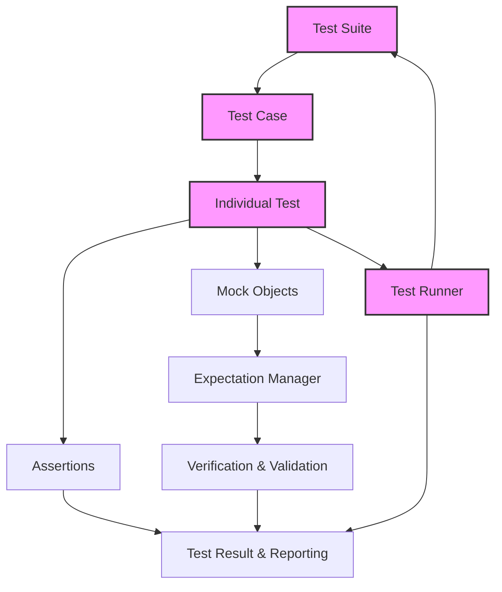

# GoogleTest System Architecture

## Overview

Understanding the architecture of GoogleTest is key to mastering effective testing in C++ projects. This documentation presents a visual and narrative-driven description of how GoogleTest’s components—tests, test runners, assertions, and mocks—interact within a typical C++ development toolchain. It also highlights the tight integration between GoogleTest and GoogleMock, explaining their synergy in modern workflows.

---

## Introduction

GoogleTest is a robust C++ testing framework designed to facilitate unit testing and behavior verification. When combined with GoogleMock, it forms a comprehensive toolset for testing both the state and interactions within your code.

This page focuses specifically on the architecture behind GoogleTest, demonstrating how its core components fit together to deliver powerful, flexible testing capabilities.

---

## Core Components and Their Interactions

GoogleTest revolves around several essential components working in concert to deliver seamless testing experiences:

- **Test Cases and Tests:** The fundamental units of verification, representing individual functions and scenarios.
- **Test Runner:** Manages execution of tests, reports results, and aggregates outcomes.
- **Assertions:** Provide mechanisms to detect failures and validate expected outcomes.
- **Mocks (GoogleMock):** Enable simulation of dependent objects' behavior for interaction-based testing.

### How These Components Connect

When you write tests using GoogleTest, each test function is registered and managed by the test runner. Assertions within these tests determine pass or fail statuses by evaluating conditions. If needed, GoogleMock integrates by allowing mocks to monitor and validate interactions such as method calls and argument correctness.

The architecture supports parallel test execution, detailed reporting, and a flexible API for defining tests and expectations.

---

## Understanding GoogleMock’s Role

GoogleMock extends GoogleTest by offering facilities to create mock objects — stand-ins for real objects — which enable you to:

- Specify expected function calls with particular arguments.
- Define methods’ return values or side effects.
- Verify that interactions between components happen as intended.

The integration of GoogleMock enhances your testing toolkit by allowing not only to check if outputs are correct but also if the internal communication within your system works appropriately.

---

## Visualizing the Architecture

Below is a simplified flowchart illustrating the relationship among key GoogleTest and GoogleMock components during a test run.

The flow:

1. The test runner loads and executes test suites and test cases.
2. Each test runs, evaluating assertions.
3. If mocks are used, mock objects enforce and track expectations.
4. Upon test completion, both assert results and mock verifications contribute to the test result.
5. The test runner collects all test outcomes for reporting.

---

## Typical User Workflow

1. **Create test cases and test functions** representing the scenarios to verify.
2. **Write assertions** within tests to validate expected behaviors.
3. **Define mocks and expectations** using GoogleMock where you need to simulate or control dependencies.
4. **Run tests using the test runner**, receiving immediate feedback on success or failures.
5. **Analyze detailed failure reports** pinpointing what broke and why, including argument values and call traces.

This workflow hinges on the architecture’s seamless coordination of components, providing a clear path from writing code to verifying its correctness with confidence.

---

## Why Architecture Matters to You

Knowing how GoogleTest and GoogleMock are architected helps you:

- **Write better tests:** Understand when and how to use mocks, assertions, and parameterized tests.
- **Debug failures faster:** Interpret error messages that tie back to expectation management and call verification.
- **Integrate effectively:** Connect testing into your build system and CI pipelines knowing how the test runner manages execution.
- **Scale confidently:** Leverage features such as sequences and cardinalities to enforce complex interaction contracts.

---

## Practical Tips & Pitfalls

- Always ensure your mock methods override virtual functions — otherwise, mocks won't operate as expected.
- Use `EXPECT_CALL` before exercising code to guarantee that expectations are set, preventing undefined behavior.
- Differentiate between `ON_CALL` (setting default behavior) and `EXPECT_CALL` (setting enforceable expectations).
- Be mindful that GoogleMock searches expectations in reverse order, allowing later expectations to override earlier ones.
- Use sequences (`InSequence`) or `After` clauses to enforce call ordering precisely.
- Avoid over-specification of expectations to prevent brittle tests.

---

## Next Steps

- Explore the [What is GoogleTest?](https://github.com/google/googletest/tree/main/docs/overview/introduction-and-value/what-is-googletest.mdx) page for an introduction to the framework.
- Learn about setting expectations and mock methods on the [Mocking Reference](https://github.com/google/googletest/tree/main/docs/reference/mocking.md) page.
- See practical examples in the [gMock for Dummies](https://github.com/google/googletest/tree/main/docs/gmock_for_dummies.md) guide.
- Progress to [Basic Mocking with GoogleMock](https://github.com/google/googletest/tree/main/guides/getting-started/basic-mocking.mdx) for hands-on mock creation and usage.

---

## Additional Resources
- [GoogleMock Framework README](https://github.com/google/googletest/tree/main/googlemock/README.md)
- [Mocking FAQ](https://github.com/google/googletest/tree/main/docs/gmock_faq.md)
- [gMock Cookbook](https://github.com/google/googletest/tree/main/docs/gmock_cook_book.md)
- [gMock Cheat Sheet](https://github.com/google/googletest/tree/main/docs/gmock_cheat_sheet.md)
- [GoogleTest Core Concepts & Terminology](https://github.com/google/googletest/tree/main/overview/essentials-and-concepts/core-concepts-and-terminology.mdx)

---

Visit the documentation navigation pane to find related topics on test discovery, assertion usage, parameterized tests, and advanced mock patterns.
