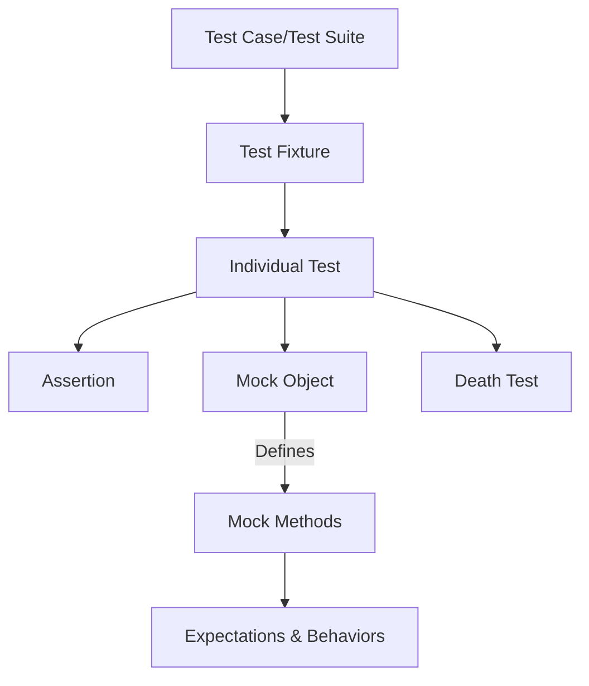

# Core Concepts & Terminology

Understanding the core concepts and terminology of GoogleTest is key to mastering its use and writing effective, maintainable tests. This documentation demystifies fundamental terms such as assertion, mock, test case, test fixture, and death test, explaining their roles and how they help you craft reliable C++ tests with GoogleTest.

---

## What You Will Learn

- Definitions of essential testing concepts that appear throughout GoogleTest
- How these concepts interact to simplify test authoring and maintenance
- Practical examples illustrating the use and value of each concept

---

## 1. Assertion

An **assertion** is a statement in a test that verifies a condition. It is the fundamental building block used to confirm that your code behaves as expected.

### What It Does

- Evaluates a boolean expression or comparison.
- Causes the test to fail immediately if the assertion is false (in fatal assertions) or continues for non-fatal assertions.

### Example

```cpp
EXPECT_EQ(result, expected_value);  // Non-fatal assertion
ASSERT_TRUE(is_initialized);        // Fatal assertion
```

Using assertions effectively allows you to pinpoint failures precisely and control test flow.

> **Tip:** Use `ASSERT_` when continuing after a failure would be meaningless or cause crashes. Use `EXPECT_` when you want to check multiple conditions within the same test.

---

## 2. Mock

A **mock object** simulates a real object's behavior in tests. It implements the same interface but allows fine-grained control over its responses and verifies interactions.

### Role in Testing

- Defines expected calls with argument constraints and call counts.
- Provides custom return values or side effects.
- Verifies that interactions happen correctly (order, frequency, arguments).

### Example

```cpp
#include <gmock/gmock.h>

class MockDatabase : public DatabaseInterface {
 public:
  MOCK_METHOD(bool, Connect, (), (override));
  MOCK_METHOD(void, Disconnect, (), (override));
  MOCK_METHOD(int, Query, (const std::string& sql), (override));
};

// In a test:
MockDatabase mock_db;
EXPECT_CALL(mock_db, Connect()).Times(1).WillOnce(Return(true));
```

> **Best Practice:** Prefer mocking interfaces you own to maintain test maintainability and reduce brittleness.

---

## 3. Test Case

A **test case** (often called a test suite) is a named collection of related tests for a component or feature.

### Purpose

- Organizes tests logically.
- Groups related tests, easing navigation and management.

### Example

```cpp
TEST(MathTests, AdditionWorks) {
  EXPECT_EQ(Add(2, 3), 5);
}

TEST(MathTests, SubtractionWorks) {
  EXPECT_EQ(Subtract(5, 3), 2);
}
```

In the above, both tests belong to the `MathTests` test case.

---

## 4. Test Fixture

A **test fixture** is a class derived from `::testing::Test` that provides a shared context for multiple tests.

### Why Use Fixtures?

- Set up common objects, resources, and initial conditions once.
- Tear down resources cleanly after each test.
- Improve code reuse and clarity in tests.

### Example

```cpp
class DatabaseTest : public ::testing::Test {
 protected:
  void SetUp() override {
    db.Connect();
  }

  void TearDown() override {
    db.Disconnect();
  }

  MockDatabase db;
};

TEST_F(DatabaseTest, QueryReturnsExpectedResult) {
  EXPECT_CALL(db, Query("SELECT 1")).WillOnce(Return(1));
  EXPECT_EQ(db.Query("SELECT 1"), 1);
}
```

Every test declared with `TEST_F` shares the setup and teardown logic.

---

## 5. Death Test

A **death test** verifies that your program terminates (crashes or exits) as expected under certain failure conditions.

### When To Use

- Confirm that code fails correctly during fatal errors.
- Ensure proper termination on invalid inputs or asserts.

### Example

```cpp
TEST(MyClassDeathTest, FailsOnBadInput) {
  EXPECT_DEATH({ MyClass obj; obj.Process(nullptr); }, "null pointer");
}
```

This test ensures that passing `nullptr` triggers a fatal error message containing "null pointer" and terminates.

> **Note:** Death tests run the code in a separate process to isolate fatal errors safely.

---

## How These Concepts Work Together

GoogleTest uses these core concepts to enable simple yet powerful testing:

- Write **test cases** and **fixtures** to organize your tests and share common context.
- Use **assertions** within tests to verify behavior.
- Create **mocks** to simulate dependencies and verify interactions.
- Employ **death tests** for verifying error handling and program stability.

This architecture ensures tests are readable, maintainable, and reliable.

---

## Practical Tips and Best Practices

- Use **fixtures** for tests that share setup code to avoid duplication.
- Balance **assertion** types (`EXPECT_` vs. `ASSERT_`) for clear, manageable test flow.
- Mock only interfaces you *own* to keep mocks stable and manageable.
- Use **death tests** judiciously for critical failure scenarios to enhance test coverage.

---

## Common Pitfalls

- Overuse of mocks can make tests brittle; mock only when interaction verification is essential.
- Forgetting virtual destructors in interfaces can lead to subtle bugs and memory issues.
- Writing expectations (e.g., with `EXPECT_CALL`) *after* invoking mock methods leads to undefined behavior.
- Using fatal assertions (`ASSERT_`) carelessly can prematurely abort tests hiding multiple failures.

---

## Next Steps

With these core concepts clear, you're now ready to dive into more detailed documentation:

- [Feature Overview](/overview/essentials-and-concepts/feature-overview) - Discover GoogleTest's capabilities.
- [Writing Your First Test](/guides/getting-started/writing-your-first-test) - Hands-on test creation.
- [Using Assertions Effectively](/guides/essential-workflows/using-assertions) - Write robust test conditions.
- [Designing and Using Mock Objects](/concepts/mocking-model/mock-object-design) - Advanced mocking techniques.

For a visual grasp of GoogleTest's architecture and component interactions, see the [GoogleTest System Architecture](/overview/essentials-and-concepts/core-architecture).

---

## Additional Resources

- [GoogleMock Cheat Sheet](https://google.github.io/googletest/gmock_cheat_sheet.html)
- [gMock for Dummies](https://google.github.io/googletest/gmock_for_dummies.html)
- [Mocking Reference](../reference/mocking.md)

These will deepen your knowledge of mocks and testing workflows.

---

### Summary Diagram of Key Concepts



---

Harness these concepts effectively to write clear, maintainable, and powerful tests using GoogleTest.


---