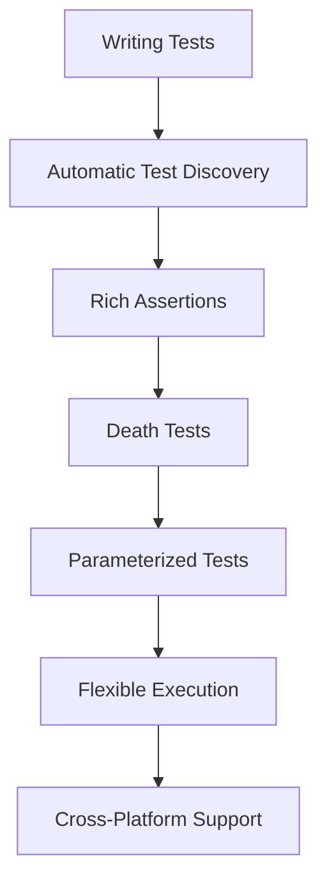

# Feature Highlights

Discover the major capabilities of GoogleTest that empower C++ developers to accelerate quality-driven testing workflows. This page highlights key features such as automatic test discovery, rich assertions, death tests, parameterized tests, flexible test execution, and broad platform support—all designed to enhance productivity and test reliability.

---

## Automatic Test Discovery

GoogleTest automatically detects and registers your tests without manual listing, enabling seamless integration with your build and test environments. Once you write test cases following the GoogleTest conventions, they are instantly discoverable and runnable, providing an uninterrupted feedback loop.

### Why It Matters

- **Effortless scaling:** Add new tests anywhere, no extra registration required.
- **Consistent execution:** Integration with test runners and CI systems is straightforward.

Example:
```cpp
TEST(MyFeatureTest, HandlesValidInput) {
  EXPECT_EQ(Process(input), expected_output);
}
```
No additional steps are necessary to have this test found and run.

---

## Rich, User-Definable Assertions

GoogleTest includes a comprehensive set of built-in assertions that cover equality, inequality, exceptions, and near comparisons alongside the power to define your own tailored assertions. This flexibility lets teams express test validations in clear, intention-revealing ways.

### Key Points:
- Assertions like `EXPECT_EQ`, `ASSERT_TRUE` allow precise checks.
- Custom assertions can be easily created for domain-specific logic.
- Assertions support rich failure messages, showing actual vs. expected values for rapid debugging.

Example:
```cpp
ASSERT_NE(value, nullptr) << "Value must not be null";
```

---

## Death Tests

Death tests verify that your code exits or crashes as expected under error conditions. GoogleTest’s death tests ensure your program handles fatal errors gracefully or fails loudly when required.

### User Benefits:
- Confident validation of error-handling code paths.
- Integration with your test suite for continuous assurance.

Example:
```cpp
EXPECT_DEATH({ FunctionThatExits(); }, "expected error message");
```

---

## Value- and Type-Parameterized Tests

GoogleTest enables writing a single generic test that runs with different input values or types, promoting high coverage with reduced code duplication.

### Advantages:
- Test broad scenarios efficiently.
- Validate template classes or functions with multiple types.

Example of value-parameterized test:
```cpp
class MyTest : public ::testing::TestWithParam<int> {};
TEST_P(MyTest, HandlesVariousInputs) {
  int input = GetParam();
  EXPECT_TRUE(Process(input));
}
INSTANTIATE_TEST_SUITE_P(MyGroup, MyTest, ::testing::Values(1, 2, 3));
```

---

## Flexible Test Execution Options

Tailor your test runs with options including filtering, sharding, and repeating tests. GoogleTest provides robust command-line flags and APIs to control what and how tests execute.

### Highlights:
- Run targeted test subsets by name or tag.
- Distribute tests across machines or cores with sharding.
- Repeat tests to uncover flaky behaviors.

Common flags:
```
--gtest_filter=MyTest.*                      # Run tests matching pattern
--gtest_repeat=10                            # Run tests 10 times
--gtest_shuffle                              # Randomize test order
```

---

## Broad Platform Support

GoogleTest runs on a variety of platforms including Linux, Windows, and macOS, and supports multiple compilers and C++ standards.

### Why This Helps You

- Write tests once, run anywhere.
- Maintain a consistent test environment regardless of development or deployment platform.

---

## Summary

GoogleTest’s feature set brings together automation, expressive assertions, robust error handling, parameterized coverage, deep configurability, and cross-platform portability—delivering an unmatched experience for C++ testing. These features streamline your workflow so you can focus on writing maintainable, trustworthy tests that accelerate development.

---

## Getting Started Preview

Kickstart your journey by following the [Getting Started Guide](../getting-started/setup-requirements/basic-configuration) and writing your first test with GoogleTest. Explore how to utilize [Mocks](../gmock_for_dummies) to further improve your test strategy.

<Tip>
Start small: create a few tests with rich assertions and gradually explore parameterized tests and death tests to build confidence and coverage.
</Tip>

<Note>
Remember, GoogleTest features work best when tests are organized clearly and follow consistent naming conventions.
</Note>

---

## Related Documentation

- [GoogleTest User's Guide Overview](../index)
- [gMock for Dummies](../gmock_for_dummies)
- [gMock Cookbook](../gmock_cook_book)
- [Feature Architecture & Integration](../feature-architecture-and-integration/quick-feature-overview)

---

## Visual Overview



Empower your C++ quality workflow by mastering these features step-by-step, adapting to your project’s needs. Every feature offers tangible benefits for faster feedback, stronger validation, and easier maintenance.
