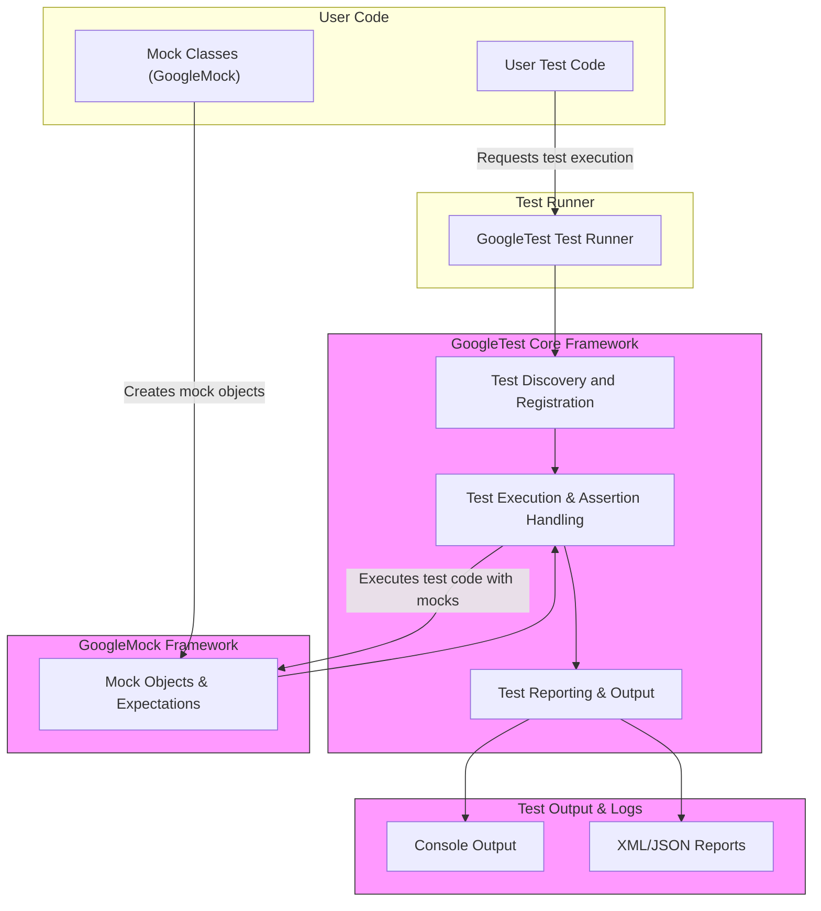

# System Architecture (with Diagram)

## Visualizing GoogleTest's High-Level Architecture

Understanding GoogleTest's architecture will empower you to grasp how its components collaborate to provide a seamless, efficient testing experience. This overview focuses on the interaction flow starting from your test code, proceeding through test runners, harnessing core GoogleTest facilities, invoking GoogleMock where applicable, and finally producing test results.

---

## Overview

GoogleTest is designed as a modular yet integrated framework that manages the lifecycle of running C++ tests, handling assertions, test discovery, and organizing results effectively. When you write test cases using GoogleTest and optionally GoogleMock, your test code interacts with these components:

- **User Test Code**: Your C++ tests written with GoogleTest macros and constructs.
- **Test Runner**: Responsible for orchestrating test execution.
- **GoogleTest Core Framework**: Implements test discovery, registration, assertion handling, and reporting.
- **GoogleMock Framework**: Integrated mocking framework to help verify interactions in tests.
- **Test Outputs**: Reports, logs, and results indicating success, failure, or errors.

This architecture separates concerns cleanly while maintaining cohesive test flows and integration points.

---

## Architecture Components and Flow

### 1. User Test Code

This is your domain where you write test cases:

- Define test fixtures, tests, and assertions using GoogleTest macros like `TEST()`, `TEST_F()`, and assertions like `EXPECT_EQ()`, `ASSERT_TRUE()`, etc.
- If needed, define mock classes using GoogleMock's `MOCK_METHOD()` macros.
- Use mocks to specify expectations on interactions.

### 2. Test Runner

When the test executable runs, the GoogleTest test runner:

- Automatically discovers test cases registered with the framework.
- Handles command-line arguments to control test filtering, repetitions, and output formats.
- Manages test lifecycle: initialization, running, and teardown.

### 3. GoogleTest Core Framework

The core processes test execution:

- Manages test registration and orderly execution.
- Executes assertions; logs success or provides detailed failure diagnostics.
- Supports advanced features such as parameterized tests, death tests, and typed tests.

### 4. GoogleMock Framework

When your tests involve mocking:

- Mock objects are created based on interfaces.
- Expectations for function calls are specified with `EXPECT_CALL()`.
- GoogleMock verifies these expectations at runtime during test execution.
- Enhances testing by allowing behavior verification and controlled responses.

### 5. Test Outputs

- After each test, GoogleTest reports pass/fail status along with detailed messages.
- Enables output to multiple formats (console, XML, JSON) for integration with CI/CD and tools.
- Provides stack traces and error diagnostics when assertions fail.

---

## Diagram: GoogleTest System Architecture

---

## Key Takeaways

- GoogleTest provides automated test discovery, execution, and reporting.
- GoogleMock integrates tightly with GoogleTest, enabling powerful mocking within tests.
- The test runner manages the end-to-end lifecycle, from invoking tests to generating outputs.
- This architecture enables fast, reliable, and scalable test execution, ensuring quality in C++ projects.

---

## Practical Tips

- **Seamless Mocking Integration:** Use GoogleMock classes to mock dependencies and set precise expectations, improving test clarity and robustness.
- **Leverage Test Filtering:** Run subsets of tests quickly with command-line filters handled by the test runner.
- **Use Output Formats:** Integrate test outputs with CI systems through XML or JSON reporting.
- **Read Failure Reports:** GoogleTest provides detailed failure messages with stack traces to ease debugging.

---

## Next Steps

Continue your learning journey with these related documentation:

- [GoogleTest Primer](primer.md) — Learn how to write your first tests.
- [GoogleMock for Dummies](gmock_for_dummies.md) — Explore mocking with GoogleMock.
- [Feature Highlights](quick-feature-overview.md) — Understand more about GoogleTest’s capabilities.
- [Integration & Ecosystem](integration-and-ecosystem.md) — Explore integrations with build and CI systems.

---

*This high-level system architecture visualization is designed to clarify how GoogleTest and GoogleMock interact to provide a comprehensive testing framework tailored for C++ development.*
