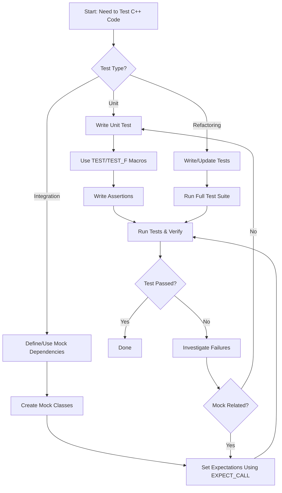

# Common Use Cases & Workflows

GoogleTest is a powerful C++ testing framework trusted by developers globally for its reliability and flexibility. This page illuminates the primary scenarios where GoogleTest excels — from unit testing to integration testing and facilitating safe code refactoring — and details typical workflows teams adopt to maximize its efficiency. Through concise, real-world stories, this resource equips teams to onboard quickly and apply best practices in their projects.

---

## Why GoogleTest for Your Testing Needs?

GoogleTest is designed to support your testing objectives with minimal friction, enabling you to write clear, reliable tests that instill confidence in your codebase. Whether verifying individual units or orchestrating complex integration tests, GoogleTest offers expressive mechanisms to capture intent, control behavior, and assert correctness.

### Primary Testing Scenarios

- **Unit Testing:** Isolate the smallest testable parts of your application and verify their correctness independently. GoogleTest’s rich assertion macros and fixture mechanisms make setting up and maintaining unit tests straightforward.

- **Integration Testing:** Test interactions between multiple components or modules. GoogleTest facilitates these broader tests by supporting parameterized tests and seamless integration with GoogleMock for mocking dependencies.

- **Safe Code Refactoring:** Refactor with confidence by ensuring your tests precisely define expected behaviors. GoogleTest’s robust expectations and mock verifications catch regressions promptly.

---

## Typical Workflows

### 1. Writing Unit Tests to Validate Code Logic

Unit tests focus on a single function or class, ensuring it behaves as intended across various inputs.

**Workflow:**

1. Define a test fixture class using `TEST` or `TEST_F` macros.
2. Write multiple assertions covering normal, boundary, and error cases.
3. Run tests frequently during development to verify changes do not break existing behavior.
4. Use parameterized tests for thorough input coverage without duplication.

**Example:**
```cpp
TEST(MathTest, HandlesZeroInput) {
  EXPECT_EQ(Factorial(0), 1);
}

TEST_F(MathTestFixture, ComputesFactorial) {
  EXPECT_EQ(Factorial(5), 120);
  EXPECT_GT(Factorial(10), 0);
}
```

### 2. Integration Testing with Dependencies Mocked Out

Integration tests may involve multiple subsystems. GoogleMock individually mocks collaborators, letting you focus on the system under test.

**Workflow:**

1. Define mock classes for interfaces using `MOCK_METHOD` macros.
2. Set expectations on method calls using `EXPECT_CALL`.
3. Use mocks to simulate collaborators’ behavior.
4. Assert that the system under test interacts correctly with mocks.

**Example:**
```cpp
class MockDatabase : public DatabaseInterface {
public:
  MOCK_METHOD(bool, Connect, (), (override));
  MOCK_METHOD(void, Disconnect, (), (override));
};

TEST(DatabaseClientTest, ConnectsSuccessfully) {
  MockDatabase mock_db;
  EXPECT_CALL(mock_db, Connect()).WillOnce(Return(true));

  DatabaseClient client(&mock_db);
  EXPECT_TRUE(client.Connect());
}
```

### 3. Supporting Safe Refactoring Practices

GoogleTest helps you catch unintentional changes in behavior early, making refactoring less risky.

**Workflow:**

1. Maintain a comprehensive suite of tests representing functionality.
2. Refactor code incrementally.
3. Re-run tests after each change to detect unexpected side effects.
4. Use `EXPECT_CALL` and `ON_CALL` to define precise expectations where needed.

---

## Rapid Onboarding Stories

### Story 1: The New Engineer Writing Their First Unit Tests

You’ve joined a project and need to verify a utility function.

- Locate existing tests in the codebase.
- Write new `TEST` cases focusing on edge conditions.
- Run tests using the existing build system.
- Observe clear success or failure messages.

### Story 2: Team Collaborating on Integration Tests

Your team mocks external inputs and writes tests that simulate real-world scenarios.

- Create mock interfaces for subsystems.
- Use `EXPECT_CALL` to specify allowed interactions and return behaviors.
- Organize tests with sequences and expectations to verify call order.
- Quickly interpret test failures using GoogleTest’s detailed diagnostics.

### Story 3: Developer Safely Refactoring Legacy Code

Before refactoring:

- Write tests for legacy methods.
- Use `InSequence` and `RetiresOnSaturation` clauses to enforce call order.

Refactor:

- Modify the code.
- Run tests to ensure existing behavior remains intact.

---

## Best Practices & Tips

- **Use Mock Objects Judiciously:** Avoid over-specifying interactions. Use `ON_CALL` for default behaviors, and `EXPECT_CALL` only when you want to check that a call happens.

- **Order Your Expectations As Needed:** Use `InSequence` or `After` to enforce specific call orders.

- **Keep Tests Focused:** Each test should verify one behavior or scenario to localize failures.

- **Watch for Over-Mocking:** Excessive expectations can make tests brittle. Favor state-based assertions when possible.

- **Leverage Parameterized and Typed Tests:** These features reduce boilerplate and improve coverage.

- **Debugging Tips:** Run tests with `--gmock_verbose=info` to get detailed mock call traces for troubleshooting.

---

## Troubleshooting Common Pitfalls

### Test Fails Unexpectedly Due to Too Strict Expectations

- Review the `EXPECT_CALL` matchers — are they too specific?
- Consider relaxing matchers by using `_` or more general predicates.
- Use `.RetiresOnSaturation()` to prevent expectations from lingering beyond their validity.

### Mock Method Called More Times Than Expected

- Check if you have `.Times()` set correctly.
- Verify if your test needs `WillRepeatedly()` for calls beyond `WillOnce()`.

### Uninteresting Mock Function Calls Warnings

- If warnings are acceptable, leave it as-is or use `NiceMock` to suppress.
- Otherwise, add `EXPECT_CALL(...).Times(AnyNumber())` for the mock method.

### Tests Block or Crash Due to Incorrect Mock Lifetimes

- Verify mock objects are deleted appropriately post use.
- Use `Mock::AllowLeak()` sparingly to prevent spurious leaks.

---

## See Also

- [gMock for Dummies](https://google.github.io/googletest/gmock_for_dummies.html) — Beginner-friendly introduction to mocking concepts.
- [Mocking Reference](../reference/mocking.md) — Detailed reference on GoogleTest mocking macros and APIs.
- [gMock Cookbook](https://google.github.io/googletest/gmock_cook_book.html) — In-depth recipes for advanced mocking scenarios.
- [Feature Highlights](../feature-overview-group/feature-highlights) — Overview of GoogleTest features.
- [Your First Test](../getting-started/first-test) — Step-by-step test creation guide.

---

Leverage these workflows and use cases to unlock GoogleTest’s full value, ensuring your C++ code is rigorously verified with speed and clarity.

---

## Appendix: Workflow Diagram


