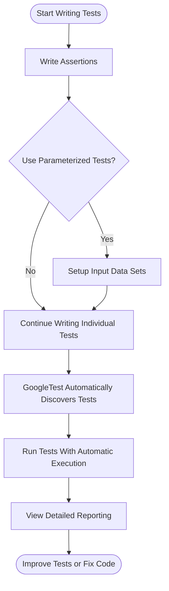

# Feature Summary

## Unlocking the Power of GoogleTest: Your Feature Overview

Welcome to the Feature Summary, your narrative map to the core capabilities that make GoogleTest the essential C++ testing framework it is today. Here, you'll discover how GoogleTest transforms the way you write, organize, and validate tests — making your development cleaner, more reliable, and deeply insightful.

### Key Features at a Glance

- **Rich Assertions:** Express your test conditions clearly with a comprehensive set of assertion macros that help validate expected outcomes with precise feedback.
- **Parameterized Tests:** Enable test reuse and broaden coverage by running the same test logic with varied inputs, streamlining your test code.
- **Test Discovery & Execution:** Let GoogleTest automatically locate and execute your tests, removing manual overhead and integrating smoothly into any build system.
- **Death Tests:** Confidently verify how your code handles abnormal or fatal conditions, bolstering robustness.
- **Advanced Reporting:** Gain clarity and context with detailed test result reporting that guides your debugging and quality assurance activities.

Whether you're verifying a tiny function or orchestrating complex integration tests, GoogleTest's foundational features align with your needs effortlessly.

## What Does This Page Offer?

This page walks you through the central features of GoogleTest in a way that connects directly to your goals as a test author and developer. You'll find a categorized, story-like summary of major capabilities such as assertions, parameterization, automatic test discovery, death tests, and reporting. Each section illustrates what you can achieve using the feature and why it matters.

More than just a list, this summary points you to deeper guides and references, steering you toward learning resources that fit your context — from beginners aiming to write effective tests to advanced users focusing on optimizing test performance or complex mocking.

## Core Features Explained

### Assertions: The Foundation of Validation

Assertions let you check whether a particular condition holds true, forming the core of test verification. GoogleTest provides diverse assertion types, from simple equality checks (`EXPECT_EQ`) to powerful predicate assertions (`EXPECT_THAT`) with expressive matchers.

**Benefit:** Immediate, clear feedback when tests fail, enabling you to pinpoint issues quickly.

```cpp
EXPECT_EQ(Factorial(5), 120);  // Passes if Factorial(5) returns 120
EXPECT_TRUE(IsPrime(7));       // Assert 7 is prime
```

### Parameterized Tests: Efficiency and Coverage

Define a test once and run it multiple times with different data sets. This feature reduces test code duplication and systematically covers various input scenarios.

**Benefit:** Maximum test coverage with minimum code duplication.

### Test Discovery and Execution: Automation at Work

GoogleTest eliminates the burden of manually registering tests. It automatically discovers all test cases and runs them, enabling smooth integration with build systems like CMake and Bazel.

**Benefit:** Streamlined workflow and fewer errors from missed or misregistered tests.

### Death Tests: Handling the Unexpected

Test how your code behaves under fatal conditions (e.g., crashes or assertions). GoogleTest provides dedicated support for such scenarios, allowing you to verify that your program fails gracefully or as expected.

**Benefit:** Improved confidence in failure handling and error recovery.

### Reporting: Insights That Matter

GoogleTest produces detailed reports about test outcomes, including success, failures, and error diagnostics. Its output can be customized and integrated into CI pipelines, providing actionable data to your engineering teams.

**Benefit:** Better visibility into test health, fostering rapid diagnosis and resolution.

## Why GoogleTest Features Matter to You

### Outcomes You Can Expect

- **Reliable, maintainable tests** that effectively guard your codebase against regressions.
- **Test clarity and productivity**, reducing the mental load and manual effort.
- **Scalability** as projects grow, with support for advanced testing scenarios.

### Common Use Cases

- Writing unit tests with clear expectations.
- Creating parameterized tests for input validation.
- Testing crash/failure conditions with death tests.
- Automating test runs within CI pipelines.
- Leveraging advanced mocking support for complex dependency management (see related gMock pages).

### Before and After GoogleTest

Before: Manual test orchestration, limited assertion expressiveness, repetitive code.

After: Automated discovery and running, rich expressive assertions, concise reusable tests, and comprehensive reporting.

### Return on Investment

- Saves countless hours in test maintenance and debugging.
- Accelerates release cycles by catching errors early.
- Promotes test-driven development with developer-friendly tools.

## Next Steps: Getting Started with GoogleTest Features

You’re now primed to dive deeper. To get started:

1. Explore the [GoogleTest Primer](../primer.md) to learn the basics of writing your first tests.
2. Visit the [Supported Platforms and Requirements](../feature-overview/supported-platforms.md) page to prepare your environment.
3. When ready, proceed to the [Quickstart & Next Steps](../feature-overview/quickstart-navigation.md) for hands-on guidance.

## Where This Fits in the Documentation

- For core concepts and architecture, see [Core Concepts & Terminology](../architecture-and-concepts/core-concepts-and-terminology.md).
- To master test writing, consult [Writing and Structuring Effective Tests](../../guides/core-workflows/writing-effective-tests.md).
- For mocking and interaction testing, refer to the [Mocking Reference](../../docs/reference/mocking.md) and [Mocking Cookbook](../../docs/gmock_cook_book.md).

Together, these resources form the pathway from feature awareness to effective mastery.

---

<Callout title="Tip">
Always shape your tests around what you *want* to achieve: verifying outcomes and interfacing with your code’s behavior. Use the power of GoogleTest’s features progressively — start with straightforward assertions and expand into advanced features as needed.
</Callout>

<Callout title="Note">
This summary articulates GoogleTest's core features without diving into internal architecture or code-level implementation. It’s meant to orient and empower you toward practical usage and further learning.
</Callout>

---

### Illustrative User Flow: From Writing a Test to Analyzing Results



This flow guides you from authoring tests to extracting value from test outcomes.

---

## Troubleshooting and Best Practices

- **Avoid Over-specifying Expectations:** Use `EXPECT_CALL` judiciously to avoid brittle tests; prefer `ON_CALL` for default behaviors.
- **Suppress Uninteresting Call Warnings:** Consider using `NiceMock` if warnings about uninteresting calls clutter your output.
- **Leverage Parameterized Tests:** Use to reduce duplication and improve coverage but keep scenarios clear and focused.
- **Understand Death Tests Carefully:** Ensure that code under test is designed to allow safe death testing and your environment supports it.

---

## Related Resources

- [GoogleTest Primer](../primer.md) – Start writing your first tests now.
- [Mocking Reference](../../docs/reference/mocking.md) – Explore mocking for testing dependencies.
- [Feature Overview](../feature-overview/feature-summary.md) – This page.
- [Value Proposition & Benefits](../product-intro-and-value/value-proposition-and-benefits.md) – Understand why GoogleTest matters.

---

Explore your testing journey with confidence, knowing GoogleTest equips you with the tools to make your C++ testing cleaner, faster, and more expressive.

---

<Source url="https://github.com/google/googletest" />
